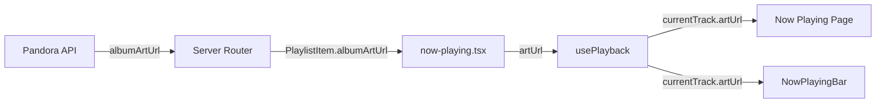

# Fix Album Art Loading

## Goal

Album art never loads because `albumArtUrl` is present in the Pandora API response but omitted from the `PlaylistItem` TypeScript type. The data is silently dropped, so the UI shows a placeholder music icon instead of cover art.

## Requirements

- Add `albumArtUrl` to the `PlaylistItem` type so it flows through from API
- Thread the art URL through the playback pipeline (server → client → playback hook → UI)
- Display actual album art in both the Now Playing page and the Now Playing bar
- Graceful fallback to the existing music icon when art is unavailable

## Source Files

### Data layer (type + threading)

| File | Change |
|------|--------|
| `src/types/api.ts:89-102` | Add `albumArtUrl` to `PlaylistItem` |
| `src/web/hooks/usePlayback.ts:3-10` | Already has `artUrl?: string` — just needs wiring |
| `src/web/routes/now-playing.tsx:72-78` | Pass `albumArtUrl` as `artUrl` in `playback.playTrack()` |
| `src/web/routes/now-playing.tsx:102-108` | Same for skip/next track |

### UI layer (display art)

| File | Change |
|------|--------|
| `src/web/routes/now-playing.tsx:188-196` | Replace placeholder div with `` + fallback |
| `src/web/components/layout/NowPlayingBar.tsx:4-9` | Add `artUrl` to prop type |
| `src/web/components/layout/NowPlayingBar.tsx:37-48` | Add album art thumbnail |
| `src/web/routes/__root.tsx` | Pass `artUrl` from playback context to NowPlayingBar |

## Data Flow



## UI Concept: Now Playing with Art

```html
<div class="flex flex-col items-center justify-center h-full p-8 text-center">
  <!-- Album art with fallback -->
  <div class="relative mb-8">
    <!-- When art URL exists -->
    
    <!-- PLAYING badge -->
    <div class="absolute -bottom-2 left-1/2 -translate-x-1/2 px-3 py-1 bg-cyan-500 rounded-full text-xs font-medium text-zinc-900">
      PLAYING
    </div>
  </div>

  <!-- When NO art URL (fallback, same as current) -->
  <!--
  <div class="w-64 h-64 md:w-80 md:h-80 bg-zinc-800 rounded-2xl shadow-2xl flex items-center justify-center relative">
    <svg class="w-20 h-20 text-zinc-600"></svg>
  </div>
  -->
</div>
```

## UI Concept: NowPlayingBar with Thumbnail

```html
<div class="fixed bottom-0 left-0 right-0 bg-zinc-950/95 backdrop-blur border-t border-zinc-800">
  <div class="h-1 bg-zinc-800">
    <div class="h-full bg-cyan-500 w-1/3"></div>
  </div>
  <div class="flex items-center gap-4 px-4 py-2">
    <!-- Album art thumbnail -->
    
    <!-- Fallback: <div class="w-10 h-10 rounded bg-zinc-800 flex items-center justify-center"><svg class="w-5 h-5 text-zinc-600"></svg></div> -->

    <a class="flex-1 min-w-0 cursor-pointer">
      <p class="text-sm font-medium text-zinc-100 truncate">Song Title</p>
      <p class="text-xs text-zinc-400 truncate">Artist — Album</p>
    </a>
    <div class="flex items-center gap-1">
      <button class="h-10 w-10 flex items-center justify-center rounded-full bg-cyan-600 text-white">
        <svg class="w-5 h-5"><!-- pause --></svg>
      </button>
      <button class="h-8 w-8 flex items-center justify-center rounded-full hover:bg-zinc-800 text-zinc-400">
        <svg class="w-4 h-4"><!-- skip --></svg>
      </button>
    </div>
  </div>
</div>
```

## Acceptance Criteria

- [ ] `PlaylistItem` type includes `albumArtUrl?: string`
- [ ] Album art displays on Now Playing page when URL available
- [ ] Album art thumbnail displays in NowPlayingBar when URL available
- [ ] Music icon fallback shows when no art URL
- [ ] Broken image URLs fall back gracefully (onError handler)
- [ ] Existing CLI/TUI unaffected (additive type change)
