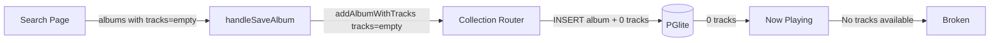
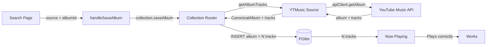

# Fix Album Save: Fetch Tracks Server-Side Before Persisting

## Goal

Clicking "Save" on an album search result currently saves the album **with zero tracks** because search results return `tracks: []` (summary data). The save flow needs to fetch full track details server-side before persisting.

The `getAlbumTracks()` method on the YTMusic source already works — it calls `apiClient.getAlbum(albumId)` and returns a complete `CanonicalAlbum` with tracks. It just needs to be called during the save flow.

## Requirements

- New `collection.saveAlbum` mutation that accepts `{ source, albumId }` and handles everything server-side:
  1. Calls `source.getAlbumTracks(albumId)` to fetch album metadata + tracks
  2. Checks for duplicates (existing logic)
  3. Inserts album + source refs + tracks into PGlite
- UI "Save" button calls this new lean mutation instead of the current `addAlbumWithTracks` (which requires the client to pass tracks)
- Keep `addAlbumWithTracks` for cases where tracks are already known (future local file import)

## Source Files

### Modified Files

| Path | Change |
|------|--------|
| `src/sources/index.ts` | Add `getAlbumTracks(source, albumId)` method to `SourceManager` |
| `server/routers/collection.ts` | Add `saveAlbum` mutation: takes `{source, albumId}`, fetches tracks via source manager, persists |
| `server/trpc.ts` | Ensure context includes source manager (or make saveAlbum a protectedProcedure that builds it) |
| `src/web/routes/search.tsx` | `handleSaveAlbum` calls `collection.saveAlbum({source, albumId})` instead of passing tracks client-side |
| `src/web/components/search/SearchResults.tsx` | `onSaveAlbum` prop changes from `(album: CanonicalAlbum) => void` to `(source: SourceType, albumId: string) => void` (leaner) |

### Unchanged Files

| Path | Why |
|------|-----|
| `src/sources/ytmusic/index.ts` | `getAlbumTracks()` already works |
| `src/sources/ytmusic/api-client.ts` | `getAlbum()` already works |
| `src/db/schema.ts` | Schema already has all needed tables |
| `src/web/routes/home.tsx` | Album display + click already works |
| `src/web/routes/now-playing.tsx` | Album playback mode already works |
| `server/routers/collection.ts` (getAlbumTracks query) | Loading tracks from DB already works |

## Data Flow

### Current (Broken)

### Fixed

## Acceptance Criteria

- [ ] Searching for "Dark Side of the Moon" → clicking Save → album appears in collection with all tracks
- [ ] Clicking saved album from Home → now-playing loads tracks → playback works
- [ ] Duplicate detection still works (saving same album twice shows "already in collection")
- [ ] Save button shows loading state while tracks are being fetched
- [ ] Error toast if track fetching fails (e.g., YTMusic API down)
- [ ] Existing `addAlbumWithTracks` mutation still works (not removed, just no longer used by search UI)
