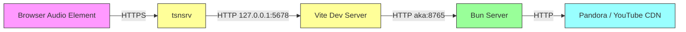

# Fix Audio Playback Through Proxy Chain

## Goal

Audio does not play when accessing Pyxis through the tsnsrv reverse proxy (`https://pyxis.hummingbird-lake.ts.net`). Track metadata loads fine (tRPC works), but the HTML5 Audio element silently fails. The root cause is a combination of: (1) no error handling on the Audio element, making failures invisible, and (2) the audio stream passing through three proxy layers that may not properly handle streaming audio responses.

## Requirements

- Audio must play when accessed through the tsnsrv proxy chain: `tsnsrv → Vite (5678) → Bun (8765) → upstream`
- Audio errors must be surfaced to the user instead of silently failing
- Stream requests and failures must be logged server-side for debugging
- Both Pandora and YTMusic sources must work

## Current Request Flow

tRPC requests follow the same path and work. The difference is that tRPC uses small JSON payloads via `fetch()`, while audio streaming requires large binary responses with proper `Content-Type`, `Content-Length`, `Content-Range`, and `Accept-Ranges` headers — any of which can be dropped or corrupted by the proxy chain.

## Root Causes

### 1. Silent Audio Failures (observability gap)
`usePlayback.ts` does not listen for the `error` event on the `HTMLAudioElement`, and the `audio.play()` Promise rejection is unhandled. When the stream request fails (403, 502, timeout, bad content-type), the UI shows "PLAYING" with 0:00 progress and no error message.

### 2. No Server-Side Stream Logging
`server/index.ts` has no logging on the `/stream/` endpoint. When a stream request arrives, succeeds, or fails, nothing is recorded. This makes it impossible to know if the request even reaches the Bun server.

### 3. Potential Proxy Chain Issues
The three-proxy hop (tsnsrv → Vite → Bun) may:
- Buffer the entire audio response before forwarding (causing timeout or memory issues)
- Strip `Content-Range` / `Accept-Ranges` headers (breaking seek and possibly initial load)
- Convert `206 Partial Content` to `200 OK` (confusing the Audio element)
- Not forward `Range` request headers from the Audio element

## Source Files

| File | Role |
|------|------|
| `src/web/hooks/usePlayback.ts` | Audio element management — needs error event handling |
| `server/index.ts` | Stream endpoint handler — needs logging |
| `server/services/stream.ts` | Stream proxy — needs logging and header fixes |
| `vite.config.ts` | Vite proxy config — may need streaming options |

## Changes

### Step 1: Add Audio Error Handling (`src/web/hooks/usePlayback.ts`)

Add an `error` event listener on the HTMLAudioElement that:
- Updates state to `isPlaying: false`
- Exposes an `error` field in the playback state
- Logs the error to console for debugging

Handle the `audio.play()` Promise rejection (catches autoplay policy blocks and load failures).

### Step 2: Add Stream Endpoint Logging (`server/index.ts`, `server/services/stream.ts`)

Log on the stream endpoint:
- Incoming stream requests (composite ID, range header)
- Resolved upstream URL (redacted for security)
- Upstream response status and content-type
- Errors with full details

### Step 3: Surface Audio Errors in UI (`src/web/routes/now-playing.tsx`)

When `playback.error` is set, show a toast notification with the error details so the user knows playback failed instead of seeing a frozen "PLAYING" state.

### Step 4: Investigate and Fix Proxy Chain (if needed after logging)

Once logging is in place, trigger a playback attempt through tsnsrv, read the logs, and identify which layer drops/corrupts the response. Likely fixes:
- Add `ws: false` to Vite proxy config for `/stream` (prevent WebSocket upgrade attempts)
- Add `selfHandleResponse: false` and configure `onProxyRes` if Vite's http-proxy is buffering
- Ensure `changeOrigin: true` preserves Range headers (it should, but verify)

## Acceptance Criteria

- [ ] Audio element `error` events are caught and surfaced as toast notifications
- [ ] `audio.play()` rejections are caught and handled
- [ ] Stream requests are logged server-side with timing and status
- [ ] Root cause of proxy chain failure is identified via logs
- [ ] Audio plays successfully through the tsnsrv → Vite → Bun proxy chain
- [ ] Both Pandora stations and YTMusic albums play audio
