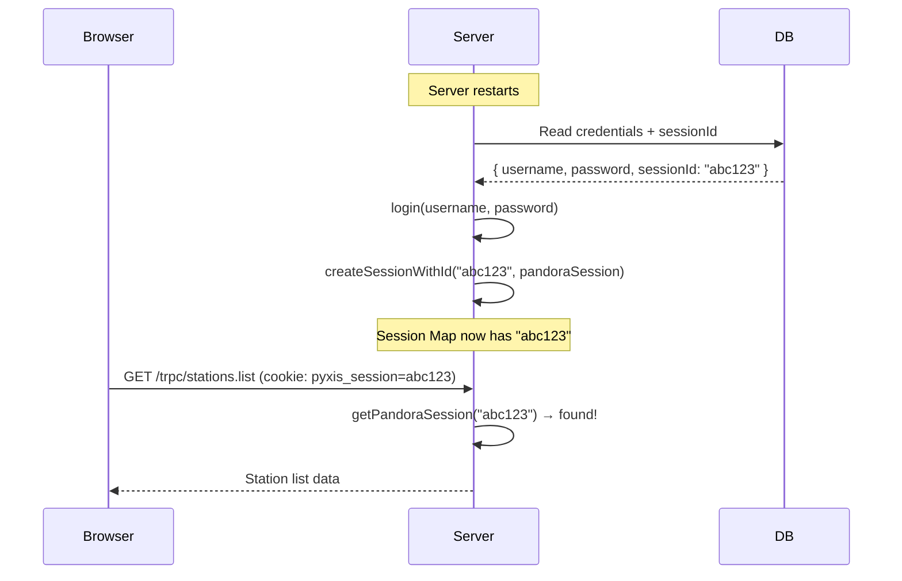

# Fix "Not authenticated" After Server Restart

## Goal

After a server restart, the browser still holds a `pyxis_session` cookie from the old session, but the server's in-memory session Map was wiped. Auto-login creates a **new** session ID that the browser doesn't know about. The result: every TRPC `protectedProcedure` call fails with "Not authenticated", and the stations page shows the error.

The fix should make sessions survive a server restart so the user never has to manually re-login when credentials are already persisted.

## Requirements

- After server restart + successful auto-login, the browser's existing cookie must work without requiring a page refresh or manual re-login
- If auto-login fails (stale credentials), the browser should be redirected to the login page as it does today
- No new database tables — use a **well-known session ID** for the auto-login session so the browser cookie can match it

## Source Files

| File | Role | Change |
|------|------|--------|
| `server/services/session.ts` | In-memory session store | Add `createSessionWithId()` to allow specifying a session ID |
| `server/services/autoLogin.ts` | Restores session on restart | Use well-known session ID from DB |
| `server/routers/auth.ts` | Login/logout mutations | Store session ID in credentials table on login |
| `src/db/schema.ts` | Database schema | Add `sessionId` column to `credentials` table |

## Data Flow

## Approach

**Use a stable session ID persisted in the credentials table.** When the user logs in, the generated session ID is saved alongside the credentials. On auto-login after restart, the server creates the session using that same ID, so the browser's cookie still maps to a valid session.

1. Add a `sessionId` column to the `credentials` table schema
2. On manual login (`auth.login` mutation), save the generated session ID to the credentials row
3. Add `createSessionWithId(id, session, username)` to `session.ts` that uses a caller-provided ID instead of generating one
4. In `tryAutoLogin()`, read the stored session ID and use `createSessionWithId()` to recreate the session with that exact ID
5. If no stored session ID exists (migration case), fall back to generating a new one (browser will redirect to login as before)

## Acceptance Criteria

- [ ] Server restart with stored credentials auto-logs in using the **same session ID** the browser has
- [ ] Browser with existing cookie can load stations immediately after server restart — no redirect to login
- [ ] Fresh browser (no cookie) still redirects to login page
- [ ] Manual login still works and updates the stored session ID
- [ ] Logout clears credentials and session ID from DB
- [ ] If stored credentials are stale, auto-login fails gracefully and browser redirects to login
