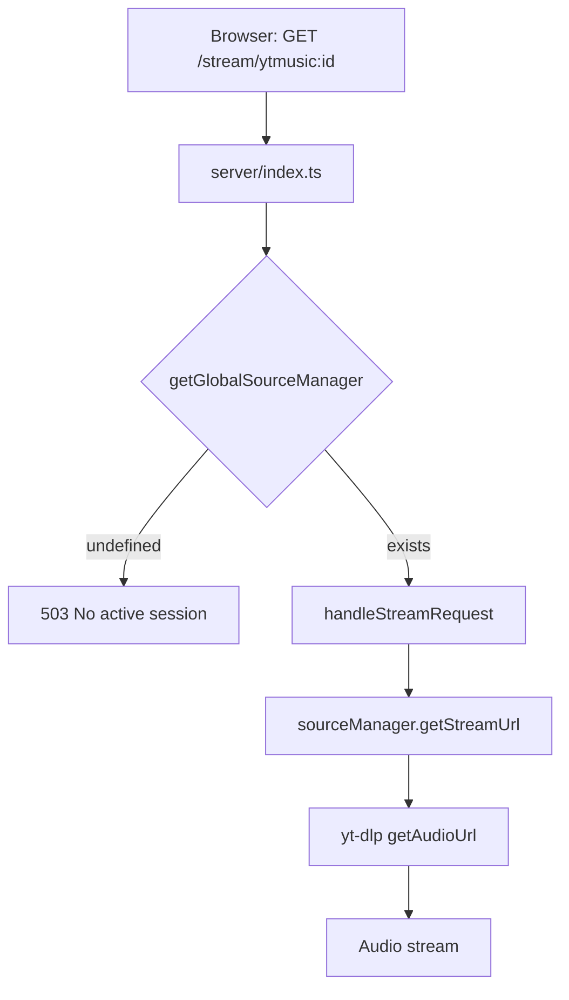
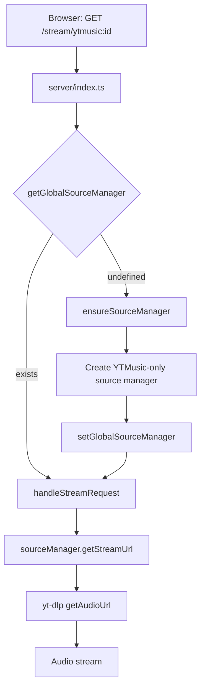

# Fix: YTMusic Streaming Fails After Server Restart

## Goal

After a server restart, playing a saved YTMusic album fails silently because the stream endpoint returns 503 "No active session". The source manager (which resolves stream URLs via yt-dlp) only lives in memory and is only populated during `auth.login`. After a restart, memory is wiped but the browser still has a valid session cookie — so the UI loads fine but audio streaming breaks.

## Requirements

- YTMusic album playback must survive server restarts without requiring re-login
- The stream endpoint must lazily initialize the source manager when a request arrives and no manager exists
- The `saveAlbum` mutation (which also needs the source manager) must also work after restart
- No changes to the auth flow or session persistence model

## Root Cause

The stream endpoint (`server/index.ts:46`) calls `getGlobalSourceManager()` which returns `undefined` after restart:

```
Browser → GET /stream/ytmusic:<trackId>
Server  → getGlobalSourceManager() → undefined
Server  → 503 "No active session"
```

The source manager is only set in one place: `server/routers/auth.ts:28` during login:

```typescript
setGlobalSourceManager(await getSourceManager(session));
```

But sessions are in-memory `Map<string, SessionData>` (`server/services/session.ts:9`) — also lost on restart.

**The deeper issue**: YTMusic streaming doesn't actually need Pandora auth. The YTMusic source uses `yt-dlp` (no auth) and an internal API client (no auth). Only the Pandora source needs a `PandoraSession`. So the entire stream endpoint is blocked by a Pandora login dependency that YTMusic doesn't need.

## Data Flow

### Current (Broken After Restart)



### Fixed



## Source Files

### Modified Files

| Path | Change |
|------|--------|
| `server/services/sourceManager.ts` | Add `ensureSourceManager()` that lazily creates a YTMusic-only source manager when no Pandora session exists. When a user logs in later, the full manager (with Pandora) replaces it. |
| `server/index.ts` | Stream endpoint calls `ensureSourceManager()` instead of checking `getGlobalSourceManager()` and 503-ing |
| `server/routers/collection.ts` | `saveAlbum` mutation calls `ensureSourceManager()` instead of `getGlobalSourceManager()` with manual null check |

### Unchanged Files

| Path | Why |
|------|-----|
| `server/routers/auth.ts` | Login still sets the full source manager (Pandora + YTMusic) — this is the upgrade path from lazy YTMusic-only to full |
| `server/services/session.ts` | Session persistence is a separate concern — not needed for this fix |
| `src/sources/ytmusic/index.ts` | YTMusic source already works without Pandora session |
| `src/web/routes/now-playing.tsx` | Client-side playback code is fine; the issue is server-side |
| `server/services/stream.ts` | Stream service already works once it has a source manager |

## Acceptance Criteria

- [ ] Restart server → navigate to saved YTMusic album → tracks play without re-login
- [ ] `saveAlbum` mutation works after restart (search → save album → tracks persisted)
- [ ] Logging in after restart upgrades the source manager to include Pandora
- [ ] No regression: Pandora streaming still works when logged in
- [ ] No new external dependencies or config changes
