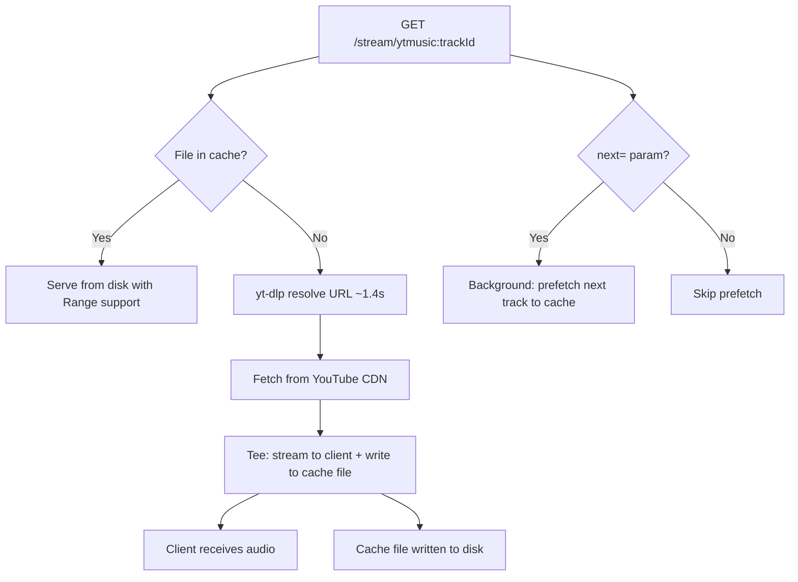

# Reduce YTMusic Stream Startup Latency

## Goal

YTMusic tracks take ~1.4s before audio starts due to yt-dlp URL resolution on every request. Once a song has been downloaded, it should never need to be fetched again. Cache the actual audio data to disk and prefetch the next track in the background.

## Requirements

- Downloaded audio files are cached to disk at `~/.cache/pyxis/audio/` (via `env-paths` cache dir)
- Cache is permanent — files persist across server restarts, never expire
- Cached tracks are served directly from disk with full Range request support (seek works)
- On cache miss: resolve URL via yt-dlp, fetch from CDN, tee the response to both the client AND a cache file simultaneously (stream-through, no double-download)
- When a track starts streaming, prefetch the next track in the background if a `?next=` hint is provided
- Pandora streams bypass the cache (their URLs are short-lived and per-session)

## Data Flow



## Cache Layout

```
~/.cache/pyxis/audio/
  ytmusic/
    fdi173iq-DQ.webm          # cached audio file
    fdi173iq-DQ.webm.meta      # JSON: {contentType, contentLength, cachedAt}
    jRGrNDV2mKc.webm
    jRGrNDV2mKc.webm.meta
```

- Flat directory per source type (only `ytmusic/` for now)
- File extension from content-type (`audio/webm` → `.webm`, `audio/mp4` → `.m4a`)
- `.meta` sidecar stores content-type and length (needed for HTTP headers)
- Incomplete downloads use `.partial` suffix, renamed on completion

## Source Files

| File | Change |
|------|--------|
| `server/services/stream.ts` | Add disk cache layer, tee-stream logic, prefetch |
| `server/index.ts` | Extract `?next=` query param, pass to handler |
| `src/web/routes/now-playing.tsx` | Append `?next=` to stream URL for next track |

## Changes

### 1. Add audio cache to stream service (`server/services/stream.ts`)

Add a `createAudioCache` module-level function that:

- Determines cache dir: `envPaths("pyxis", {suffix: ""}).cache + "/audio"`
- `has(source, trackId)` → checks if `<source>/<trackId>.<ext>` + `.meta` exist
- `getPath(source, trackId)` → returns the file path for a cached track
- `getMeta(source, trackId)` → reads the `.meta` JSON (contentType, contentLength)
- `store(source, trackId, readableStream, contentType, contentLength)` → writes stream to `<trackId>.<ext>.partial`, renames to `<trackId>.<ext>` on completion, writes `.meta`

Update `handleStreamRequest`:

**Cache hit path** — if `has(source, trackId)` is true:
- Read meta for `Content-Type` and `Content-Length`
- If `Range` header present: use `Bun.file()` with appropriate slice for `206 Partial Content`
- If no `Range`: serve the whole file as `200 OK`
- Log: `[stream] cache hit compositeId=...`

**Cache miss path** — existing flow, but tee the upstream body:
- Create a `ReadableStream` that forwards chunks to both the HTTP response and a file write stream
- The client starts receiving data immediately while the file is being written
- On stream completion, rename `.partial` → final filename and write `.meta`
- Log: `[stream] cache miss compositeId=... (downloading + caching)`

**Prefetch** — add `prefetchToCache(sourceManager, compositeId)`:
- If already cached, skip
- Otherwise, resolve URL, fetch, write directly to cache (no HTTP response needed)
- Fire-and-forget (errors logged, not thrown)
- Log: `[stream] prefetch compositeId=...`

### 2. Pass next-track hint (`server/index.ts`)

In the `/stream/` handler, extract `url.searchParams.get("next")`. After calling `handleStreamRequest`, if `next` is non-null, fire off `prefetchToCache(sourceManager, next)` without awaiting it.

### 3. Append next-track hint from UI (`src/web/routes/now-playing.tsx`)

Update `buildStreamUrl` to accept an optional `nextCompositeId` parameter:

```typescript
function buildStreamUrl(source: SourceType, trackId: string, nextTrackId?: string): string {
  const base = `/stream/${encodeURIComponent(`${source}:${trackId}`)}`;
  if (!nextTrackId) return base;
  return `${base}?next=${encodeURIComponent(nextTrackId)}`;
}
```

Update `playTrackAtIndex` to compute the next track's composite ID from `tracks[index + 1]` and pass it through.

## Acceptance Criteria

- [ ] First play of a YTMusic track downloads and caches the audio file to disk
- [ ] Second play of the same track serves from cache with <50ms latency (no yt-dlp, no CDN fetch)
- [ ] Range requests work on cached files (seek support)
- [ ] Stream-through: client starts receiving audio immediately on cache miss (no wait for full download)
- [ ] `.partial` files are cleaned up — only complete downloads are served
- [ ] Next track is prefetched in the background when `?next=` hint is provided
- [ ] Pandora streams bypass the cache entirely
- [ ] Cache files persist across server restarts
- [ ] Stream logs show cache hit/miss/prefetch status
