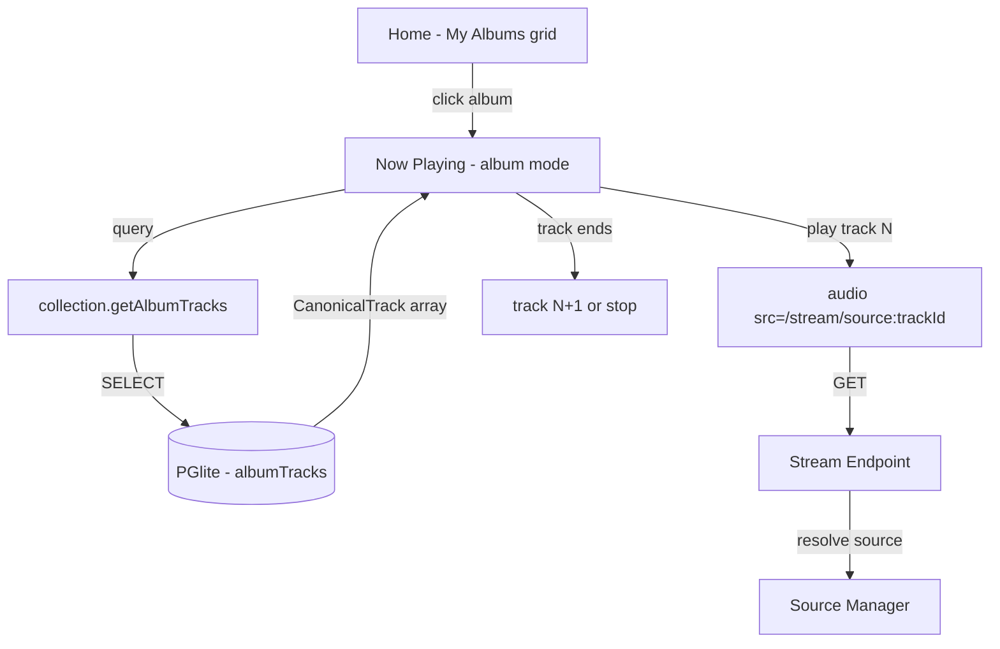
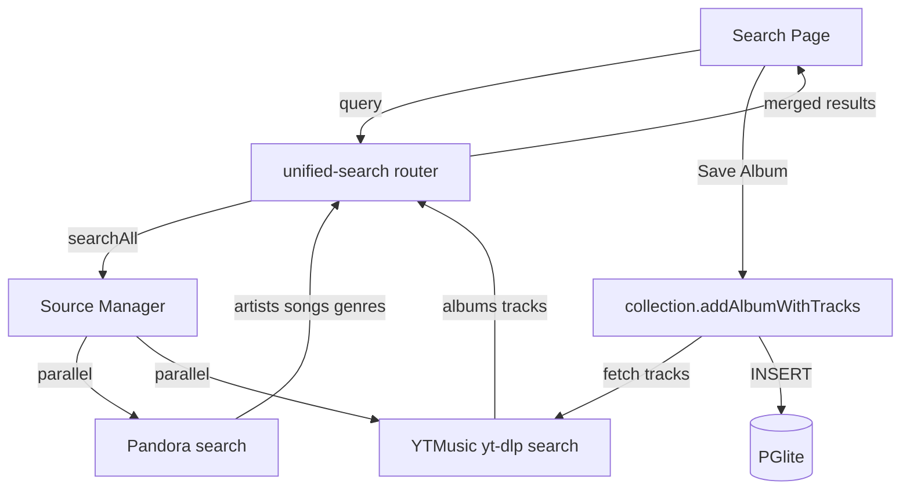
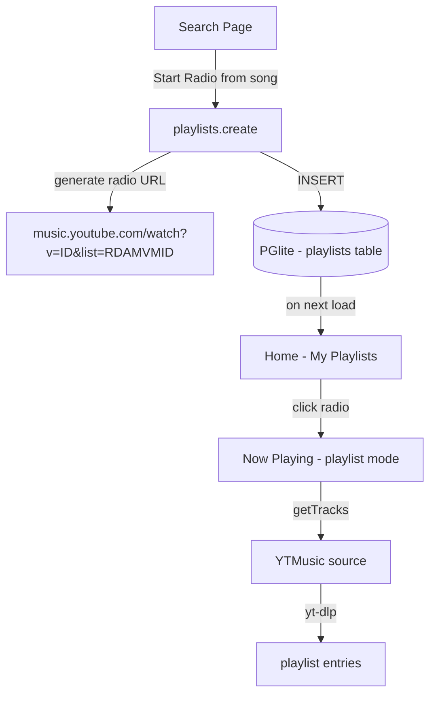

# Milestone 2: Album Playback, Album Discovery, and YTMusic Radio

## Goal

Complete the three missing user-facing features that make Pyxis a usable unified music app:

1. **Album Playback** — Click an album from "My Albums" and play it track-by-track
2. **Album Discovery** — Unified search across sources, bookmark albums to collection
3. **YTMusic Radio** — Create YouTube Music radio playlists from search seeds (like Pandora station creation), replacing the hardcoded playlist URL config

These three features connect the existing infrastructure (source abstraction, stream proxy, collection DB, canonical types) into end-to-end user workflows.

## Requirements

### 1. Album Playback

- Clicking an album in "My Albums" navigates to now-playing in album mode
- Album mode plays tracks sequentially (track 1 → track 2 → ... → end)
- Album tracks stored in `albumTracks` table (already exists in schema) are loaded and played via stream proxy
- Now-playing page shows album context: track list with current track highlighted
- No shuffle/repeat for now — sequential playback, stops at end
- Skip forward/backward within album track list

### 2. Album Discovery (Search → Bookmark)

- Unified search router aggregates results from all sources with `SearchCapability`
- YTMusic source gains `SearchCapability` using `yt-dlp` search (`ytsearch:` prefix)
- Search results include an **Albums** section showing `CanonicalAlbum` results
- Each album result has a "Save to collection" action
- Saving an album: fetches full track list, writes album + tracks + source refs to PGlite
- Search page shows albums alongside existing artists/songs/genres sections
- Pandora search continues returning artists/songs/genres (no album support from Pandora API)

### 3. YTMusic Radio from Seeds

- When user searches and finds a YTMusic result (artist or song), they can "Start Radio"
- "Start Radio" generates a YTMusic radio URL from the seed: `https://music.youtube.com/watch?v={videoId}&list=RDAMVM{videoId}` (auto-mix format)
- The generated radio is stored as a `CanonicalPlaylist` and appears in "My Playlists"
- YTMusic source's `listPlaylists()` returns both auto-generated radios and any configured playlists
- Radio playlists persisted in PGlite so they survive restarts
- YTMusic `configureYtMusic()` replaced by DB-backed playlist storage

## Source Files

### New Files

| Path | Purpose |
|------|---------|
| `server/routers/unified-search.ts` | Aggregated search across all sources |
| `src/web/components/search/AlbumSearchResults.tsx` | Album results with "Save" action |
| `src/web/components/albums/AlbumTrackList.tsx` | Track list view for album playback mode |
| `src/db/migrations/002-playlists.sql` | New `playlists` table for persisted radio/playlists |

### Modified Files

| Path | Change |
|------|--------|
| `src/sources/types.ts` | Add `AlbumCapability` to fetch full album track list from source |
| `src/sources/index.ts` | Add `searchAll()` and `getAlbumTracks()` to `SourceManager` |
| `src/sources/ytmusic/index.ts` | Add `SearchCapability` (yt-dlp search), radio URL generation |
| `src/sources/ytmusic/yt-dlp.ts` | Add `searchYtMusic(query)` function using `ytsearch:` |
| `src/sources/pandora/index.ts` | No changes — search already implemented |
| `server/router.ts` | Add `unifiedSearch` router |
| `server/routers/collection.ts` | Add `addAlbumWithTracks` mutation (album + tracks in one call) |
| `server/routers/playlists.ts` | Add `create` mutation for radio playlists, load from DB |
| `src/db/schema.ts` | Add `playlists` table schema |
| `src/db/index.ts` | Add migration for playlists table |
| `src/web/routes/search.tsx` | Dual-purpose: create stations AND save albums/start radio |
| `src/web/routes/home.tsx` | Wire album `onPlay` to navigate to album playback |
| `src/web/routes/now-playing.tsx` | Add album playback mode (sequential, track list, skip back) |
| `src/web/components/search/SearchResults.tsx` | Add album section, "Save" and "Start Radio" actions |
| `server/services/sourceManager.ts` | Remove hardcoded ytmusic config, load playlists from DB |

## Data Flow

### Album Playback



### Album Discovery



### YTMusic Radio Creation



## UI Concept

### Search Page — Unified Results with Album Section

```html
<div class="flex-1 p-4 space-y-4">
  <!-- Search input -->
  <div class="relative">
    <input type="text" placeholder="Search artists, songs, albums..." class="w-full bg-zinc-800 text-white rounded-lg pl-10 pr-4 py-3 text-sm focus:outline-none focus:ring-2 focus:ring-emerald-500/50" value="pink floyd" />
    <svg class="absolute left-3 top-3.5 w-4 h-4 text-zinc-500" fill="none" stroke="currentColor" viewBox="0 0 24 24"><path stroke-linecap="round" stroke-linejoin="round" stroke-width="2" d="M21 21l-6-6m2-5a7 7 0 11-14 0 7 7 0 0114 0z"/></svg>
  </div>

  <!-- Albums section (NEW) -->
  <section>
    <h3 class="text-xs font-medium text-zinc-500 uppercase tracking-wider mb-2">Albums</h3>
    <div class="space-y-1">
      <!-- Album result from YTMusic -->
      <div class="flex items-center gap-3 p-3 rounded-lg hover:bg-zinc-800/50 group">
        <div class="w-12 h-12 rounded bg-zinc-700 flex items-center justify-center shrink-0 overflow-hidden">
          
        </div>
        <div class="flex-1 min-w-0">
          <p class="text-sm font-medium text-zinc-100 truncate">The Dark Side of the Moon</p>
          <p class="text-xs text-zinc-500">Pink Floyd · 1973 · YouTube Music</p>
        </div>
        <div class="flex items-center gap-1.5 shrink-0">
          <button class="text-xs text-zinc-400 hover:text-white bg-zinc-800 hover:bg-zinc-700 px-2.5 py-1.5 rounded transition-colors">
            Save
          </button>
          <button class="text-xs text-zinc-400 hover:text-white bg-zinc-800 hover:bg-zinc-700 px-2.5 py-1.5 rounded transition-colors">
            Start Radio
          </button>
        </div>
      </div>
      <div class="flex items-center gap-3 p-3 rounded-lg hover:bg-zinc-800/50 group">
        <div class="w-12 h-12 rounded bg-zinc-700 flex items-center justify-center shrink-0 overflow-hidden">
          
        </div>
        <div class="flex-1 min-w-0">
          <p class="text-sm font-medium text-zinc-100 truncate">Wish You Were Here</p>
          <p class="text-xs text-zinc-500">Pink Floyd · 1975 · YouTube Music</p>
        </div>
        <div class="flex items-center gap-1.5 shrink-0">
          <button class="text-xs text-zinc-400 hover:text-white bg-zinc-800 hover:bg-zinc-700 px-2.5 py-1.5 rounded transition-colors">
            Save
          </button>
          <button class="text-xs text-zinc-400 hover:text-white bg-zinc-800 hover:bg-zinc-700 px-2.5 py-1.5 rounded transition-colors">
            Start Radio
          </button>
        </div>
      </div>
    </div>
  </section>

  <!-- Songs section (existing, enhanced) -->
  <section>
    <h3 class="text-xs font-medium text-zinc-500 uppercase tracking-wider mb-2">Songs</h3>
    <div class="space-y-1">
      <div class="flex items-center gap-3 p-3 rounded-lg hover:bg-zinc-800/50">
        <div class="w-10 h-10 rounded bg-zinc-700 flex items-center justify-center shrink-0">
          <svg class="w-5 h-5 text-zinc-500" fill="none" stroke="currentColor" viewBox="0 0 24 24"><path stroke-linecap="round" stroke-linejoin="round" stroke-width="2" d="M9 19V6l12-3v13M9 19c0 1.105-1.343 2-3 2s-3-.895-3-2 1.343-2 3-2 3 .895 3 2zm12-3c0 1.105-1.343 2-3 2s-3-.895-3-2 1.343-2 3-2 3 .895 3 2zM9 10l12-3"/></svg>
        </div>
        <div class="flex-1 min-w-0">
          <p class="text-sm font-medium text-zinc-100">Comfortably Numb</p>
          <p class="text-xs text-zinc-500">Pink Floyd · Pandora</p>
        </div>
        <div class="flex items-center gap-1.5 shrink-0">
          <button class="text-xs text-zinc-400 hover:text-white bg-zinc-800 hover:bg-zinc-700 px-2.5 py-1.5 rounded transition-colors">
            Create station
          </button>
          <button class="text-xs text-zinc-400 hover:text-white bg-zinc-800 hover:bg-zinc-700 px-2.5 py-1.5 rounded transition-colors">
            Start Radio
          </button>
        </div>
      </div>
    </div>
  </section>

  <!-- Artists section (existing, enhanced) -->
  <section>
    <h3 class="text-xs font-medium text-zinc-500 uppercase tracking-wider mb-2">Artists</h3>
    <div class="space-y-1">
      <div class="flex items-center gap-3 p-3 rounded-lg hover:bg-zinc-800/50">
        <div class="w-10 h-10 rounded-full bg-zinc-700 flex items-center justify-center shrink-0">
          <svg class="w-5 h-5 text-zinc-500" fill="none" stroke="currentColor" viewBox="0 0 24 24"><path stroke-linecap="round" stroke-linejoin="round" stroke-width="2" d="M16 7a4 4 0 11-8 0 4 4 0 018 0zM12 14a7 7 0 00-7 7h14a7 7 0 00-7-7z"/></svg>
        </div>
        <div class="flex-1 min-w-0">
          <p class="text-sm font-medium text-zinc-100">Pink Floyd</p>
          <p class="text-xs text-zinc-500">Pandora</p>
        </div>
        <button class="text-xs text-zinc-400 hover:text-white bg-zinc-800 hover:bg-zinc-700 px-2.5 py-1.5 rounded transition-colors shrink-0">
          Create station
        </button>
      </div>
    </div>
  </section>
</div>
```

### Now Playing — Album Mode with Track List

```html
<div class="flex-1 flex flex-col items-center justify-center p-8 bg-zinc-950 text-white">
  <!-- Album art + info -->
  <div class="w-56 h-56 rounded-xl overflow-hidden shadow-2xl mb-6">
    
  </div>
  <div class="text-center mb-4">
    <h2 class="text-xl font-bold">Breathe (In the Air)</h2>
    <p class="text-sm text-zinc-400 mt-1">Pink Floyd</p>
    <p class="text-xs text-zinc-600">The Dark Side of the Moon · 1973</p>
  </div>

  <!-- Progress bar -->
  <div class="w-full max-w-sm mb-4">
    <div class="h-1 bg-zinc-800 rounded-full overflow-hidden">
      <div class="h-full bg-emerald-500 rounded-full" style="width: 35%"></div>
    </div>
    <div class="flex justify-between text-xs text-zinc-600 mt-1">
      <span>1:04</span>
      <span>2:49</span>
    </div>
  </div>

  <!-- Controls (album mode: prev + play/pause + next) -->
  <div class="flex items-center gap-6 mb-6">
    <button class="p-2 text-zinc-400 hover:text-white">
      <svg class="w-6 h-6" fill="currentColor" viewBox="0 0 24 24"><path d="M6 6h2v12H6zm3.5 6l8.5 6V6z"/></svg>
    </button>
    <button class="h-14 w-14 rounded-full bg-emerald-500 hover:bg-emerald-400 flex items-center justify-center">
      <svg class="w-7 h-7 text-black" fill="currentColor" viewBox="0 0 24 24"><path d="M6 19h4V5H6v14zm8-14v14h4V5h-4z"/></svg>
    </button>
    <button class="p-2 text-zinc-400 hover:text-white">
      <svg class="w-6 h-6" fill="currentColor" viewBox="0 0 24 24"><path d="M6 18l8.5-6L6 6v12zM16 6v12h2V6h-2z"/></svg>
    </button>
  </div>

  <!-- Album track list -->
  <div class="w-full max-w-sm">
    <h3 class="text-xs font-medium text-zinc-500 uppercase tracking-wider mb-2">Tracklist</h3>
    <div class="space-y-0.5 max-h-48 overflow-y-auto">
      <button class="w-full flex items-center gap-3 px-3 py-2 rounded text-left text-zinc-500 text-sm">
        <span class="w-5 text-right text-xs">1</span>
        <span class="flex-1 truncate">Speak to Me</span>
        <span class="text-xs">1:05</span>
      </button>
      <button class="w-full flex items-center gap-3 px-3 py-2 rounded text-left bg-emerald-500/10 text-emerald-400 text-sm font-medium">
        <span class="w-5 text-right text-xs">2</span>
        <span class="flex-1 truncate">Breathe (In the Air)</span>
        <span class="text-xs">2:49</span>
      </button>
      <button class="w-full flex items-center gap-3 px-3 py-2 rounded text-left text-zinc-500 hover:text-zinc-300 hover:bg-zinc-800/50 text-sm">
        <span class="w-5 text-right text-xs">3</span>
        <span class="flex-1 truncate">On the Run</span>
        <span class="text-xs">3:36</span>
      </button>
      <button class="w-full flex items-center gap-3 px-3 py-2 rounded text-left text-zinc-500 hover:text-zinc-300 hover:bg-zinc-800/50 text-sm">
        <span class="w-5 text-right text-xs">4</span>
        <span class="flex-1 truncate">Time</span>
        <span class="text-xs">7:01</span>
      </button>
      <button class="w-full flex items-center gap-3 px-3 py-2 rounded text-left text-zinc-500 hover:text-zinc-300 hover:bg-zinc-800/50 text-sm">
        <span class="w-5 text-right text-xs">5</span>
        <span class="flex-1 truncate">The Great Gig in the Sky</span>
        <span class="text-xs">4:44</span>
      </button>
      <button class="w-full flex items-center gap-3 px-3 py-2 rounded text-left text-zinc-500 hover:text-zinc-300 hover:bg-zinc-800/50 text-sm">
        <span class="w-5 text-right text-xs">6</span>
        <span class="flex-1 truncate">Money</span>
        <span class="text-xs">6:22</span>
      </button>
    </div>
  </div>
</div>
```

## Acceptance Criteria

### Album Playback
- [ ] Clicking album card in "My Albums" navigates to now-playing with album context
- [ ] Album tracks load from `albumTracks` table via collection router
- [ ] Tracks play sequentially via `/stream/source:trackId`
- [ ] Skip forward advances to next track; skip backward goes to previous
- [ ] Track list displayed below controls with current track highlighted
- [ ] Clicking a track in the list jumps to that track
- [ ] Playback stops after last track (no auto-loop)

### Album Discovery
- [ ] Unified search router calls `searchAll()` on source manager
- [ ] YTMusic source implements `SearchCapability` using `yt-dlp ytsearch:`
- [ ] Search results page shows Albums section with artwork, title, artist, year, source
- [ ] "Save" button fetches full track list and persists album + tracks to PGlite
- [ ] Saved album immediately appears in "My Albums" on home page
- [ ] Duplicate detection: cannot save same album twice (by source + sourceId)

### YTMusic Radio
- [ ] "Start Radio" on a YTMusic song result generates auto-mix radio URL
- [ ] Radio playlist persisted in `playlists` table in PGlite
- [ ] Created radio appears in "My Playlists" on home page
- [ ] Playing the radio loads tracks via yt-dlp and streams through proxy
- [ ] `sourceManager` loads playlists from DB instead of hardcoded config
- [ ] Existing Pandora station creation ("Create station") continues to work unchanged
