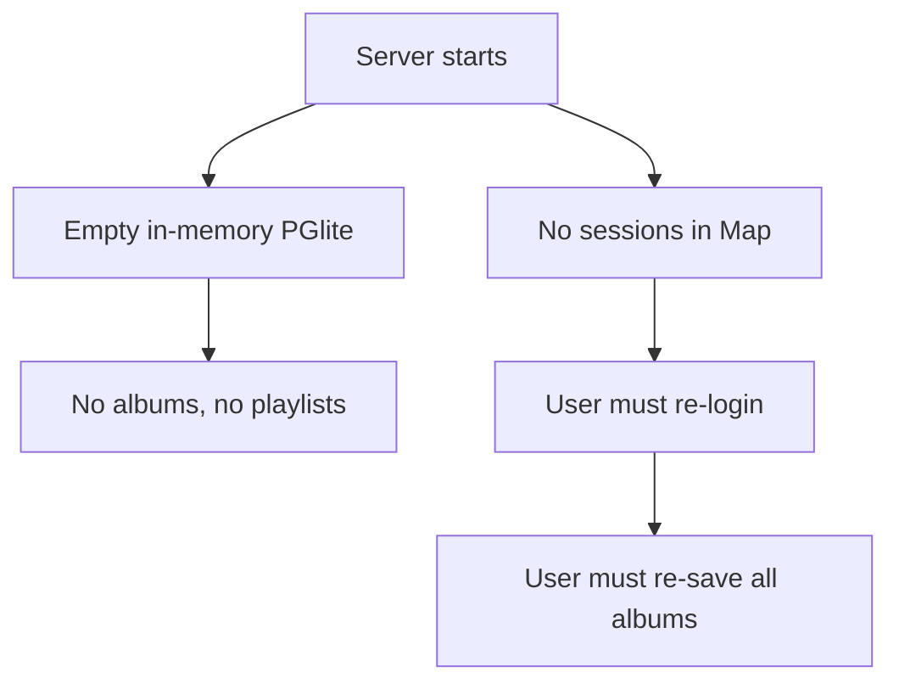
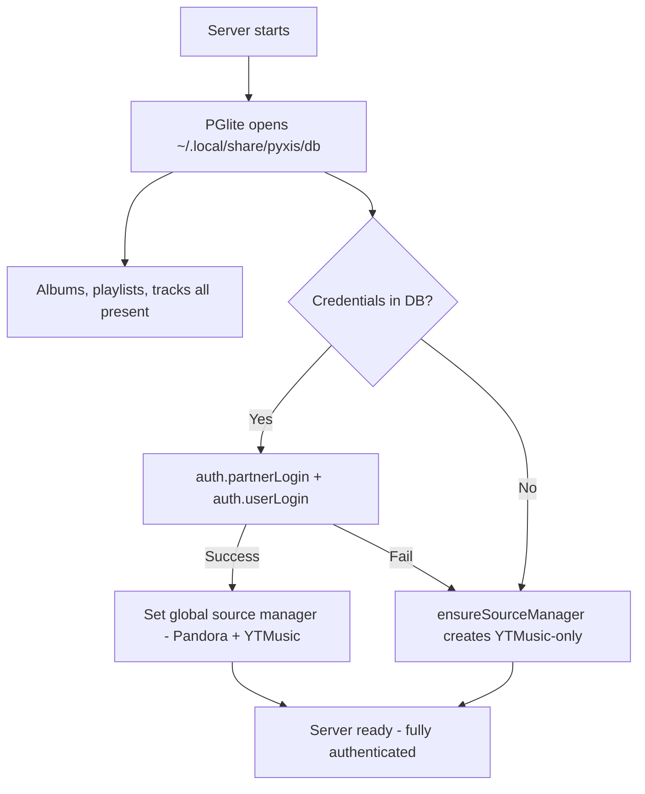

# Persist Database & Auto-Login After Server Restart

## Goal

Everything is ephemeral right now. PGlite runs in-memory (no path argument), so saved albums, playlists, and tracks vanish on restart. Sessions are an in-memory `Map`, so auth is also lost. The user must re-login and re-save all their albums every time the server restarts.

This plan makes two things survive restarts:
1. **All DB data** (albums, playlists, tracks) — by giving PGlite a filesystem path
2. **Pandora credentials** — by storing them in the DB and auto-logging in on startup

## Requirements

- PGlite must persist to `~/.local/share/pyxis/db` (XDG data dir)
- On successful web login, store credentials (username + password) in a `credentials` table
- On server startup, read stored credentials and auto-login to Pandora (restoring the full source manager)
- If auto-login fails (bad password, network down), server starts normally — user just sees the login page
- No changes to the login page UI (it works as-is, just also persists creds on success)
- Logout clears stored credentials

## Data Flow

### Current (Broken)



### Fixed



## Source Files

### Modified Files

| Path | Change |
|------|--------|
| `src/db/index.ts` | Pass XDG data path to `new PGlite(path)` instead of `new PGlite()`. Add `credentials` table to migration SQL. |
| `src/db/schema.ts` | Add `credentials` drizzle table definition (id, username, password, createdAt). |
| `server/routers/auth.ts` | After successful login, upsert credentials into DB. On logout, delete stored credentials. |
| `server/index.ts` | On startup (after `Bun.serve`), attempt auto-login from stored credentials. |
| `server/services/session.ts` | No structural change, but the auto-login path needs to call `createSession` — may need to export the session creation without requiring a request context. |

### Unchanged Files

| Path | Why |
|------|-----|
| `src/web/routes/login.tsx` | Login form UI stays the same |
| `src/web/contexts/AuthContext.tsx` | Client auth flow unchanged — cookie still set on login response |
| `server/services/sourceManager.ts` | Already has `setGlobalSourceManager` + `ensureSourceManager` |
| `src/cli/config/paths.ts` | Already exports `getCacheDir` / XDG helpers we can reuse the `env-paths` pattern from |

### New Files

| Path | Purpose |
|------|---------|
| `server/services/autoLogin.ts` | Reads credentials from DB, calls `login()`, creates session, sets global source manager. Called once at startup. |

## Schema: `credentials` Table

```sql
CREATE TABLE IF NOT EXISTS credentials (
    id TEXT PRIMARY KEY DEFAULT 'default',
    username TEXT NOT NULL,
    password TEXT NOT NULL,
    created_at TIMESTAMP DEFAULT NOW() NOT NULL
);
```

Single-row table (primary key `'default'`) — only one set of credentials stored at a time. Upsert on login, delete on logout.

**Security note**: Password stored in plaintext in the PGlite data directory. This matches the existing pattern in `~/.config/pyxis/config.yml` where `auth.password` is also plaintext. The data directory has restrictive permissions (`0o700`).

## PGlite Persistence

Change from:
```typescript
pgliteInstance = new PGlite();
```

To:
```typescript
import envPaths from 'env-paths';
const paths = envPaths('pyxis', { suffix: '' });
// ~/.local/share/pyxis/db (Linux) or ~/Library/Application Support/pyxis/db (macOS)
pgliteInstance = new PGlite(join(paths.data, 'db'));
```

This one-line change makes all existing tables (albums, playlists, tracks) persist automatically.

## Auto-Login Flow (`server/services/autoLogin.ts`)

```typescript
export async function tryAutoLogin(): Promise<void> {
    const db = await getDb();
    const rows = await db.select().from(schema.credentials).limit(1);
    const creds = rows[0];
    if (!creds) return; // No stored credentials, skip

    try {
        const session = await Effect.runPromise(login(creds.username, creds.password));
        const sessionId = createSession(session, creds.username);
        setGlobalSourceManager(await getSourceManager(session));
        console.log(`Auto-login successful for ${creds.username}`);
    } catch {
        console.log('Auto-login failed — stored credentials may be stale');
    }
}
```

Called at the bottom of `server/index.ts` after `Bun.serve()`.

## Auth Router Changes

**Login mutation** — after existing logic, add:
```typescript
// Persist credentials for auto-login after restart
const db = await getDb();
await db.insert(schema.credentials)
    .values({ id: 'default', username: input.username, password: input.password })
    .onConflictDoUpdate({
        target: schema.credentials.id,
        set: { username: input.username, password: input.password },
    });
```

**Logout mutation** — after existing logic, add:
```typescript
const db = await getDb();
await db.delete(schema.credentials);
```

## Acceptance Criteria

- [ ] Restart server — saved albums and playlists are still there
- [ ] Restart server — auto-login happens, Pandora streaming works without manual login
- [ ] Login via web UI — credentials stored in DB
- [ ] Logout via web UI — credentials removed from DB, next restart requires manual login
- [ ] If stored credentials are invalid (password changed), server starts normally with YTMusic-only mode
- [ ] PGlite data directory created with `0o700` permissions
- [ ] No regressions: fresh install with no DB works, login page shows, first login stores creds
