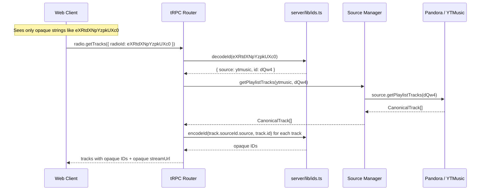
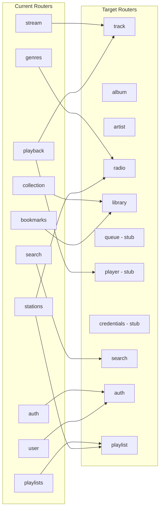

# Phase 2: Opaque IDs + API Reshape

## Goal

Transform the tRPC API from a source-leaking, Pandora-centric surface into a source-agnostic API with opaque IDs. Clients should never see `source:trackId` composite strings, Pandora-specific tokens, or raw source types. The API becomes the stable contract described in the v2 architecture vision.

## Requirements

- All IDs emitted in tRPC responses are **opaque** (base64-encoded `source:id`)
- All tRPC inputs accept opaque IDs and decode server-side
- No `source:trackId` composite format visible to any client
- Routers reshaped to target structure: `track`, `album`, `artist`, `playlist`, `radio`, `queue`, `player`, `library`, `search`, `auth`, `credentials`
- Frontend updated to use new router paths and opaque IDs
- Old routers removed
- `server/trpc.ts` context generalized (not Pandora-specific)
- Application works end-to-end with both Pandora and YTMusic sources

## Current State

### Router Map (what exists today)

| Router | Procedures | Source Coupling |
|--------|-----------|-----------------|
| `auth` | login, logout, status | Pandora-only (hardcoded PandoraSession) |
| `stations` | list, create, delete, rename, setQuickMix, addMusic, deleteMusic | Pandora-only (stationToken) |
| `playback` | getPlaylist, addFeedback, deleteFeedback, sleepSong, explainTrack | Pandora-only (trackToken, stationToken) |
| `search` | search, unified | Mixed (unified is multi-source) |
| `bookmarks` | list, addArtist, addSong, deleteArtist, deleteSong | Pandora-only |
| `genres` | list | Pandora-only |
| `user` | settings, usage, changeSettings, setExplicitFilter | Pandora-only |
| `stream` | resolve, info | Multi-source (composite IDs) |
| `playlists` | list, getTracks, createRadio | Multi-source (takes source param) |
| `collection` | listAlbums, getAlbumTracks, addAlbum, addAlbumWithTracks, saveAlbum, removeAlbum | Multi-source (local DB) |

### ID Formats in Play

1. **Pandora tokens** — `trackToken`, `stationToken`, `feedbackId`, `bookmarkToken` (opaque Pandora strings)
2. **SourceId object** — `{ source: "ytmusic", id: "abc" }` (nested in CanonicalTrack)
3. **Composite string** — `"ytmusic:abc"` (used only in stream service)
4. **DB IDs** — album UUIDs, credential IDs (local PGlite)

### Frontend ID Awareness

`now-playing.tsx` manually constructs composite IDs:
```typescript
// Line 33 — builds stream URL with raw source:trackId
const base = `/stream/${encodeURIComponent(`${source}:${trackId}`)}`;
```
And converts between Pandora PlaylistItem, CanonicalTrack, and AlbumTrackRow into a unified `NowPlayingTrack`.

## Source Files

### New Files to Create

| File | Purpose |
|------|---------|
| `server/lib/ids.ts` | `encodeId(source, id)` / `decodeId(opaqueId)` — base64 encoding at API boundary |
| `server/routers/track.ts` | Track entity router: `get`, `search`, `streamUrl` |
| `server/routers/album.ts` | Album entity router: `get`, `search`, `tracks` |
| `server/routers/artist.ts` | Artist entity router: `get`, `search` (stub — future capability) |
| `server/routers/radio.ts` | Radio router: replaces stations + Pandora playlist logic |
| `server/routers/library.ts` | Library router: merges bookmarks + collection |
| `server/routers/queue.ts` | Queue router: stub for Phase 3 (thin wrapper over current Up Next) |
| `server/routers/player.ts` | Player router: stub for Phase 3 (thin wrapper over current playback) |
| `server/routers/credentials.ts` | Credential router: stub for Phase 4 |

### Files to Modify

| File | Change |
|------|--------|
| `server/trpc.ts` | Generalize context: replace `pandoraSession` with source-agnostic session map; keep backwards compat |
| `server/router.ts` | Wire new routers, remove old ones |
| `server/services/stream.ts` | Use `decodeId()` from `server/lib/ids.ts` instead of custom `parseTrackId()` |
| `server/services/sourceManager.ts` | No changes needed (already source-agnostic internally) |
| `server/index.ts` | Update stream endpoint to use `decodeId()` for `/stream/:compositeTrackId` |
| `src/sources/types.ts` | Add `CanonicalArtist`, `RadioCapability`, `ArtistCapability` |
| `src/sources/index.ts` | Add artist/radio methods to SourceManager |
| `src/web/lib/trpc.ts` | No changes (type-driven from AppRouter) |
| `src/web/routes/now-playing.tsx` | Use opaque IDs from API; remove manual composite ID construction |
| `src/web/routes/home.tsx` | Update to use new router paths |
| `src/web/routes/search.tsx` | Use opaque IDs from search results |
| `src/web/routes/stations.tsx` | Update to use `radio.*` / `playlist.*` routers |
| `src/web/routes/bookmarks.tsx` | Update to use `library.*` router |
| `src/web/components/playback/TrackInfoModal.tsx` | Use opaque IDs |
| `src/web/contexts/PlaybackContext.tsx` | Accept opaque track IDs |
| `src/web/hooks/usePlayback.ts` | No source awareness needed — just receives audioUrl |
| `src/types/api.ts` | Deprecated — Pandora PlaylistItem type moves to pandora source internals |

### Files to Delete

| File | Reason |
|------|--------|
| `server/routers/stations.ts` | Replaced by `radio.ts` + `playlist.ts` |
| `server/routers/playback.ts` | Split into `player.ts` (stub) + feedback moves to `track.ts` |
| `server/routers/bookmarks.ts` | Merged into `library.ts` |
| `server/routers/collection.ts` | Merged into `library.ts` |
| `server/routers/genres.ts` | Merged into `radio.ts` |
| `server/routers/user.ts` | Moves to `auth.ts` (settings are account-level) |
| `src/types/api.ts` | Pandora-specific PlaylistItem no longer needed at API boundary |

## Data Flow

### Opaque ID Encoding/Decoding



### Router Reshape Map



## API Surface (Target)

### `auth` Router

| Procedure | Type | Input | Notes |
|-----------|------|-------|-------|
| `login` | Mutation | `{ username, password }` | Returns session cookie (unchanged) |
| `logout` | Mutation | — | Clears session |
| `status` | Query | — | Auth status |
| `settings` | Query | — | Account settings (from old `user` router) |
| `usage` | Query | — | Listening stats |
| `changeSettings` | Mutation | settings obj | Update settings |

### `track` Router

| Procedure | Type | Input | Output |
|-----------|------|-------|--------|
| `get` | Query | `{ id: opaqueId }` | Track metadata |
| `streamUrl` | Query | `{ id: opaqueId }` | `{ url: string }` |
| `feedback` | Mutation | `{ id: opaqueId, radioId: opaqueId, positive: bool }` | Wraps Pandora addFeedback |
| `removeFeedback` | Mutation | `{ feedbackId: opaqueId }` | |
| `sleep` | Mutation | `{ id: opaqueId }` | Skip 30 days |
| `explain` | Query | `{ id: opaqueId }` | Music Genome attributes |

### `album` Router

| Procedure | Type | Input | Output |
|-----------|------|-------|--------|
| `get` | Query | `{ id: opaqueId }` | Album metadata |
| `tracks` | Query | `{ id: opaqueId }` | Track list with opaque IDs |

### `radio` Router

| Procedure | Type | Input | Output |
|-----------|------|-------|--------|
| `list` | Query | — | All radio stations/playlists (replaces stations.list) |
| `getTracks` | Query | `{ id: opaqueId }` | Next batch of tracks (replaces playback.getPlaylist) |
| `create` | Mutation | `{ seedId: opaqueId, seedType }` | Create radio station |
| `delete` | Mutation | `{ id: opaqueId }` | |
| `rename` | Mutation | `{ id: opaqueId, name }` | |
| `genres` | Query | — | Browse genre stations (from old genres router) |
| `quickMix` | Mutation | `{ radioIds: opaqueId[] }` | Configure shuffle |
| `addSeed` | Mutation | `{ radioId: opaqueId, seedToken }` | |
| `removeSeed` | Mutation | `{ radioId: opaqueId, seedId }` | |

### `playlist` Router

| Procedure | Type | Input | Output |
|-----------|------|-------|--------|
| `list` | Query | — | All playlists across sources |
| `getTracks` | Query | `{ id: opaqueId }` | Track list |

### `library` Router

| Procedure | Type | Input | Output |
|-----------|------|-------|--------|
| `albums` | Query | — | Saved albums (from collection) |
| `albumTracks` | Query | `{ albumId }` | Tracks for saved album |
| `saveAlbum` | Mutation | `{ id: opaqueId }` | Save album to library |
| `removeAlbum` | Mutation | `{ id: opaqueId }` | |
| `bookmarks` | Query | — | Bookmarked tracks/artists |
| `addBookmark` | Mutation | `{ id: opaqueId, type }` | |
| `removeBookmark` | Mutation | `{ id: opaqueId, type }` | |

### `search` Router

| Procedure | Type | Input | Output |
|-----------|------|-------|--------|
| `unified` | Query | `{ query }` | Tracks + albums + artists, all with opaque IDs |

### `player` Router (Phase 3 stub)

| Procedure | Type | Input | Notes |
|-----------|------|-------|-------|
| `state` | Query | — | Returns current client-side state for now |

### `queue` Router (Phase 3 stub)

| Procedure | Type | Input | Notes |
|-----------|------|-------|-------|
| `get` | Query | — | Returns empty for now |

### `credentials` Router (Phase 4 stub)

| Procedure | Type | Input | Notes |
|-----------|------|-------|-------|
| `list` | Query | — | Returns empty for now |

## Opaque ID Design

### Encoding

```typescript
// server/lib/ids.ts
function encodeId(source: SourceType, id: string): string {
  return btoa(`${source}:${id}`);
}

function decodeId(opaqueId: string): { source: SourceType; id: string } {
  const decoded = atob(opaqueId);
  const idx = decoded.indexOf(":");
  return {
    source: decoded.slice(0, idx) as SourceType,
    id: decoded.slice(idx + 1),
  };
}
```

### Stream URL Change

**Before**: `/stream/ytmusic:dQw4w9WgXcQ` (composite visible in URL)
**After**: `/stream/eXRtdXNpYzpkUXc0dzlXZ1hjUQ==` (opaque in URL)

The `/stream/:id` endpoint calls `decodeId()` internally. Frontend just passes opaque IDs.

### Where Encoding Happens

Encoding happens at the **tRPC boundary** — inside router handlers, just before returning data:

```
SourceManager returns CanonicalTrack { sourceId: { source: "ytmusic", id: "abc" } }
    ↓
Router handler calls encodeId("ytmusic", "abc") → "eXRtdXNpYzo..."
    ↓
Response: { id: "eXRtdXNpYzo...", title: "...", streamUrl: "/stream/eXRtdXNpYzo..." }
```

## Context Generalization

### Current (`server/trpc.ts`)

```typescript
type Context = {
  sessionId: string | undefined;
  pandoraSession: PandoraSession | undefined;  // Pandora-specific
};
```

### Target

```typescript
type Context = {
  sessionId: string | undefined;
  sourceManager: SourceManager;   // Access to all sources
  pandoraSession: PandoraSession | undefined;  // Keep for now — Phase 4 generalizes fully
};
```

The key change: inject `sourceManager` into context so routers don't import it as a global singleton. The Pandora session stays for now (Phase 4 replaces it with credential-based sessions).

## Acceptance Criteria

- [ ] New `server/lib/ids.ts` with `encodeId` / `decodeId` utilities
- [ ] All tRPC responses emit opaque IDs (base64-encoded)
- [ ] All tRPC inputs accept and decode opaque IDs
- [ ] No `source:trackId` composite format visible to frontend
- [ ] Frontend `now-playing.tsx` uses opaque IDs from API (no manual composite ID construction)
- [ ] Router structure matches target: auth, track, album, artist, radio, playlist, library, search, player (stub), queue (stub), credentials (stub)
- [ ] Old routers removed: stations, playback, bookmarks, collection, genres, user, stream
- [ ] `server/trpc.ts` context includes `sourceManager`
- [ ] Stream endpoint `/stream/:id` accepts opaque IDs
- [ ] `bun run typecheck` passes
- [ ] `bun test` passes
- [ ] `bun run build:web` succeeds
- [ ] End-to-end: Pandora station playback works
- [ ] End-to-end: YTMusic playlist playback works
- [ ] End-to-end: Search returns results with opaque IDs
- [ ] End-to-end: Album playback from library works
