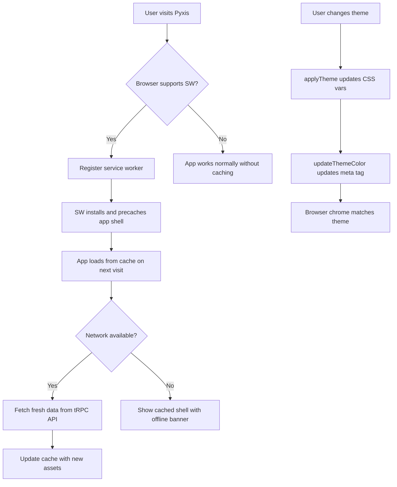

# PWA: Fully Immersive Progressive Web App

## Goal

Make Pyxis installable as a native-feeling music app on mobile and desktop. When added to home screen, it should launch fullscreen without browser chrome, respect notches/safe areas, prevent accidental zoom/pull-to-refresh, and dynamically sync theme colors with the active Pyxis theme.

## Requirements

- Installable via browser "Add to Home Screen" prompt
- Launches in standalone mode (no address bar, no browser UI)
- Extends content to notch/safe areas on modern phones (`viewport-fit=cover`)
- Prevents pull-to-refresh, pinch-zoom, and double-tap zoom
- Dynamic `<meta name="theme-color">` synced to active Pyxis theme
- Inline theme flash prevention (load theme before React renders)
- NowPlayingBar respects bottom safe area on notched devices
- MobileNav header respects top safe area
- App shell cached via service worker for instant launch
- Works offline with graceful degradation (shows cached shell, queues API calls)

## Source Files

| File | Type | Change |
|---|---|---|
| `index.html` | HTML | Add PWA meta tags, manifest link, inline theme script, SW registration |
| `public/manifest.json` | JSON | **NEW** - Web app manifest |
| `public/sw.js` | JS | **NEW** - Service worker with caching strategies |
| `src/web/index.css` | CSS | Add safe-area padding utilities, overscroll prevention |
| `src/web/lib/themes.ts` | TS | Add `updateThemeColor()` to sync `<meta theme-color>` on theme change |
| `src/web/components/layout/RootLayout.tsx` | TSX | Safe area classes |
| `src/web/components/layout/NowPlayingBar.tsx` | TSX | Bottom safe area padding |
| `src/web/components/layout/MobileNav.tsx` | TSX | Top safe area padding |
| `vite.config.ts` | TS | Ensure `public/` served correctly |

## UI Concept

### Mobile Standalone (iPhone notch device)

```html
<!-- Simulates how the app looks as an installed PWA on a notched phone -->
<div style="width:375px; height:812px; border-radius:40px; overflow:hidden; border:3px solid #333; position:relative; background:#18181b; font-family:system-ui;">
  <!-- Status bar area (notch safe area) -->
  <div style="height:44px; background:rgba(9,9,11,0.95); display:flex; align-items:flex-end; justify-content:center; padding-bottom:4px;">
    <span style="color:#f4f4f5; font-size:12px; font-weight:600;">9:41</span>
  </div>

  <!-- Mobile nav header (below safe area) -->
  <div style="display:flex; align-items:center; justify-content:space-between; padding:12px 16px; border-bottom:1px solid #27272a; background:#09090b;">
    <span style="color:#06b6d4; font-size:20px; font-weight:700;">pyxis</span>
    <div style="width:24px; height:24px; display:flex; flex-direction:column; gap:4px; justify-content:center;">
      <div style="height:2px; background:#a1a1aa; border-radius:1px;"></div>
      <div style="height:2px; background:#a1a1aa; border-radius:1px;"></div>
      <div style="height:2px; background:#a1a1aa; border-radius:1px;"></div>
    </div>
  </div>

  <!-- Content area -->
  <div style="flex:1; padding:16px; overflow:auto; height:calc(100% - 44px - 56px - 72px - 34px);">
    <h2 style="color:#f4f4f5; font-size:20px; font-weight:700; margin:0 0 16px;">Your Stations</h2>
    <div style="display:flex; flex-direction:column; gap:8px;">
      <div style="display:flex; align-items:center; gap:12px; padding:12px; background:#27272a; border-radius:8px;">
        <div style="width:48px; height:48px; background:linear-gradient(135deg,#06b6d4,#a855f7); border-radius:6px;"></div>
        <div>
          <div style="color:#f4f4f5; font-size:14px; font-weight:500;">Chill Vibes</div>
          <div style="color:#a1a1aa; font-size:12px;">Last played 2h ago</div>
        </div>
      </div>
      <div style="display:flex; align-items:center; gap:12px; padding:12px; background:#27272a; border-radius:8px;">
        <div style="width:48px; height:48px; background:linear-gradient(135deg,#eab308,#ef4444); border-radius:6px;"></div>
        <div>
          <div style="color:#f4f4f5; font-size:14px; font-weight:500;">Classic Rock</div>
          <div style="color:#a1a1aa; font-size:12px;">Last played yesterday</div>
        </div>
      </div>
    </div>
  </div>

  <!-- Now Playing Bar (with bottom safe area padding) -->
  <div style="position:absolute; bottom:0; left:0; right:0; background:rgba(9,9,11,0.95); backdrop-filter:blur(10px); border-top:1px solid #27272a;">
    <!-- Progress bar -->
    <div style="height:3px; background:#27272a;">
      <div style="height:100%; width:35%; background:#06b6d4;"></div>
    </div>
    <div style="display:flex; align-items:center; gap:12px; padding:8px 16px;">
      <div style="width:40px; height:40px; background:linear-gradient(135deg,#06b6d4,#a855f7); border-radius:4px;"></div>
      <div style="flex:1; min-width:0;">
        <div style="color:#f4f4f5; font-size:13px; font-weight:500; white-space:nowrap; overflow:hidden; text-overflow:ellipsis;">Comfortably Numb</div>
        <div style="color:#a1a1aa; font-size:11px; white-space:nowrap; overflow:hidden; text-overflow:ellipsis;">Pink Floyd — The Wall</div>
      </div>
      <div style="display:flex; gap:4px; align-items:center;">
        <div style="width:36px; height:36px; background:#06b6d4; border-radius:50%; display:flex; align-items:center; justify-content:center;">
          <span style="color:white; font-size:14px;">&#9654;</span>
        </div>
        <div style="width:32px; height:32px; display:flex; align-items:center; justify-content:center;">
          <span style="color:#a1a1aa; font-size:14px;">&#9197;</span>
        </div>
      </div>
    </div>
    <!-- Bottom safe area (home indicator region) -->
    <div style="height:34px; background:rgba(9,9,11,0.95);"></div>
  </div>
</div>
```

### Install Prompt (Android Chrome)

```html
<div style="width:375px; font-family:system-ui; background:#18181b; padding:20px; border-radius:12px;">
  <!-- Android mini-infobar style -->
  <div style="background:#27272a; border-radius:12px; padding:12px 16px; display:flex; align-items:center; gap:12px;">
    <div style="width:40px; height:40px; background:linear-gradient(135deg,#06b6d4,#a855f7); border-radius:8px; display:flex; align-items:center; justify-content:center;">
      <span style="color:white; font-size:18px; font-weight:bold;">P</span>
    </div>
    <div style="flex:1;">
      <div style="color:#f4f4f5; font-size:14px; font-weight:600;">Add Pyxis to Home Screen</div>
      <div style="color:#a1a1aa; font-size:12px;">Install app for the best experience</div>
    </div>
    <button style="background:#06b6d4; color:white; border:none; padding:8px 16px; border-radius:8px; font-size:13px; font-weight:600; cursor:pointer;">Install</button>
  </div>
</div>
```

## Data Flow



## Implementation Details

### manifest.json

```json
{
  "name": "Pyxis - Pandora Client",
  "short_name": "Pyxis",
  "description": "Unofficial Pandora music client",
  "start_url": "/",
  "scope": "/",
  "display": "standalone",
  "display_override": ["standalone", "minimal-ui"],
  "orientation": "any",
  "background_color": "#18181b",
  "theme_color": "#18181b",
  "icons": [
    { "src": "/icons/icon-192.png", "sizes": "192x192", "type": "image/png", "purpose": "any maskable" },
    { "src": "/icons/icon-512.png", "sizes": "512x512", "type": "image/png", "purpose": "any maskable" }
  ]
}
```

### Service Worker Strategy

| Request Type | Strategy | Rationale |
|---|---|---|
| App shell (HTML) | Network-first, cache fallback | Always try fresh, serve cached if offline |
| Static assets (JS, CSS, fonts) | Cache-first | Hashed filenames = safe to cache aggressively |
| API calls (`/trpc/*`) | Network-only | Real-time data, no stale responses |
| Images (album art) | Cache-first with expiry | Album art rarely changes |

### index.html Additions

- `<meta name="viewport" content="width=device-width, initial-scale=1.0, maximum-scale=1.0, user-scalable=no, viewport-fit=cover, interactive-widget=resizes-content">`
- `<meta name="theme-color" content="#18181b">`
- `<meta name="mobile-web-app-capable" content="yes">`
- `<meta name="apple-mobile-web-app-capable" content="yes">`
- `<meta name="apple-mobile-web-app-status-bar-style" content="black-translucent">`
- `<meta name="apple-mobile-web-app-title" content="Pyxis">`
- `<link rel="manifest" href="/manifest.json">`
- Inline `<script>` for theme flash prevention (read `pyxis-theme` from localStorage, apply CSS vars before React)
- SW registration script at end of body

### CSS Safe Area Additions (index.css)

```css
html, body {
  overscroll-behavior-y: none;  /* Prevent pull-to-refresh */
}

/* Safe area utilities for notched devices */
.safe-top { padding-top: env(safe-area-inset-top); }
.safe-bottom { padding-bottom: env(safe-area-inset-bottom); }
.safe-left { padding-left: env(safe-area-inset-left); }
.safe-right { padding-right: env(safe-area-inset-right); }
```

### Dynamic Theme Color Sync

In `themes.ts`, `applyTheme()` will also update `<meta name="theme-color">`:
```typescript
document.querySelector('meta[name="theme-color"]')?.setAttribute('content', c.background);
```

This makes the Android status bar / iOS status bar match the active theme.

### Icon Generation

Generate placeholder icons from the app's primary color palette. Two sizes needed:
- 192x192 PNG (home screen icon)
- 512x512 PNG (splash screen)

SVG fallback in manifest for browsers that support it.

## Acceptance Criteria

- [ ] `manifest.json` exists in `public/` with name, icons, display: standalone, theme_color
- [ ] `index.html` has all PWA meta tags (theme-color, apple-mobile-web-app-capable, viewport-fit=cover, etc.)
- [ ] Service worker registers on load, precaches app shell
- [ ] App installs via browser "Add to Home Screen"
- [ ] Installed app launches without browser chrome (standalone mode)
- [ ] NowPlayingBar has bottom safe area padding on notched devices
- [ ] MobileNav has top safe area padding on notched devices
- [ ] Pull-to-refresh is disabled (`overscroll-behavior-y: none`)
- [ ] Pinch-zoom is disabled (`user-scalable=no, maximum-scale=1`)
- [ ] Theme changes update `<meta name="theme-color">` (browser chrome matches)
- [ ] No theme flash on load (inline script applies saved theme before React)
- [ ] Cached app shell loads instantly on repeat visits
- [ ] Offline state shows graceful degradation (not a blank screen)
