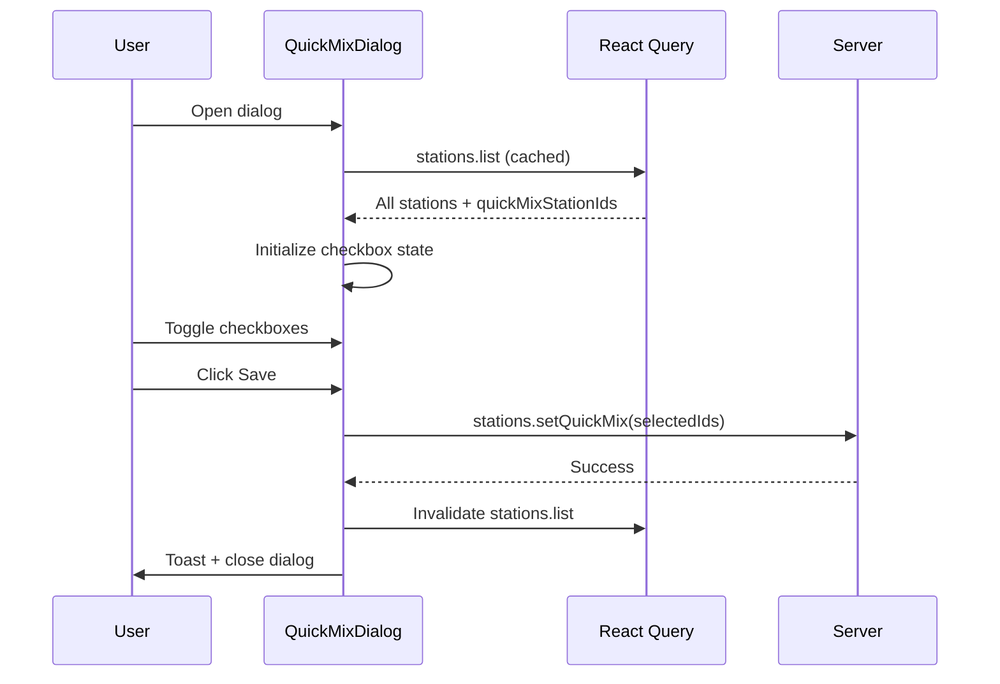
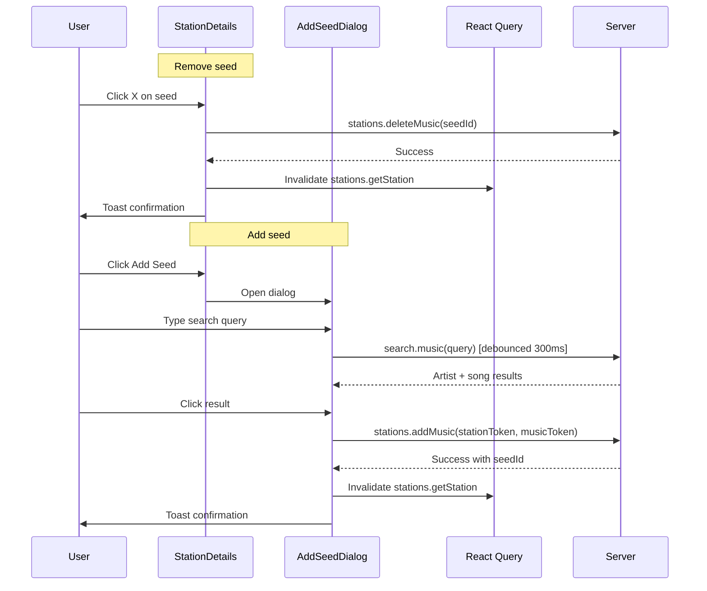

# QuickMix & Seed Management for Web App

## Goal

Add QuickMix (Shuffle) management and station seed management to the web UI. These are the two remaining station-management features that the TUI has but the web app lacks. The station details page already exists as a read-only view -- this work adds interactivity to it.

## Requirements

- Manage which stations are included in QuickMix/Shuffle
- View, add, and remove station seeds (artists/songs)
- Reuse existing `src/client.ts` API methods (`setQuickMix`, `addMusic`, `deleteMusic`, `search`)
- Wire through tRPC endpoints on the server

## Source Files

### Existing (Reuse)

| File | Relevant API | Status |
|------|-------------|--------|
| `src/client.ts` | `setQuickMix()`, `addMusic()`, `deleteMusic()`, `search()`, `getStation()` | Ready |
| `src/types/api.ts` | `StationSeed`, `AddMusicRequest`, `DeleteMusicRequest`, `SetQuickMixRequest`, `MusicSearchResponse` | Ready |
| `server/routers/stations.ts` | `list`, `getStation`, `create`, `delete`, `rename` | Needs new endpoints |
| `server/routers/search.ts` | Music search endpoint | Check if exists |
| `src/web/routes/index.tsx` | Station list page | Needs QuickMix entry point |
| `src/web/routes/station-details.tsx` | Read-only station details | Needs seed CRUD |
| `src/web/components/stations/StationList.tsx` | Station list component | Needs QuickMix action |

### New / Modified Files

| File | Purpose |
|------|---------|
| `server/routers/stations.ts` | Add `setQuickMix`, `addMusic`, `deleteMusic` endpoints |
| `src/web/routes/station-details.tsx` | Add seed add/remove interactivity |
| `src/web/components/stations/QuickMixDialog.tsx` | Station toggle checklist dialog |
| `src/web/components/stations/AddSeedDialog.tsx` | Search + add seed dialog |
| `src/web/routes/index.tsx` | Add QuickMix management entry point |

---

## Phase 1: Server Endpoints

**Goal**: Add missing tRPC endpoints so the frontend has APIs to call.

### Changes to `server/routers/stations.ts`

Add 3 new mutations:

```typescript
// setQuickMix - toggle which stations are in Shuffle
setQuickMix: protectedProcedure
  .input(z.object({ quickMixStationIds: z.array(z.string()) }))
  .mutation(...)

// addMusic - add a seed to a station
addMusic: protectedProcedure
  .input(z.object({ stationToken: z.string(), musicToken: z.string() }))
  .mutation(...)

// deleteMusic - remove a seed from a station
deleteMusic: protectedProcedure
  .input(z.object({ seedId: z.string() }))
  .mutation(...)
```

### Acceptance Criteria (Phase 1)

- [ ] `stations.setQuickMix` mutation accepts station ID array
- [ ] `stations.addMusic` mutation accepts stationToken + musicToken
- [ ] `stations.deleteMusic` mutation accepts seedId

---

## Phase 2: QuickMix Management UI

**Goal**: Add a dialog to toggle which stations are included in Shuffle/QuickMix.

### Entry Point

Add a "Manage Shuffle" button to the station list page (`src/web/routes/index.tsx`), visible when the station list contains a QuickMix station.

### UI Concept: QuickMix Dialog

```html
<!-- Trigger: button on station list page -->
<button class="flex items-center gap-2 px-3 py-1.5 text-sm text-purple-400 hover:bg-purple-500/10 rounded-lg">
  <svg class="w-4 h-4"><!-- shuffle icon --></svg>
  Manage Shuffle
</button>

<!-- Dialog overlay -->
<div class="fixed inset-0 bg-black/60 flex items-center justify-center p-4 z-50">
  <div class="bg-zinc-900 border border-zinc-800 rounded-xl w-full max-w-md max-h-[70vh] flex flex-col shadow-2xl">
    <!-- Header -->
    <div class="p-4 border-b border-zinc-800 flex items-center justify-between shrink-0">
      <div>
        <h2 class="text-lg font-semibold text-zinc-100">Manage Shuffle</h2>
        <p class="text-sm text-zinc-500">12 of 24 stations selected</p>
      </div>
      <div class="flex gap-2">
        <button class="text-xs text-zinc-500 hover:text-zinc-300 px-2 py-1 rounded hover:bg-zinc-800">All</button>
        <button class="text-xs text-zinc-500 hover:text-zinc-300 px-2 py-1 rounded hover:bg-zinc-800">None</button>
      </div>
    </div>

    <!-- Station list with checkboxes -->
    <div class="flex-1 overflow-y-auto p-2 space-y-0.5">
      <!-- Selected station -->
      <label class="flex items-center gap-3 p-3 rounded-lg hover:bg-zinc-800 cursor-pointer">
        <input type="checkbox" checked class="w-4 h-4 rounded border-zinc-600 text-purple-500 focus:ring-purple-500 bg-zinc-800" />
        <span class="text-sm text-zinc-200">Classic Rock Radio</span>
      </label>

      <!-- Unselected station -->
      <label class="flex items-center gap-3 p-3 rounded-lg hover:bg-zinc-800 cursor-pointer">
        <input type="checkbox" class="w-4 h-4 rounded border-zinc-600 text-purple-500 focus:ring-purple-500 bg-zinc-800" />
        <span class="text-sm text-zinc-400">Jazz Piano Radio</span>
      </label>

      <!-- More stations... -->
      <label class="flex items-center gap-3 p-3 rounded-lg hover:bg-zinc-800 cursor-pointer">
        <input type="checkbox" checked class="w-4 h-4 rounded border-zinc-600 text-purple-500 focus:ring-purple-500 bg-zinc-800" />
        <span class="text-sm text-zinc-200">Indie Folk Radio</span>
      </label>
    </div>

    <!-- Footer -->
    <div class="p-4 border-t border-zinc-800 flex gap-3 justify-end shrink-0">
      <button class="px-4 py-2 text-sm text-zinc-400 hover:bg-zinc-800 rounded-lg">
        Cancel
      </button>
      <button class="px-4 py-2 text-sm text-zinc-900 bg-purple-500 hover:bg-purple-400 rounded-lg font-medium">
        Save
      </button>
    </div>
  </div>
</div>
```

### Data Flow



### Acceptance Criteria (Phase 2)

- [ ] "Manage Shuffle" button visible on station list when QuickMix exists
- [ ] Dialog shows all non-QuickMix stations with checkboxes
- [ ] Pre-selects stations currently in QuickMix
- [ ] "All" / "None" quick-select buttons work
- [ ] Shows count of selected stations
- [ ] Save calls `stations.setQuickMix` mutation
- [ ] Station list refreshes after save
- [ ] Cancel closes without changes

---

## Phase 3: Seed Management on Station Details

**Goal**: Make station details page interactive -- add and remove seeds.

### Changes to `src/web/routes/station-details.tsx`

1. Add "Remove" button to each `SeedItem`
2. Add "Add Seed" button that opens a search dialog
3. Wire up mutations for `addMusic` and `deleteMusic`

### UI Concept: Interactive Station Details (Seeds Section)

```html
<div>
  <div class="flex items-center justify-between mb-3">
    <h3 class="text-sm font-medium text-zinc-400 uppercase tracking-wide">Seeds</h3>
    <button class="flex items-center gap-1.5 px-3 py-1.5 text-sm text-cyan-400 hover:bg-cyan-500/10 rounded-lg">
      <svg class="w-4 h-4"><!-- plus icon --></svg>
      Add Seed
    </button>
  </div>

  <!-- Artist seeds -->
  <p class="text-xs text-zinc-500 mb-1">Artists</p>
  <div class="space-y-1 mb-4">
    <!-- Seed with remove button -->
    <div class="flex items-center gap-3 p-3 rounded-lg bg-zinc-800/50 group">
      <div class="w-8 h-8 rounded-full bg-zinc-700 flex items-center justify-center shrink-0">
        <svg class="w-4 h-4 text-zinc-400"><!-- user icon --></svg>
      </div>
      <div class="flex-1 min-w-0">
        <p class="text-sm text-zinc-300 truncate">Pink Floyd</p>
      </div>
      <button
        class="opacity-0 group-hover:opacity-100 p-1.5 text-zinc-500 hover:text-red-400 hover:bg-red-500/10 rounded transition-all"
        title="Remove seed"
      >
        <svg class="w-4 h-4"><!-- x icon --></svg>
      </button>
    </div>

    <div class="flex items-center gap-3 p-3 rounded-lg bg-zinc-800/50 group">
      <div class="w-8 h-8 rounded-full bg-zinc-700 flex items-center justify-center shrink-0">
        <svg class="w-4 h-4 text-zinc-400"><!-- user icon --></svg>
      </div>
      <div class="flex-1 min-w-0">
        <p class="text-sm text-zinc-300 truncate">Led Zeppelin</p>
      </div>
      <button
        class="opacity-0 group-hover:opacity-100 p-1.5 text-zinc-500 hover:text-red-400 hover:bg-red-500/10 rounded transition-all"
        title="Remove seed"
      >
        <svg class="w-4 h-4"><!-- x icon --></svg>
      </button>
    </div>
  </div>

  <!-- Song seeds -->
  <p class="text-xs text-zinc-500 mb-1">Songs</p>
  <div class="space-y-1">
    <div class="flex items-center gap-3 p-3 rounded-lg bg-zinc-800/50 group">
      <div class="w-8 h-8 rounded-full bg-zinc-700 flex items-center justify-center shrink-0">
        <svg class="w-4 h-4 text-zinc-400"><!-- music icon --></svg>
      </div>
      <div class="flex-1 min-w-0">
        <p class="text-sm text-zinc-300 truncate">Comfortably Numb</p>
        <p class="text-xs text-zinc-500 truncate">Pink Floyd</p>
      </div>
      <button
        class="opacity-0 group-hover:opacity-100 p-1.5 text-zinc-500 hover:text-red-400 hover:bg-red-500/10 rounded transition-all"
        title="Remove seed"
      >
        <svg class="w-4 h-4"><!-- x icon --></svg>
      </button>
    </div>
  </div>
</div>
```

### UI Concept: Add Seed Dialog

```html
<div class="fixed inset-0 bg-black/60 flex items-center justify-center p-4 z-50">
  <div class="bg-zinc-900 border border-zinc-800 rounded-xl w-full max-w-md max-h-[70vh] flex flex-col shadow-2xl">
    <!-- Header with search -->
    <div class="p-4 border-b border-zinc-800 shrink-0">
      <h2 class="text-lg font-semibold text-zinc-100 mb-3">Add Seed</h2>
      <div class="relative">
        <svg class="absolute left-3 top-1/2 -translate-y-1/2 w-4 h-4 text-zinc-500">
          <!-- search icon -->
        </svg>
        <input
          type="text"
          placeholder="Search artists or songs..."
          autofocus
          class="w-full pl-9 pr-4 py-2 bg-zinc-800 border border-zinc-700 rounded-lg text-sm text-zinc-100 placeholder:text-zinc-500 focus-visible:outline-none focus-visible:ring-2 focus-visible:ring-cyan-500"
        />
      </div>
    </div>

    <!-- Results -->
    <div class="flex-1 overflow-y-auto p-2">
      <!-- Loading -->
      <div class="hidden py-8 text-center">
        <svg class="w-5 h-5 animate-spin mx-auto text-zinc-500"><!-- spinner --></svg>
      </div>

      <!-- Artists section -->
      <div class="mb-2">
        <p class="text-xs text-zinc-500 px-3 py-1">Artists</p>
        <button class="w-full flex items-center gap-3 p-3 rounded-lg hover:bg-zinc-800 text-left">
          <div class="w-8 h-8 rounded-full bg-zinc-700 flex items-center justify-center shrink-0">
            <svg class="w-4 h-4 text-zinc-400"><!-- user icon --></svg>
          </div>
          <span class="text-sm text-zinc-200">Pink Floyd</span>
          <span class="ml-auto text-xs text-cyan-400 bg-cyan-500/10 px-2 py-0.5 rounded">Add</span>
        </button>
      </div>

      <!-- Songs section -->
      <div>
        <p class="text-xs text-zinc-500 px-3 py-1">Songs</p>
        <button class="w-full flex items-center gap-3 p-3 rounded-lg hover:bg-zinc-800 text-left">
          <div class="w-8 h-8 rounded-full bg-zinc-700 flex items-center justify-center shrink-0">
            <svg class="w-4 h-4 text-zinc-400"><!-- music icon --></svg>
          </div>
          <div class="flex-1 min-w-0">
            <p class="text-sm text-zinc-200 truncate">Wish You Were Here</p>
            <p class="text-xs text-zinc-500 truncate">Pink Floyd</p>
          </div>
          <span class="ml-auto text-xs text-cyan-400 bg-cyan-500/10 px-2 py-0.5 rounded shrink-0">Add</span>
        </button>
      </div>

      <!-- Empty state -->
      <div class="hidden py-8 text-center text-zinc-500 text-sm">
        Search for artists or songs to add as seeds
      </div>
    </div>

    <!-- Footer -->
    <div class="p-4 border-t border-zinc-800 shrink-0">
      <button class="w-full px-4 py-2 text-sm text-zinc-400 hover:bg-zinc-800 rounded-lg">
        Done
      </button>
    </div>
  </div>
</div>
```

### Data Flow



### Acceptance Criteria (Phase 3)

- [ ] Each seed shows remove button on hover
- [ ] Clicking remove calls `deleteMusic` and refreshes
- [ ] "Add Seed" button opens search dialog
- [ ] Search debounces at 300ms
- [ ] Results grouped by artists/songs
- [ ] Clicking result adds seed and shows toast
- [ ] Station details refresh after add/remove
- [ ] Loading/empty states display correctly
