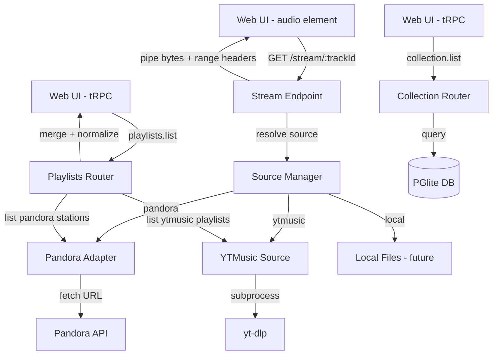

# Source Abstraction Layer

## Goal

Transform Pyxis from a Pandora-only client into a **unified music app** with two listening modes: **Albums** and **Curated Playlists**. The user should never care where music comes from — Pandora, YouTube Music, local files, or future sources are all implementation details hidden behind a common abstraction.

Albums are collected (bookmarked) through listening or search, stored in a flat collection, and played on demand. Playlists are infinite/finite streams from any source (Pandora stations, YTMusic playlists) treated as equal peers. All audio is served through a unified stream endpoint that proxies from any source, enabling playback on remote devices.

## Requirements

### Source Abstraction (`src/sources/`)
- Capability-based source interface (inspired by Lull's `@lull/sources`):
  - **SearchCapability**: Find albums/tracks matching a query
  - **PlaylistCapability**: List and fetch tracks from curated playlists
  - **StreamCapability**: Provide audio stream for a given track
- Each source implements a subset of capabilities (type guards for checking)
- Pandora source wraps existing `src/client.ts` — no rewrite, just adapter
- YouTube Music source uses `yt-dlp` subprocess (already in flake)
- Sources normalize to shared canonical types (not Pandora-specific types)

### Canonical Types
- `CanonicalTrack`: id, title, artist, album, duration, sourceId, artworkUrl
- `CanonicalAlbum`: id, title, artist, year, tracks, artworkUrl, sourceIds
- `CanonicalPlaylist`: id, name, source, description — tracks fetched on demand
- `SourceId`: discriminated union `{ source: "pandora" | "ytmusic" | "local"; id: string }`

### Persistence (Drizzle ORM + PGlite)
- Album collection: bookmarked albums with source cross-references
- Listening history (optional, future)
- PGlite runs embedded — no external database dependency

### Stream Endpoint
- tRPC query `stream.resolve` returns metadata + stream URL
- `/stream/:trackId` HTTP endpoint on the Bun server with range request support
- Server proxies audio from source (Pandora URL fetch, yt-dlp pipe, local file read)
- Client `<audio>` element points to `/stream/:trackId` — source-agnostic

### UI Changes
- Home page with two sections: **My Albums** and **My Playlists**
- Playlists section shows both Pandora stations and YTMusic playlists as peers
- Albums section shows bookmarked collection (flat grid)
- Playback hook updated to use `/stream/:trackId` instead of direct Pandora URLs

### First Milestone: YouTube Music Playlists
- YTMusic source with PlaylistCapability + StreamCapability
- `yt-dlp` for audio URL extraction and streaming
- Playlists page showing both Pandora stations and YTMusic playlists
- Unified stream endpoint serving both sources

## Source Files

### New Files

| Path | Purpose |
|------|---------|
| `src/sources/types.ts` | Canonical types, source interface, capability traits |
| `src/sources/index.ts` | Source registry, createSourceManager() |
| `src/sources/pandora/index.ts` | Pandora adapter wrapping `src/client.ts` |
| `src/sources/ytmusic/index.ts` | YouTube Music source (yt-dlp based) |
| `src/sources/ytmusic/yt-dlp.ts` | yt-dlp subprocess wrapper |
| `server/services/stream.ts` | Stream proxy service (range requests, source dispatch) |
| `server/routers/stream.ts` | tRPC stream.resolve procedure |
| `server/routers/collection.ts` | Album collection CRUD |
| `server/routers/playlists.ts` | Unified playlist listing (multi-source) |
| `src/db/schema.ts` | Drizzle schema (albums, tracks, source_refs) |
| `src/db/index.ts` | PGlite + Drizzle client setup |
| `src/db/migrate.ts` | Migration runner |

### Modified Files

| Path | Change |
|------|--------|
| `server/index.ts` | Add `/stream/:trackId` HTTP route alongside tRPC |
| `server/router.ts` | Add stream, collection, playlists routers |
| `server/trpc.ts` | Extend Context with sourceManager and db |
| `server/services/playback.ts` | Use canonical track type, resolve via stream endpoint |
| `server/handlers/websocket.ts` | Send `/stream/:trackId` URLs instead of Pandora URLs |
| `src/web/hooks/usePlayback.ts` | Point `<audio>` at `/stream/:trackId` |
| `src/web/routes/index.tsx` | Redesign as Home with Albums + Playlists sections |
| `src/web/routes/now-playing.tsx` | Use canonical track shape |
| `src/types/api.ts` | Keep Pandora types, add canonical re-exports |
| `package.json` | Add drizzle-orm, @electric-sql/pglite, drizzle-kit |

## Data Flow



## UI Concept

### Home Page (Albums + Playlists)

```html
<div class="min-h-screen bg-zinc-950 text-white">
  <!-- Top bar -->
  <div class="sticky top-0 z-10 bg-zinc-950/80 backdrop-blur-md border-b border-zinc-800 px-6 py-4 flex items-center justify-between">
    <h1 class="text-xl font-semibold">Pyxis</h1>
    <div class="flex items-center gap-3">
      <button class="p-2 rounded-full hover:bg-zinc-800">
        <svg class="w-5 h-5" fill="none" stroke="currentColor" viewBox="0 0 24 24"><path stroke-linecap="round" stroke-linejoin="round" stroke-width="2" d="M21 21l-6-6m2-5a7 7 0 11-14 0 7 7 0 0114 0z"/></svg>
      </button>
      <button class="p-2 rounded-full hover:bg-zinc-800">
        <svg class="w-5 h-5" fill="none" stroke="currentColor" viewBox="0 0 24 24"><path stroke-linecap="round" stroke-linejoin="round" stroke-width="2" d="M10.325 4.317c.426-1.756 2.924-1.756 3.35 0a1.724 1.724 0 002.573 1.066c1.543-.94 3.31.826 2.37 2.37a1.724 1.724 0 001.066 2.573c1.756.426 1.756 2.924 0 3.35a1.724 1.724 0 00-1.066 2.573c.94 1.543-.826 3.31-2.37 2.37a1.724 1.724 0 00-2.573 1.066c-.426 1.756-2.924 1.756-3.35 0a1.724 1.724 0 00-2.573-1.066c-1.543.94-3.31-.826-2.37-2.37a1.724 1.724 0 00-1.066-2.573c-1.756-.426-1.756-2.924 0-3.35a1.724 1.724 0 001.066-2.573c-.94-1.543.826-3.31 2.37-2.37.996.608 2.296.07 2.572-1.065z"/><path stroke-linecap="round" stroke-linejoin="round" stroke-width="2" d="M15 12a3 3 0 11-6 0 3 3 0 016 0z"/></svg>
      </button>
    </div>
  </div>

  <div class="px-6 py-6 space-y-10">
    <!-- My Playlists Section -->
    <section>
      <div class="flex items-center justify-between mb-4">
        <h2 class="text-lg font-semibold text-zinc-100">My Playlists</h2>
        <button class="text-sm text-zinc-400 hover:text-white">See all</button>
      </div>
      <div class="grid grid-cols-2 sm:grid-cols-3 md:grid-cols-4 lg:grid-cols-5 gap-3">
        <!-- Pandora station -->
        <div class="group cursor-pointer">
          <div class="aspect-square bg-gradient-to-br from-indigo-600 to-purple-800 rounded-lg mb-2 flex items-center justify-center relative overflow-hidden">
            <span class="text-xs font-medium text-indigo-200/60 uppercase tracking-wider">Pandora</span>
            <div class="absolute inset-0 bg-black/0 group-hover:bg-black/30 transition-colors flex items-center justify-center">
              <div class="opacity-0 group-hover:opacity-100 transition-opacity bg-emerald-500 rounded-full p-2.5 shadow-lg">
                <svg class="w-5 h-5 text-black" fill="currentColor" viewBox="0 0 24 24"><path d="M8 5v14l11-7z"/></svg>
              </div>
            </div>
          </div>
          <p class="text-sm font-medium text-zinc-200 truncate">Today's Hits Radio</p>
          <p class="text-xs text-zinc-500">Pandora</p>
        </div>
        <!-- YTMusic playlist -->
        <div class="group cursor-pointer">
          <div class="aspect-square bg-gradient-to-br from-red-600 to-red-900 rounded-lg mb-2 flex items-center justify-center relative overflow-hidden">
            <span class="text-xs font-medium text-red-200/60 uppercase tracking-wider">YouTube</span>
            <div class="absolute inset-0 bg-black/0 group-hover:bg-black/30 transition-colors flex items-center justify-center">
              <div class="opacity-0 group-hover:opacity-100 transition-opacity bg-emerald-500 rounded-full p-2.5 shadow-lg">
                <svg class="w-5 h-5 text-black" fill="currentColor" viewBox="0 0 24 24"><path d="M8 5v14l11-7z"/></svg>
              </div>
            </div>
          </div>
          <p class="text-sm font-medium text-zinc-200 truncate">Discover Weekly</p>
          <p class="text-xs text-zinc-500">YouTube Music</p>
        </div>
        <!-- Another Pandora station -->
        <div class="group cursor-pointer">
          <div class="aspect-square rounded-lg mb-2 relative overflow-hidden">
            
            <div class="absolute inset-0 bg-black/0 group-hover:bg-black/30 transition-colors flex items-center justify-center">
              <div class="opacity-0 group-hover:opacity-100 transition-opacity bg-emerald-500 rounded-full p-2.5 shadow-lg">
                <svg class="w-5 h-5 text-black" fill="currentColor" viewBox="0 0 24 24"><path d="M8 5v14l11-7z"/></svg>
              </div>
            </div>
          </div>
          <p class="text-sm font-medium text-zinc-200 truncate">Pink Floyd Radio</p>
          <p class="text-xs text-zinc-500">Pandora</p>
        </div>
      </div>
    </section>

    <!-- My Albums Section -->
    <section>
      <div class="flex items-center justify-between mb-4">
        <h2 class="text-lg font-semibold text-zinc-100">My Albums</h2>
        <button class="text-sm text-zinc-400 hover:text-white">See all</button>
      </div>
      <div class="grid grid-cols-2 sm:grid-cols-3 md:grid-cols-4 lg:grid-cols-5 gap-3">
        <div class="group cursor-pointer">
          <div class="aspect-square bg-zinc-800 rounded-lg mb-2 relative overflow-hidden">
            
            <div class="absolute inset-0 bg-black/0 group-hover:bg-black/30 transition-colors flex items-center justify-center">
              <div class="opacity-0 group-hover:opacity-100 transition-opacity bg-emerald-500 rounded-full p-2.5 shadow-lg">
                <svg class="w-5 h-5 text-black" fill="currentColor" viewBox="0 0 24 24"><path d="M8 5v14l11-7z"/></svg>
              </div>
            </div>
          </div>
          <p class="text-sm font-medium text-zinc-200 truncate">Dark Side of the Moon</p>
          <p class="text-xs text-zinc-500">Pink Floyd · 1973</p>
        </div>
        <div class="group cursor-pointer">
          <div class="aspect-square bg-zinc-800 rounded-lg mb-2 relative overflow-hidden">
            
            <div class="absolute inset-0 bg-black/0 group-hover:bg-black/30 transition-colors flex items-center justify-center">
              <div class="opacity-0 group-hover:opacity-100 transition-opacity bg-emerald-500 rounded-full p-2.5 shadow-lg">
                <svg class="w-5 h-5 text-black" fill="currentColor" viewBox="0 0 24 24"><path d="M8 5v14l11-7z"/></svg>
              </div>
            </div>
          </div>
          <p class="text-sm font-medium text-zinc-200 truncate">OK Computer</p>
          <p class="text-xs text-zinc-500">Radiohead · 1997</p>
        </div>
        <!-- Empty state placeholder -->
        <div class="aspect-square border-2 border-dashed border-zinc-700 rounded-lg flex flex-col items-center justify-center cursor-pointer hover:border-zinc-500 transition-colors">
          <svg class="w-8 h-8 text-zinc-600 mb-1" fill="none" stroke="currentColor" viewBox="0 0 24 24"><path stroke-linecap="round" stroke-linejoin="round" stroke-width="1.5" d="M12 4v16m8-8H4"/></svg>
          <span class="text-xs text-zinc-600">Add album</span>
        </div>
      </div>
    </section>
  </div>

  <!-- Now Playing Bar (bottom) -->
  <div class="fixed bottom-0 left-0 right-0 bg-zinc-900 border-t border-zinc-800 px-4 py-3 flex items-center gap-4">
    
    <div class="flex-1 min-w-0">
      <p class="text-sm font-medium text-white truncate">Breathe (In the Air)</p>
      <p class="text-xs text-zinc-400 truncate">Pink Floyd · Dark Side of the Moon</p>
    </div>
    <div class="flex items-center gap-2">
      <button class="p-2 text-zinc-400 hover:text-white">
        <svg class="w-5 h-5" fill="currentColor" viewBox="0 0 24 24"><path d="M6 19h4V5H6v14zm8-14v14h4V5h-4z"/></svg>
      </button>
      <button class="p-2 text-zinc-400 hover:text-white">
        <svg class="w-5 h-5" fill="currentColor" viewBox="0 0 24 24"><path d="M6 18l8.5-6L6 6v12zM16 6v12h2V6h-2z"/></svg>
      </button>
    </div>
  </div>
</div>
```

## Acceptance Criteria

- [ ] Source interface defined with SearchCapability, PlaylistCapability, StreamCapability
- [ ] Pandora adapter wraps existing client without modifying it
- [ ] YouTube Music source lists playlists and extracts audio via yt-dlp
- [ ] `/stream/:trackId` serves audio with range request support from any source
- [ ] `usePlayback` hook uses `/stream/:trackId` instead of direct Pandora URLs
- [ ] Home page shows both Pandora stations and YTMusic playlists in one list
- [ ] Album collection stored in PGlite via Drizzle ORM
- [ ] Albums can be bookmarked and appear in My Albums grid
- [ ] Playing a playlist track works regardless of source (Pandora or YTMusic)
- [ ] Source identity shown as subtle label but not a primary UI concern
