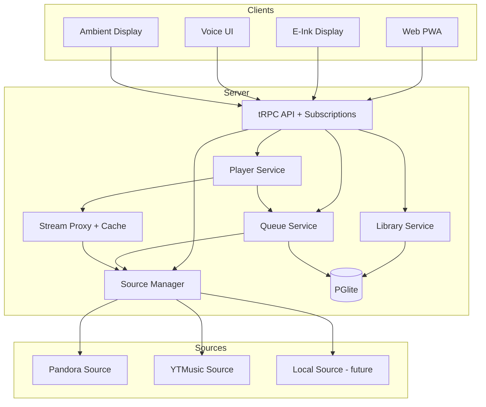
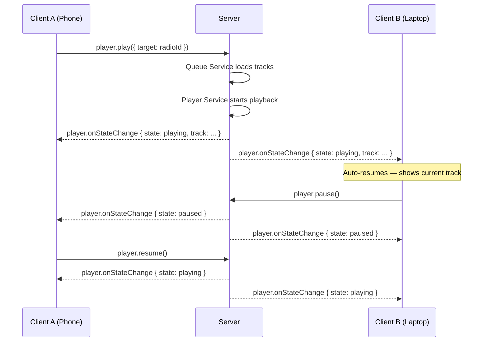

# Pyxis v2 — Architecture Vision

## Identity

Personal unified music hub. Source-agnostic. Single always-on server. The tRPC API is the product — the web UI is just one client.

---

## Core Principles

1. **Source-agnostic** — Clients never see Pandora, YTMusic, or local. Sources are an implementation detail behind opaque IDs.
2. **Server-authoritative** — The server owns playback state, queue, and position. Clients subscribe and send commands.
3. **Transfer model** — Open the app on any device, it auto-resumes. Pause on phone, play on laptop. The server is the single source of truth.
4. **Unified queue** — All sources feed into one queue. A Pandora radio track followed by a YTMusic album track — the client doesn't care.
5. **Stable API contract** — The tRPC surface is the foundation for experimental UIs (e-ink, voice, ambient displays). It must be clean, opaque, and subscription-capable.
6. **Graceful degradation** — If the server goes down, clients handle it. Future: local caching on capable devices.
7. **Multi-user ready** — Not implemented now, but the architecture must not prevent it.

---

## Target Architecture



---

## Opaque ID System

**Encoding**: Base64 of `source:trackId` — stateless, reversible server-side, opaque to clients.

```
Server encodes:  btoa("ytmusic:dQw4w9WgXcQ") → "eXRtdXNpYzpkUXc0dzlXZ1hjUQ=="
Client sees:     "eXRtdXNpYzpkUXc0dzlXZ1hjUQ=="
Server decodes:  atob(id) → "ytmusic:dQw4w9WgXcQ"
```

Applies to: track IDs, album IDs, playlist IDs, artist IDs — anything that currently leaks `source:id` format.

The encoding/decoding happens at the tRPC boundary. Internal server code continues using `source:trackId` composite format. The opaque layer is purely an API concern.

### Source Files

| File | Change |
|------|--------|
| `server/trpc.ts` | Add `encodeId(source, id)` and `decodeId(opaqueId)` utility functions |
| `server/routers/*.ts` | Encode IDs in all responses, decode IDs in all inputs |
| `src/web/**/*.ts` | Remove all composite ID parsing — just pass opaque strings |

---

## API Surface — Hybrid Model

Entities for data. Actions for playback/queue. tRPC subscriptions for realtime.

### Router Structure

| Router | Type | Procedures | Auth |
|--------|------|------------|------|
| **auth** | Mutation/Query | `login`, `logout`, `status` | Public |
| **credentials** | Mutation/Query | `list`, `add`, `remove`, `test` | Protected |
| **track** | Query | `get(id)`, `search(query)`, `streamUrl(id)` | Protected |
| **album** | Query/Mutation | `get(id)`, `search(query)`, `tracks(id)` | Protected |
| **artist** | Query | `get(id)`, `search(query)` | Protected |
| **playlist** | Query/Mutation | `list`, `get(id)`, `tracks(id)`, `create`, `delete` | Protected |
| **radio** | Query/Mutation | `create(seed)`, `getTracks(id)` | Protected |
| **queue** | Query/Mutation/Sub | `get`, `add(trackIds)`, `remove(index)`, `jump(index)`, `clear`, `shuffle` | Protected |
| **player** | Query/Mutation/Sub | `state`, `play(target?)`, `pause`, `resume`, `skip`, `previous`, `seek(position)`, `volume(level)` | Protected |
| **library** | Query/Mutation | `list(type)`, `save(id, type)`, `remove(id, type)` | Protected |
| **search** | Query | `unified(query)` → tracks, albums, artists | Protected |

### Key Subscriptions (tRPC)

| Subscription | Payload | Purpose |
|--------------|---------|---------|
| `player.onStateChange` | `{ state, track, progress, duration }` | Real-time playback state for all connected clients |
| `queue.onChange` | `{ items, currentIndex }` | Queue updates when tracks added/removed/reordered |

### Subscription Data Flow



---

## Server-Side Services

### Player Service (NEW)

Replaces the browser-side `usePlayback` hook as the source of truth.

**Responsibilities:**
- Owns transport state: playing/paused/stopped + current position
- Tracks elapsed time server-side (monotonic clock when playing, frozen when paused)
- Emits state change events to subscription listeners
- Delegates to Queue Service for "what's next"
- Delegates to Stream Proxy for audio URLs

**State:**
```typescript
type PlayerState = {
  status: "playing" | "paused" | "stopped";
  currentTrack: Track | null;
  progress: number;     // seconds elapsed (server-tracked)
  duration: number;     // total track duration
  volume: number;       // 0-100
  updatedAt: number;    // timestamp of last state change
}
```

**Note on audio**: The server does NOT play audio. It tracks state only. Clients play audio from the `/stream/:id` endpoint. The server's progress tracking uses a monotonic clock — when playing, `progress = lastProgress + (now - lastUpdateTime)`. When paused, progress freezes.

### Queue Service (NEW)

The central primitive. All playback flows through the queue.

**Responsibilities:**
- Maintains ordered list of tracks to play
- Supports: add, remove, jump, clear, shuffle, insert-next
- Knows the current index
- Auto-fetches more tracks for radio mode (calls SourceManager)
- Persists queue state to DB (survives server restart)

**State:**
```typescript
type QueueState = {
  items: QueueItem[];
  currentIndex: number;
  context: QueueContext;   // what started this queue
}

type QueueItem = {
  track: Track;           // opaque canonical track
  addedBy: string;        // "radio:seed123" | "user" | "playlist:abc"
}

type QueueContext =
  | { type: "radio"; seedId: string; source: SourceType }
  | { type: "album"; albumId: string }
  | { type: "playlist"; playlistId: string }
  | { type: "manual" }
```

### Library Service (replaces collection + bookmarks routers)

**Responsibilities:**
- Save/remove albums, tracks, playlists to local DB
- List saved items by type
- Explicit saves only (no auto-import)

### Credential Service (NEW — replaces Pandora-specific session model)

**Responsibilities:**
- Store source credentials in DB (username/password per source)
- Test credentials (validate login without creating session)
- Manage active source sessions (Pandora auth tokens, etc.)
- Per-source, not per-user (single-user for now, multi-user ready)

---

## Source Abstraction Changes

The existing `Source` interface and `SourceManager` are well-designed. Key changes:

### New Capability: `RadioCapability`

```typescript
type RadioCapability = {
  readonly createRadio: (seed: RadioSeed) => Promise<RadioSession>;
  readonly getRadioTracks: (sessionId: string) => Promise<readonly CanonicalTrack[]>;
};

type RadioSeed = {
  readonly type: "track" | "artist" | "genre";
  readonly id: string;
};
```

Pandora already has this (stations are radio). YTMusic has "start radio" from any track/artist.

### New Capability: `ArtistCapability`

```typescript
type ArtistCapability = {
  readonly getArtist: (id: string) => Promise<CanonicalArtist>;
  readonly searchArtists: (query: string) => Promise<readonly CanonicalArtist[]>;
};
```

### New Canonical Type: `CanonicalArtist`

```typescript
type CanonicalArtist = {
  readonly id: string;
  readonly name: string;
  readonly artworkUrl?: string;
  readonly sourceId: SourceId;
};
```

### Source Files

| File | Change |
|------|--------|
| `src/sources/types.ts` | Add `RadioCapability`, `ArtistCapability`, `CanonicalArtist`, `RadioSeed` |
| `src/sources/index.ts` | Add `createRadio`, `getRadioTracks`, `getArtist`, `searchArtists` to SourceManager |
| `src/sources/pandora/index.ts` | Implement `RadioCapability` (wrap existing station/playlist API) |
| `src/sources/ytmusic/index.ts` | Implement `RadioCapability` (yt-dlp radio extraction) |

---

## Pandora Client Library — Fold Into Source

Move `src/api/`, `src/crypto/`, `src/http/` into `src/sources/pandora/`. They become internal implementation details of the Pandora source.

### File Moves

| From | To |
|------|-----|
| `src/api/*.ts` | `src/sources/pandora/api/*.ts` |
| `src/crypto/*.ts` | `src/sources/pandora/crypto/*.ts` |
| `src/http/*.ts` | `src/sources/pandora/http/*.ts` |
| `src/types/api.ts` | `src/sources/pandora/types.ts` |
| `src/types/errors.ts` | `src/sources/pandora/errors.ts` |
| `src/client.ts` | `src/sources/pandora/client.ts` |
| `src/constants.ts` | `src/sources/pandora/constants.ts` |
| `src/quality.ts` | `src/sources/pandora/quality.ts` |

### Files to Delete

| Path | Reason |
|------|--------|
| `src/cli/` (entire directory) | CLI deprecated |
| `src/types/config.ts` | CLI config — unused |
| `example.config.yaml` | CLI config example |
| `src/cli/config/README.md` | CLI docs |

---

## Database Schema Changes

### New Tables

```sql
-- Server-side queue persistence
queue_items (
  id TEXT PRIMARY KEY,
  track_id TEXT NOT NULL,        -- opaque encoded ID
  track_title TEXT NOT NULL,
  track_artist TEXT NOT NULL,
  track_album TEXT NOT NULL,
  track_duration INTEGER,
  track_artwork_url TEXT,
  queue_index INTEGER NOT NULL,
  added_by TEXT NOT NULL,        -- "radio:seed123" | "user" | "playlist:abc"
  created_at TIMESTAMP DEFAULT NOW()
)

-- Player state persistence (survives restart)
player_state (
  id TEXT PRIMARY KEY DEFAULT 'singleton',
  status TEXT NOT NULL DEFAULT 'stopped',    -- playing | paused | stopped
  current_queue_index INTEGER,
  progress REAL DEFAULT 0,                   -- seconds
  duration REAL DEFAULT 0,
  volume INTEGER DEFAULT 100,
  updated_at TIMESTAMP DEFAULT NOW()
)

-- Queue context (what started the current queue)
queue_context (
  id TEXT PRIMARY KEY DEFAULT 'singleton',
  type TEXT NOT NULL,            -- radio | album | playlist | manual
  source_id TEXT,                -- for radio/album/playlist
  source_type TEXT,
  updated_at TIMESTAMP DEFAULT NOW()
)

-- Source credentials (replaces single-credential model)
source_credentials (
  id TEXT PRIMARY KEY,
  source TEXT NOT NULL,          -- pandora | ytmusic | ...
  username TEXT NOT NULL,
  password TEXT NOT NULL,
  session_data TEXT,             -- JSON blob for source-specific session tokens
  created_at TIMESTAMP DEFAULT NOW(),
  updated_at TIMESTAMP DEFAULT NOW()
)
```

### Source Files

| File | Change |
|------|--------|
| `src/db/schema.ts` | Add `queueItems`, `playerState`, `queueContext`, `sourceCredentials` tables |
| `src/db/index.ts` | Migration for new tables |

---

## Frontend Changes

### `usePlayback` → Thin Subscription Client

The hook stops owning state and becomes a thin wrapper around tRPC subscriptions:

**Before (current):**
- Creates `HTMLAudioElement`
- Owns all playback state
- Calls tRPC mutations to get tracks
- Manages progress tracking via `timeupdate` events

**After:**
- Subscribes to `player.onStateChange` for state
- Subscribes to `queue.onChange` for queue
- Creates `HTMLAudioElement` but loads URL from server-provided stream endpoint
- Reports actual audio position back to server (for accuracy)
- Sends transport commands (`play`, `pause`, `skip`, `seek`) as tRPC mutations

### Route Changes

Current routes that need updating:

| Route | Current File | Change |
|-------|-------------|--------|
| `/now-playing` | `src/web/routes/now-playing.tsx` | Subscribe to player + queue state instead of local state |
| `/stations` | `src/web/routes/stations.tsx` | Rename to playlists/radio, use opaque IDs |
| `/bookmarks` | `src/web/routes/bookmarks.tsx` | Merge into library |
| `/` | `src/web/routes/home.tsx` | Use library queries |

### WebSocket Removal

| File | Change |
|------|--------|
| `src/web/hooks/useWebSocket.ts` | Delete — replaced by tRPC subscriptions |
| `server/handlers/websocket.ts` | Delete — replaced by tRPC subscriptions |
| `server/services/playback.ts` | Fold into new Player Service |
| `server/index.ts` | Remove WebSocket upgrade handling |

---

## Migration Phases

Each phase is scoped to fit within a single LLM context window (~200k tokens). Each phase should result in a working application.

### Phase 1: Remove CLI

**Goal**: Clean the codebase. Remove the CLI layer and fold Pandora client library into `src/sources/pandora/`.

**Scope:**
- Delete `src/cli/` (58 files)
- Move `src/api/`, `src/crypto/`, `src/http/`, relevant `src/types/` into `src/sources/pandora/`
- Move `src/client.ts`, `src/constants.ts`, `src/quality.ts` into `src/sources/pandora/`
- Update all imports in `server/` and `src/sources/pandora/index.ts`
- Remove CLI-only `tsconfig.json` config (keep `tsconfig.web.json`)
- Remove CLI dependencies from `package.json` (`commander`, `cli-table3`, `picocolors`)
- Update `package.json` scripts (remove `build`, `start:cli`, `cli`)
- Verify: `bun run typecheck`, `bun test`, `bun run build:web`

**Produces**: Same working app, but cleaner codebase.

### Phase 2: Opaque IDs + API Reshape

**Goal**: Introduce opaque ID encoding and reshape tRPC routers to the target structure.

**Scope:**
- Add `server/lib/ids.ts` with `encodeId`/`decodeId`
- Create new routers: `track`, `album`, `artist`, `radio`, `queue`, `player`, `library`, `search`, `credentials`
- Implement entity routers (`track`, `album`, `artist`) wrapping existing SourceManager calls
- Merge `bookmarks` + `collection` → `library` router
- Merge `stations` + `playback` + `genres` → `radio` + `player` + `queue` routers (initially thin wrappers)
- All responses emit opaque IDs, all inputs accept opaque IDs
- Update frontend to use new router paths
- Remove old routers (`stations`, `playback`, `bookmarks`, `genres`, `user`, `stream`, `playlists`, `collection`)
- Verify: full app works with opaque IDs

**Produces**: New API surface, still browser-owned playback.

### Phase 3: Server-Authoritative Player + Queue

**Goal**: Move playback state and queue to the server. Add tRPC subscriptions.

**Scope:**
- Add `server/services/player.ts` — server-side player state machine
- Add `server/services/queue.ts` — server-side queue with DB persistence
- Add DB tables: `queue_items`, `player_state`, `queue_context`
- Implement `queue.*` and `player.*` procedures including subscriptions
- Add `player.onStateChange` and `queue.onChange` tRPC subscriptions
- Refactor `usePlayback` hook to subscribe to server state
- Remove `useWebSocket` hook and `server/handlers/websocket.ts`
- Remove `server/services/playback.ts` (old WebSocket-based)
- Auto-resume on client connect (subscribe → get current state → sync audio element)
- Verify: cross-tab playback sync works, queue persists across server restart

**Produces**: Server-authoritative playback with cross-device transfer.

### Phase 4: Credential Management + Source Sessions

**Goal**: Source-agnostic credential management. Replace Pandora-centric session model.

**Scope:**
- Add `source_credentials` DB table
- Add `server/services/credentials.ts` — manage per-source credentials
- Implement `credentials.*` router
- Refactor `server/trpc.ts` context: replace `pandoraSession` with generic source session
- Refactor `server/services/session.ts` to be source-agnostic
- Refactor `server/services/sourceManager.ts` to initialize sources from DB credentials
- Update `auth` router to be Pyxis-native (not Pandora-specific)
- Settings page: manage source credentials
- Verify: can add/remove Pandora credentials, YTMusic works without Pandora login

**Produces**: Fully source-agnostic auth and credential management.

---

## Acceptance Criteria (Full v2)

- [ ] No CLI code in the repository
- [ ] Pandora client library lives entirely within `src/sources/pandora/`
- [ ] All IDs in tRPC responses are opaque (base64 encoded)
- [ ] No `source:trackId` composite format visible to any client
- [ ] API routers match target structure (track, album, artist, playlist, radio, queue, player, library, search, auth, credentials)
- [ ] Player state is server-authoritative
- [ ] Queue state is server-authoritative and persisted to DB
- [ ] tRPC subscriptions deliver real-time state to all connected clients
- [ ] Opening the app on a new device auto-resumes current playback state
- [ ] Pause on one device, play on another — seamless transfer
- [ ] No WebSocket handler code — replaced by tRPC subscriptions
- [ ] Source credentials managed in DB, not hardcoded to Pandora
- [ ] `bun run typecheck` passes
- [ ] `bun test` passes
- [ ] `bun run build:web` succeeds
- [ ] Application works end-to-end with both Pandora and YTMusic sources
