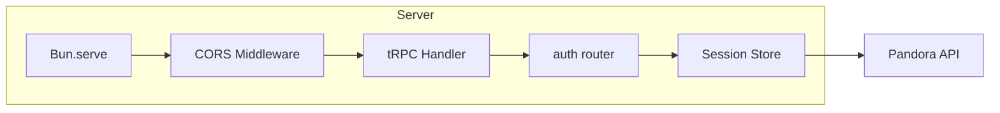
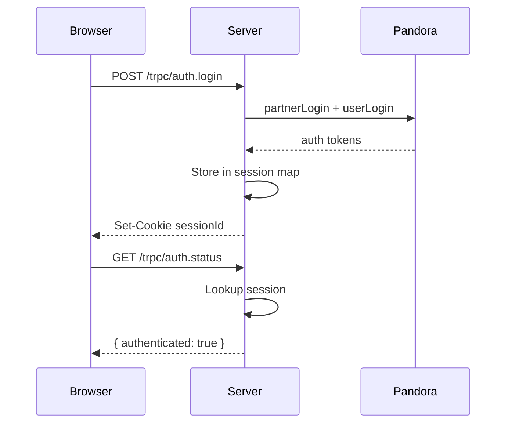
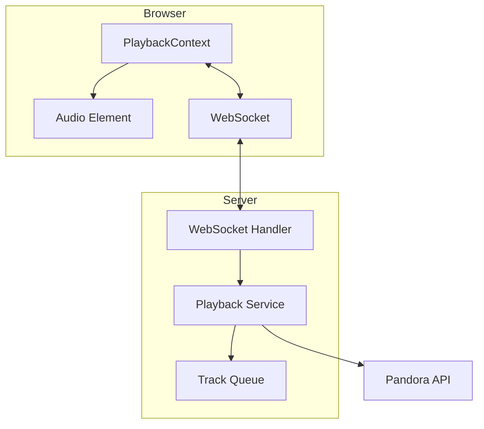

# Pyxis Web App Conversion

## Goal

Convert Pyxis from a terminal-based TUI (Ink/React) application to a modern web application, replicating the tech stack and architecture from agentic-orchestra. This enables browser-based access to Pandora streaming with a responsive, mobile-friendly interface.

## Requirements

- Replicate agentic-orchestra tech stack (React 19, Vite, TanStack Router/Query, tRPC, Tailwind CSS 4, Bun)
- Maintain existing Effect-TS API layer (`src/api/`, `src/client.ts`, `src/crypto/`)
- Build equivalent UI for all current TUI views (stations, search, playback, bookmarks, genres, settings)
- Server-side session management (authentication tokens cannot be stored client-side securely)
- Real-time playback state via WebSocket
- Responsive design (desktop + mobile)

---

## Phase 1: Project Scaffolding & Build Setup

**Goal**: Set up build tooling, dependencies, and basic project structure so the dev server runs.

### Files to Create

| File | Purpose |
|------|---------|
| `index.html` | Vite entry HTML |
| `vite.config.ts` | Vite + React + Tailwind + Router config |
| `tsconfig.web.json` | Web-specific TypeScript config |
| `src/web/main.tsx` | React entry point |
| `src/web/index.css` | Tailwind imports + CSS variables |
| `src/web/routes/__root.tsx` | TanStack Router root layout |
| `src/web/routes/index.tsx` | Placeholder home route |
| `src/web/lib/utils.ts` | cn() utility (clsx + tailwind-merge) |
| `Procfile` | Process definitions (frontend + backend) |

### Package.json Changes

Add dependencies:
```json
{
  "dependencies": {
    "@radix-ui/react-dialog": "^1.1.15",
    "@radix-ui/react-slot": "^1.2.4",
    "@tailwindcss/vite": "^4.1.18",
    "@tanstack/react-query": "^5.90.16",
    "@tanstack/react-router": "^1.147.3",
    "@trpc/client": "^11.8.1",
    "@trpc/react-query": "^11.8.1",
    "@trpc/server": "^11.8.1",
    "class-variance-authority": "^0.7.1",
    "clsx": "^2.1.1",
    "framer-motion": "^12.28.1",
    "lucide-react": "^0.562.0",
    "sonner": "^2.0.7",
    "tailwind-merge": "^3.4.0",
    "tailwindcss": "^4.1.18"
  },
  "devDependencies": {
    "@tanstack/router-plugin": "^1.149.0",
    "@vitejs/plugin-react": "^5.1.1",
    "vite": "^7.2.4"
  }
}
```

Add scripts:
```json
{
  "scripts": {
    "dev:web": "vite",
    "dev:server": "bun --watch server/index.ts",
    "build:web": "vite build"
  }
}
```

### Acceptance Criteria (Phase 1)

- [ ] `bun run dev:web` starts Vite dev server
- [ ] Browser shows placeholder page at localhost:5173
- [ ] Tailwind CSS classes render correctly
- [ ] TanStack Router initializes without errors

---

## Phase 2: Server Foundation & tRPC Setup

**Goal**: Create Bun HTTP server with tRPC router, session management, and basic auth endpoint.

### Files to Create

| File | Purpose |
|------|---------|
| `server/index.ts` | Bun HTTP server with CORS, tRPC handler |
| `server/trpc.ts` | tRPC initialization (context, router factory) |
| `server/router.ts` | Root router composition |
| `server/routers/auth.ts` | Login/logout/status procedures |
| `server/services/session.ts` | In-memory session store |
| `src/web/lib/trpc.ts` | tRPC client + React Query setup |

### Server Architecture



### Session Flow



### Acceptance Criteria (Phase 2)

- [ ] `bun run dev:server` starts on port 3847
- [ ] POST to `/trpc/auth.login` with credentials returns session cookie
- [ ] GET `/trpc/auth.status` returns authentication state
- [ ] Session persists across requests via httpOnly cookie
- [ ] Vite proxy forwards `/trpc/*` to backend

---

## Phase 3: Login UI & Auth Flow

**Goal**: Create login page, wire up tRPC client, implement protected routes.

### Files to Create

| File | Purpose |
|------|---------|
| `src/web/routes/login.tsx` | Login form page |
| `src/web/contexts/AuthContext.tsx` | Auth state provider |
| `src/web/components/ui/button.tsx` | Button component |
| `src/web/components/ui/input.tsx` | Input component |

### UI Concept: Login Page

```html
<div class="min-h-screen flex items-center justify-center bg-zinc-900 p-4">
  <div class="w-full max-w-sm">
    <div class="text-center mb-8">
      <h1 class="text-3xl font-bold text-cyan-400 mb-2">pyxis</h1>
      <p class="text-zinc-500">Pandora client for the modern web</p>
    </div>

    <form class="space-y-4">
      <div>
        <label class="block text-sm font-medium text-zinc-400 mb-1">Email</label>
        <input
          type="email"
          class="w-full px-4 py-2 bg-zinc-800 border border-zinc-700 rounded-lg focus:outline-none focus:ring-2 focus:ring-cyan-500"
          placeholder="your@email.com"
        />
      </div>
      <div>
        <label class="block text-sm font-medium text-zinc-400 mb-1">Password</label>
        <input
          type="password"
          class="w-full px-4 py-2 bg-zinc-800 border border-zinc-700 rounded-lg focus:outline-none focus:ring-2 focus:ring-cyan-500"
          placeholder="********"
        />
      </div>

      <!-- Error state -->
      <div class="hidden p-3 bg-red-500/10 border border-red-500/30 rounded-lg text-red-400 text-sm">
        Invalid credentials. Please try again.
      </div>

      <!-- Loading state -->
      <button
        type="submit"
        class="w-full py-2 bg-cyan-500 hover:bg-cyan-400 disabled:bg-cyan-500/50 text-zinc-900 font-medium rounded-lg transition-colors flex items-center justify-center gap-2"
      >
        <svg class="hidden w-4 h-4 animate-spin"><!-- spinner --></svg>
        Sign In
      </button>
    </form>

    <p class="text-center text-xs text-zinc-600 mt-8">
      This is an unofficial client. Use at your own risk.
    </p>
  </div>
</div>
```

### Acceptance Criteria (Phase 3)

- [ ] Login page renders at `/login`
- [ ] Form validates email/password fields
- [ ] Successful login redirects to `/`
- [ ] Failed login shows error message
- [ ] Unauthenticated users redirect to `/login`
- [ ] Auth state persists on page refresh

---

## Phase 4: Station List & Layout Shell

**Goal**: Create main app layout with sidebar navigation and station list display.

### Files to Create

| File | Purpose |
|------|---------|
| `server/routers/stations.ts` | getStationList, deleteStation, renameStation |
| `src/web/routes/__root.tsx` | Layout with sidebar + now-playing bar |
| `src/web/routes/index.tsx` | Station list (home) |
| `src/web/components/layout/Sidebar.tsx` | Navigation sidebar |
| `src/web/components/layout/NowPlayingBar.tsx` | Persistent playback bar |
| `src/web/components/stations/StationList.tsx` | Station list component |
| `src/web/components/stations/StationItem.tsx` | Individual station row |

### UI Concept: Main Layout

```html
<div class="flex h-screen bg-zinc-900 text-zinc-100">
  <!-- Sidebar (desktop) -->
  <aside class="hidden md:flex w-64 flex-col border-r border-zinc-800">
    <div class="p-4 border-b border-zinc-800">
      <h1 class="text-xl font-bold text-cyan-400">pyxis</h1>
    </div>
    <nav class="flex-1 p-2 space-y-1">
      <a class="flex items-center gap-2 px-3 py-2 rounded-lg bg-zinc-800 text-zinc-100">
        <svg class="w-5 h-5"><!-- radio icon --></svg>
        Stations
      </a>
      <a class="flex items-center gap-2 px-3 py-2 rounded-lg hover:bg-zinc-800/50 text-zinc-400">
        <svg class="w-5 h-5"><!-- search icon --></svg>
        Search
      </a>
      <a class="flex items-center gap-2 px-3 py-2 rounded-lg hover:bg-zinc-800/50 text-zinc-400">
        <svg class="w-5 h-5"><!-- bookmark icon --></svg>
        Bookmarks
      </a>
      <a class="flex items-center gap-2 px-3 py-2 rounded-lg hover:bg-zinc-800/50 text-zinc-400">
        <svg class="w-5 h-5"><!-- grid icon --></svg>
        Genres
      </a>
      <a class="flex items-center gap-2 px-3 py-2 rounded-lg hover:bg-zinc-800/50 text-zinc-400">
        <svg class="w-5 h-5"><!-- settings icon --></svg>
        Settings
      </a>
    </nav>
    <!-- User info -->
    <div class="p-4 border-t border-zinc-800">
      <button class="flex items-center gap-2 text-sm text-zinc-400 hover:text-zinc-200">
        <svg class="w-4 h-4"><!-- logout icon --></svg>
        Sign out
      </button>
    </div>
  </aside>

  <!-- Main content -->
  <main class="flex-1 flex flex-col overflow-hidden">
    <!-- Mobile header -->
    <header class="md:hidden flex items-center justify-between p-4 border-b border-zinc-800">
      <h1 class="text-lg font-bold text-cyan-400">pyxis</h1>
      <button class="p-2 hover:bg-zinc-800 rounded-lg">
        <svg class="w-6 h-6"><!-- menu icon --></svg>
      </button>
    </header>

    <!-- Page content (router outlet) -->
    <div class="flex-1 overflow-y-auto">
      <!-- Outlet here -->
    </div>

    <!-- Now Playing Bar (when playing) -->
    <div class="border-t border-zinc-800 bg-zinc-900/95 backdrop-blur">
      <div class="flex items-center gap-4 p-3">
        
        <div class="flex-1 min-w-0">
          <p class="font-medium truncate">Song Title</p>
          <p class="text-sm text-zinc-400 truncate">Artist Name</p>
        </div>
        <div class="flex items-center gap-2">
          <button class="p-2 hover:bg-zinc-800 rounded-full text-green-500">
            <svg class="w-5 h-5"><!-- thumbs up --></svg>
          </button>
          <button class="p-2 hover:bg-zinc-800 rounded-full">
            <svg class="w-8 h-8"><!-- play/pause --></svg>
          </button>
          <button class="p-2 hover:bg-zinc-800 rounded-full">
            <svg class="w-5 h-5"><!-- skip --></svg>
          </button>
          <button class="p-2 hover:bg-zinc-800 rounded-full text-red-500">
            <svg class="w-5 h-5"><!-- thumbs down --></svg>
          </button>
        </div>
      </div>
      <div class="h-1 bg-zinc-800">
        <div class="h-full w-1/3 bg-cyan-500"></div>
      </div>
    </div>
  </main>
</div>
```

### UI Concept: Station List

```html
<div class="p-4 space-y-4">
  <h2 class="text-lg font-semibold">Your Stations</h2>

  <!-- Filter input -->
  <div class="relative">
    <svg class="absolute left-3 top-1/2 -translate-y-1/2 w-5 h-5 text-zinc-500">
      <!-- search icon -->
    </svg>
    <input
      type="text"
      placeholder="Filter stations..."
      class="w-full pl-10 pr-4 py-2 bg-zinc-800 border border-zinc-700 rounded-lg focus:outline-none focus:ring-2 focus:ring-cyan-500"
    />
  </div>

  <!-- Station list -->
  <div class="space-y-1">
    <!-- Playing station -->
    <button class="w-full flex items-center gap-3 p-3 rounded-lg bg-cyan-500/10 border border-cyan-500/30 text-left">
      <div class="w-10 h-10 rounded bg-cyan-500/20 flex items-center justify-center">
        <svg class="w-5 h-5 text-cyan-400 animate-pulse"><!-- equalizer --></svg>
      </div>
      <div class="flex-1 min-w-0">
        <p class="font-medium truncate">Currently Playing Station</p>
        <p class="text-sm text-cyan-400">Now playing</p>
      </div>
    </button>

    <!-- Regular station -->
    <button class="w-full flex items-center gap-3 p-3 rounded-lg hover:bg-zinc-800 text-left group">
      <div class="w-10 h-10 rounded bg-zinc-800 flex items-center justify-center">
        <svg class="w-5 h-5 text-zinc-500"><!-- radio --></svg>
      </div>
      <div class="flex-1 min-w-0">
        <p class="font-medium truncate">Another Station</p>
      </div>
      <button class="opacity-0 group-hover:opacity-100 p-1 hover:bg-zinc-700 rounded">
        <svg class="w-4 h-4 text-zinc-400"><!-- more --></svg>
      </button>
    </button>

    <!-- QuickMix -->
    <button class="w-full flex items-center gap-3 p-3 rounded-lg hover:bg-zinc-800 text-left">
      <div class="w-10 h-10 rounded bg-purple-500/20 flex items-center justify-center">
        <svg class="w-5 h-5 text-purple-400"><!-- shuffle --></svg>
      </div>
      <div class="flex-1 min-w-0">
        <p class="font-medium truncate">Shuffle</p>
        <p class="text-sm text-purple-400">QuickMix</p>
      </div>
    </button>
  </div>
</div>
```

### Acceptance Criteria (Phase 4)

- [ ] Sidebar renders with navigation links
- [ ] Station list fetches and displays from API
- [ ] Filter input filters stations locally
- [ ] Clicking station triggers playback (next phase)
- [ ] QuickMix station shows distinct styling
- [ ] Mobile hamburger menu toggles sidebar

---

## Phase 5: Playback System & WebSocket

**Goal**: Implement audio playback with real-time state sync via WebSocket.

### Files to Create

| File | Purpose |
|------|---------|
| `server/routers/playback.ts` | getPlaylist, addFeedback, skip |
| `server/services/playback.ts` | Playback state management |
| `server/handlers/websocket.ts` | WebSocket upgrade + message handling |
| `src/web/contexts/PlaybackContext.tsx` | Playback state provider |
| `src/web/hooks/usePlayback.ts` | Playback controls hook |
| `src/web/hooks/useWebSocket.ts` | WebSocket connection hook |
| `src/web/routes/now-playing.tsx` | Full now-playing page |

### Playback State Flow



### WebSocket Messages

```typescript
// Server → Client
type ServerMessage =
  | { type: 'playback:state', state: PlaybackState }
  | { type: 'playback:track', track: Track }
  | { type: 'playback:error', error: string }

// Client → Server
type ClientMessage =
  | { type: 'playback:play', stationId: string }
  | { type: 'playback:skip' }
  | { type: 'playback:pause' }
  | { type: 'playback:resume' }
  | { type: 'playback:like' }
  | { type: 'playback:dislike' }
```

### UI Concept: Now Playing (Full View)

```html
<div class="flex flex-col items-center justify-center h-full p-8 text-center">
  <!-- Album art -->
  <div class="relative mb-8">
    
    <div class="absolute -bottom-2 left-1/2 -translate-x-1/2 px-3 py-1 bg-cyan-500 rounded-full text-xs font-medium text-zinc-900">
      PLAYING
    </div>
  </div>

  <!-- Track info -->
  <h2 class="text-2xl md:text-3xl font-bold mb-2">Song Title Here</h2>
  <p class="text-lg text-zinc-400 mb-1">Artist Name</p>
  <p class="text-sm text-zinc-500 mb-6">Album Name</p>

  <p class="text-sm text-zinc-500 mb-8">
    Playing from <span class="text-cyan-400">Station Name</span>
  </p>

  <!-- Progress -->
  <div class="w-full max-w-md mb-6">
    <div class="h-1 bg-zinc-800 rounded-full overflow-hidden">
      <div class="h-full bg-cyan-500" style="width: 66%"></div>
    </div>
    <div class="flex justify-between text-xs text-zinc-500 mt-1">
      <span>2:34</span>
      <span>3:45</span>
    </div>
  </div>

  <!-- Primary controls -->
  <div class="flex items-center gap-6">
    <button class="p-3 hover:bg-zinc-800 rounded-full text-green-500" title="Like">
      <svg class="w-8 h-8"><!-- thumbs up --></svg>
    </button>
    <button class="p-4 bg-cyan-500 hover:bg-cyan-400 rounded-full text-zinc-900" title="Pause">
      <svg class="w-10 h-10"><!-- pause --></svg>
    </button>
    <button class="p-3 hover:bg-zinc-800 rounded-full" title="Skip">
      <svg class="w-8 h-8"><!-- skip-forward --></svg>
    </button>
    <button class="p-3 hover:bg-zinc-800 rounded-full text-red-500" title="Dislike">
      <svg class="w-8 h-8"><!-- thumbs down --></svg>
    </button>
  </div>

  <!-- Secondary actions -->
  <div class="flex items-center gap-4 mt-8 text-zinc-500">
    <button class="p-2 hover:text-zinc-300" title="Bookmark song">
      <svg class="w-5 h-5"><!-- bookmark --></svg>
    </button>
    <button class="p-2 hover:text-zinc-300" title="Sleep song (30 days)">
      <svg class="w-5 h-5"><!-- moon --></svg>
    </button>
    <button class="p-2 hover:text-zinc-300" title="Track info">
      <svg class="w-5 h-5"><!-- info --></svg>
    </button>
  </div>
</div>
```

### Acceptance Criteria (Phase 5)

- [ ] WebSocket connects on app load
- [ ] Clicking station starts playback
- [ ] Audio plays in browser (via HTML5 Audio)
- [ ] Now-playing bar updates with current track
- [ ] Play/pause toggle works
- [ ] Skip advances to next track
- [ ] Like/dislike sends feedback to Pandora
- [ ] Progress bar shows track position
- [ ] Full now-playing page accessible at `/now-playing`

---

## Phase 6: Search & Station Creation

**Goal**: Implement search view with artist/song/genre results and station creation.

### Files to Create

| File | Purpose |
|------|---------|
| `server/routers/search.ts` | search procedure |
| `server/routers/stations.ts` | Add createStation procedure |
| `src/web/routes/search.tsx` | Search page |
| `src/web/components/search/SearchInput.tsx` | Debounced search input |
| `src/web/components/search/SearchResults.tsx` | Results list by type |

### UI Concept: Search View

```html
<div class="p-4 space-y-6">
  <h2 class="text-lg font-semibold">Search</h2>

  <!-- Search input -->
  <div class="relative">
    <svg class="absolute left-3 top-1/2 -translate-y-1/2 w-5 h-5 text-zinc-500">
      <!-- search icon -->
    </svg>
    <input
      type="text"
      placeholder="Search artists, songs, or genres..."
      class="w-full pl-10 pr-4 py-3 bg-zinc-800 border border-zinc-700 rounded-lg focus:outline-none focus:ring-2 focus:ring-cyan-500 text-lg"
      autofocus
    />
  </div>

  <!-- Results -->
  <div class="space-y-6">
    <!-- Artists section -->
    <div>
      <h3 class="text-sm font-medium text-zinc-400 mb-2">Artists</h3>
      <div class="space-y-1">
        <button class="w-full flex items-center gap-3 p-3 rounded-lg hover:bg-zinc-800 text-left">
          <div class="w-10 h-10 rounded-full bg-zinc-700 flex items-center justify-center">
            <svg class="w-5 h-5 text-zinc-400"><!-- user icon --></svg>
          </div>
          <div class="flex-1">
            <p class="font-medium">Pink Floyd</p>
          </div>
          <span class="text-xs text-zinc-500 bg-zinc-800 px-2 py-1 rounded">Create station</span>
        </button>
      </div>
    </div>

    <!-- Songs section -->
    <div>
      <h3 class="text-sm font-medium text-zinc-400 mb-2">Songs</h3>
      <div class="space-y-1">
        <button class="w-full flex items-center gap-3 p-3 rounded-lg hover:bg-zinc-800 text-left">
          <div class="w-10 h-10 rounded bg-zinc-700 flex items-center justify-center">
            <svg class="w-5 h-5 text-zinc-400"><!-- music note --></svg>
          </div>
          <div class="flex-1">
            <p class="font-medium">Comfortably Numb</p>
            <p class="text-sm text-zinc-400">Pink Floyd</p>
          </div>
          <span class="text-xs text-zinc-500 bg-zinc-800 px-2 py-1 rounded">Create station</span>
        </button>
      </div>
    </div>

    <!-- Genres section -->
    <div>
      <h3 class="text-sm font-medium text-zinc-400 mb-2">Genres</h3>
      <div class="space-y-1">
        <button class="w-full flex items-center gap-3 p-3 rounded-lg hover:bg-zinc-800 text-left">
          <div class="w-10 h-10 rounded bg-gradient-to-br from-purple-500 to-pink-500 flex items-center justify-center">
            <svg class="w-5 h-5 text-white"><!-- grid icon --></svg>
          </div>
          <div class="flex-1">
            <p class="font-medium">Classic Rock</p>
          </div>
          <span class="text-xs text-zinc-500 bg-zinc-800 px-2 py-1 rounded">Create station</span>
        </button>
      </div>
    </div>
  </div>

  <!-- Empty state -->
  <div class="hidden text-center py-12 text-zinc-500">
    <svg class="w-12 h-12 mx-auto mb-4 text-zinc-600"><!-- search icon --></svg>
    <p>Search for artists, songs, or genres to create a new station</p>
  </div>
</div>
```

### Acceptance Criteria (Phase 6)

- [ ] Search input debounces queries (300ms)
- [ ] Results display grouped by type (artists, songs, genres)
- [ ] Clicking result creates station via API
- [ ] New station appears in station list
- [ ] Loading state shows during search
- [ ] Empty state shows when no results

---

## Phase 7: Bookmarks, Genres & Settings

**Goal**: Implement remaining secondary views.

### Files to Create

| File | Purpose |
|------|---------|
| `server/routers/bookmarks.ts` | getBookmarks, addBookmark, deleteBookmark |
| `server/routers/genres.ts` | getGenreStations |
| `server/routers/user.ts` | getSettings, updateSettings |
| `src/web/routes/bookmarks.tsx` | Bookmarks page |
| `src/web/routes/genres.tsx` | Genre browser page |
| `src/web/routes/settings.tsx` | Settings page |

### Acceptance Criteria (Phase 7)

- [ ] Bookmarks page lists artist and song bookmarks
- [ ] Can create station from bookmark
- [ ] Can delete bookmarks
- [ ] Genre browser shows categories and stations
- [ ] Can create station from genre
- [ ] Settings page shows account preferences
- [ ] Can toggle explicit content filter

---

## Phase 8: Polish & Mobile

**Goal**: Responsive design, animations, error handling, and final polish.

### Focus Areas

1. **Mobile Navigation**
   - Hamburger menu opens slide-out drawer
   - Bottom navigation bar for key actions
   - Touch-friendly tap targets

2. **Animations**
   - Page transitions (Framer Motion)
   - Loading skeletons
   - Micro-interactions (button presses, hover states)

3. **Error Handling**
   - Toast notifications (Sonner)
   - Error boundaries
   - Offline state detection

4. **Accessibility**
   - Keyboard navigation
   - Focus management
   - ARIA labels

### Acceptance Criteria (Phase 8)

- [ ] Mobile navigation works correctly
- [ ] All interactions have appropriate feedback
- [ ] Errors display user-friendly messages
- [ ] App works offline (shows appropriate state)
- [ ] Keyboard navigation functional throughout

---

## Directory Structure (Final)

```
pyxis/
├── index.html              # Vite entry
├── vite.config.ts          # Vite config
├── tsconfig.web.json       # Web TypeScript config
├── Procfile                # Process manager
├── package.json            # Updated deps
├── server/                 # Bun backend
│   ├── index.ts            # HTTP server
│   ├── trpc.ts             # tRPC setup
│   ├── router.ts           # Router composition
│   ├── routers/
│   │   ├── auth.ts
│   │   ├── stations.ts
│   │   ├── playback.ts
│   │   ├── search.ts
│   │   ├── bookmarks.ts
│   │   ├── genres.ts
│   │   └── user.ts
│   ├── services/
│   │   ├── session.ts
│   │   └── playback.ts
│   └── handlers/
│       └── websocket.ts
├── src/
│   ├── api/                # Existing Pandora API
│   ├── client.ts           # Existing API facade
│   ├── crypto/             # Existing Blowfish
│   ├── types/              # Existing types
│   ├── cli/                # Existing CLI (preserved)
│   ├── tui/                # Existing TUI (preserved)
│   └── web/                # New web frontend
│       ├── main.tsx
│       ├── index.css
│       ├── routes/
│       │   ├── __root.tsx
│       │   ├── index.tsx
│       │   ├── login.tsx
│       │   ├── now-playing.tsx
│       │   ├── search.tsx
│       │   ├── bookmarks.tsx
│       │   ├── genres.tsx
│       │   └── settings.tsx
│       ├── components/
│       │   ├── ui/
│       │   ├── layout/
│       │   ├── stations/
│       │   ├── playback/
│       │   └── search/
│       ├── contexts/
│       │   ├── AuthContext.tsx
│       │   └── PlaybackContext.tsx
│       ├── hooks/
│       │   ├── usePlayback.ts
│       │   └── useWebSocket.ts
│       └── lib/
│           ├── trpc.ts
│           └── utils.ts
└── public/
    └── favicon.ico
```

---

## Tech Stack Summary

| Category | Technology |
|----------|------------|
| Runtime | Bun |
| Build | Vite 7 |
| Frontend | React 19, TanStack Router, TanStack Query |
| API | tRPC (type-safe RPC) |
| Styling | Tailwind CSS 4 |
| Icons | Lucide React |
| State | React Query + WebSocket + Contexts |
| Validation | Zod |
| Animation | Framer Motion |
| Notifications | Sonner |
