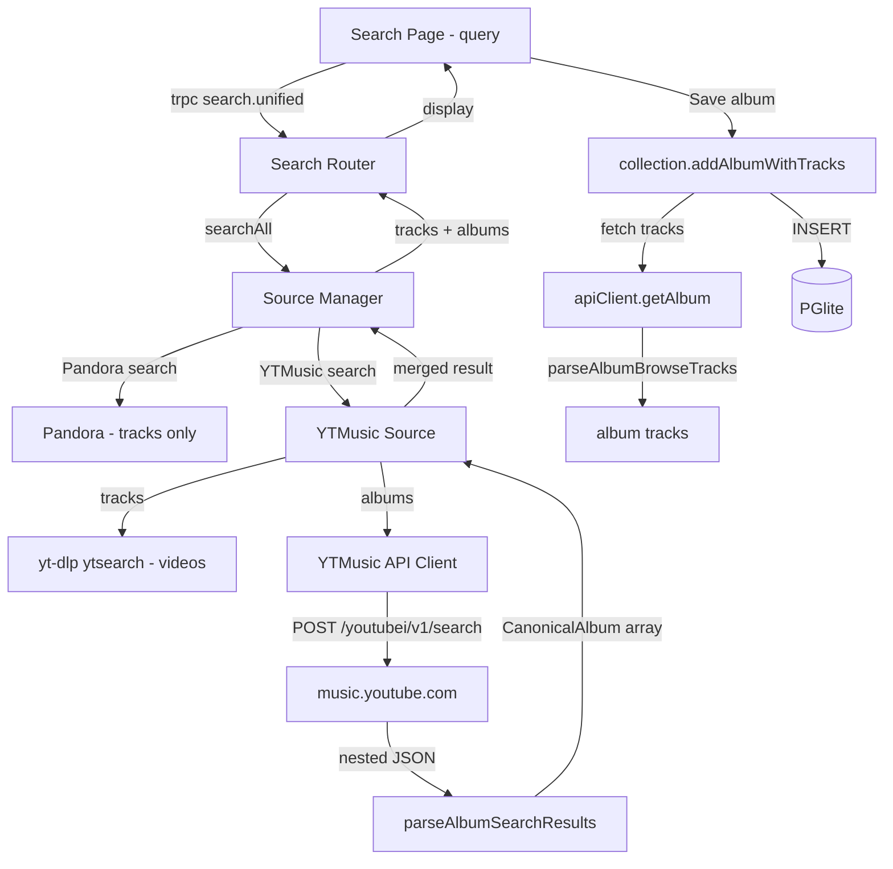

# YTMusic Album Search — Port Internal API Client from Raziel

## Goal

Fix the album search gap: `yt-dlp ytsearch:` returns individual videos, never albums. Port raziel's reverse-engineered YouTube Music internal API client (`/youtubei/v1/search` with album filter params) to give Pyxis real album search results.

The key insight: YouTube Music's `/youtubei/v1/search` endpoint accepts base64-encoded filter tokens (`SEARCH_PARAMS.album`) that tell the backend to return only album results. This is what the official web player uses.

## Requirements

### Port from Raziel
- **Rate limiter** — token bucket with exponential backoff (simple, self-contained)
- **YTMusic API config** — `BASE_CONTEXT`, `DEFAULT_HEADERS`, `SEARCH_PARAMS` for `WEB_REMIX` client
- **YTMusic API client** — `searchAlbums(query)` and `getAlbum(albumId)` via `/youtubei/v1/search` and `/browse`
- **Response parsers** — `parseAlbumSearchResults()`, `parseAlbumBrowseTracks()`, `parseAlbumBrowseInfo()` for extracting albums from nested renderer JSON

### Integration with Existing Source
- YTMusic source's `search()` method uses the new API client for album results (replaces `albums: []`)
- YTMusic source's `getAlbumTracks()` method optionally uses the new API client's `getAlbum()` instead of yt-dlp for track listing (faster, no subprocess)
- yt-dlp stays for audio streaming (`getStreamUrl`) — the internal API doesn't provide audio URLs
- Existing yt-dlp search for tracks continues working (individual video search is fine for tracks)

### What NOT to Port
- Song search parsers (yt-dlp handles this fine)
- Artist search parsers (not needed)
- Playlist track parsers (not needed, yt-dlp handles playlists)
- MPREb → OLAK converter (useful but can add later if needed)
- Zod schemas for API responses (parsers work with raw types, can validate later)

## Source Files

### Raziel Source → Pyxis Target

| Raziel File | What to Extract | Pyxis Target |
|-------------|----------------|--------------|
| `raziel/packages/sources/src/rate-limiter.ts` | Full file (67 lines) | `src/sources/rate-limiter.ts` |
| `raziel/packages/sources/src/ytmusic/config.ts` | `BASE_CONTEXT`, `DEFAULT_HEADERS`, `SEARCH_PARAMS` | `src/sources/ytmusic/api-config.ts` |
| `raziel/packages/sources/src/ytmusic/client.ts` | `createYTMusicClient` (album methods only) | `src/sources/ytmusic/api-client.ts` |
| `raziel/packages/sources/src/ytmusic/parsers.ts` | `parseAlbumSearchResults`, `parseAlbumBrowseTracks`, `parseAlbumBrowseInfo`, helpers | `src/sources/ytmusic/parsers.ts` |

### New Files

| Path | Purpose |
|------|---------|
| `src/sources/rate-limiter.ts` | Token bucket rate limiter (port from raziel, ~67 lines) |
| `src/sources/ytmusic/api-config.ts` | YTMusic API constants: BASE_CONTEXT, DEFAULT_HEADERS, SEARCH_PARAMS |
| `src/sources/ytmusic/api-client.ts` | `createYTMusicClient()` with `searchAlbums()` and `getAlbum()` |
| `src/sources/ytmusic/parsers.ts` | Response parsers for album search and browse results |

### Modified Files

| Path | Change |
|------|--------|
| `src/sources/ytmusic/index.ts` | `search()` calls `apiClient.searchAlbums()` for album results; `getAlbumTracks()` optionally uses `apiClient.getAlbum()` |

### Unchanged Files

| Path | Why |
|------|-----|
| `src/sources/ytmusic/yt-dlp.ts` | Still used for `getAudioUrl()`, `getPlaylistEntries()`, track search |
| `src/sources/index.ts` | `searchAll()` already aggregates albums from all sources |
| `server/routers/search.ts` | Already calls `searchAll()` and returns albums |
| `src/web/components/search/SearchResults.tsx` | Already renders album results with Save button |
| `src/web/routes/search.tsx` | Already wires `onSaveAlbum` handler |

## Data Flow

## Acceptance Criteria

- [ ] Searching "Pink Floyd" returns albums like "The Dark Side of the Moon" in the Albums section
- [ ] Album results include title, artist, year, and thumbnail from YouTube Music
- [ ] Saving an album fetches its full track list via the API client (not yt-dlp subprocess)
- [ ] Rate limiter prevents hitting YouTube Music too aggressively (1 req/s default, burst of 5)
- [ ] Exponential backoff on 429/503 responses with configurable retries
- [ ] yt-dlp continues working for audio streaming (no regression)
- [ ] Existing track search via yt-dlp still works alongside album search
- [ ] No new npm dependencies needed (uses native `fetch`)
