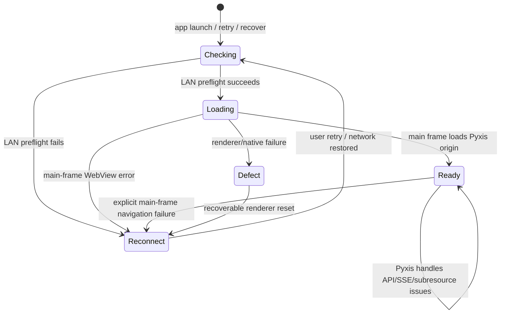
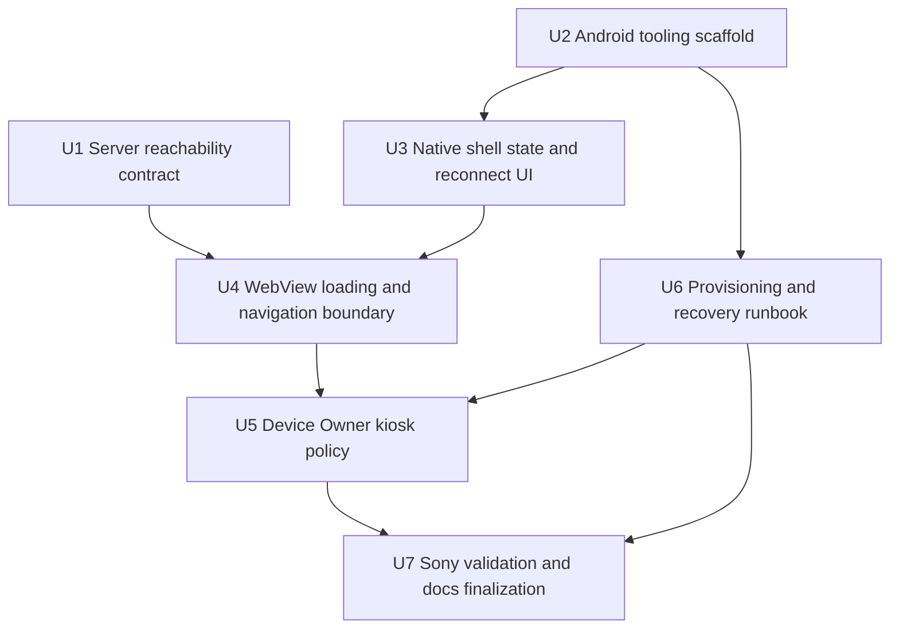

# feat: Add Sony Android kiosk APK

## Summary

Add a native Android/Kotlin kiosk shell to Pyxis as an isolated `android/` project, targeting the Sony Walkman NW-A306 and the local ZAO Pyxis server at `http://192.168.1.243:8765/`. The Android shell owns launch, fullscreen kiosk policy, reachability checks, reconnect UI, and provisioning recovery, while the existing Pyxis server and web app remain the source of product behavior.

---

## Problem Frame

The upstream requirements define a first-class Android appliance experience because the current PWA path has been unreliable on dedicated music-device use. Planning therefore needs to add a native shell without turning the Android app into a second Pyxis client or disturbing the existing TypeScript/Bun web server.

---

## Requirements

**Target and packaging**
- R1. Target the Sony Walkman NW-A306 as the first supported and validated Android device.
- R2. Provide a dedicated Android launcher/kiosk app rather than a browser shortcut.
- R3. Keep the MVP debug-oriented and clearly mark hardcoded temporary assumptions.

**ZAO connectivity**
- R4. Load the ZAO-hosted Pyxis instance over local LAN at `http://192.168.1.243:8765/`.
- R5. Treat the hardcoded ZAO URL as temporary and localized to the Android config/profile seam.
- R6. Launch directly to the Pyxis web app without browser choice, URL entry, or PWA installation.

**Failure and recovery**
- R7. Show a simple branded native reconnect state when the configured Pyxis instance is unreachable.
- R8. Give the user a clear retry action and visible target context in the reconnect state.

**Kiosk behavior**
- R9. Support full Device Owner kiosk posture for the Sony target.
- R10. Provide a documented development recovery/release path for kiosk provisioning.
- R11. Prioritize fullscreen dedicated-device behavior over generic Android distribution polish.

**Future compatibility posture**
- R12. Avoid unnecessary choices that block later iKKO or generic Android support.
- R13. Preserve a small future device-profile seam without building a multi-device profile framework.

**Origin actors:** A1 (Device user), A2 (Device provisioner), A3 (Sony Walkman NW-A306), A4 (ZAO Pyxis instance)
**Origin flows:** F1 (Provision Sony as a Pyxis kiosk), F2 (Launch into Pyxis on ZAO), F3 (Recover from unreachable ZAO)
**Origin acceptance examples:** AE1 (reachable ZAO launch), AE2 (unreachable ZAO reconnect), AE3 (Device Owner recovery), AE4 (temporary hardcoded URL visibility)

---

## Scope Boundaries

- Music synchronization and offline library support remain out of scope.
- Server discovery, saved instances, QR setup, and editable server configuration remain out of scope.
- Tailscale/VPN and roaming connectivity remain out of scope; the MVP assumes the Sony and ZAO are on the same LAN.
- iKKO-specific behavior is deferred even though the prior iKKO kiosk exploration informs the approach.
- App-store distribution, production signing, release update channels, and generic Android polish are deferred.
- Native playback truth, durable playback logs, and media-library behavior must not move into the APK.
- Pyxis React UI refactors are out of scope except for minimal compatibility fixes discovered while validating the Android shell.

### Deferred to Follow-Up Work

- Production Android release hardening: non-`testOnly` release builds, signing policy, release recovery posture, and update channels.
- Multi-device profile UX: editable host/profile setup, QR enrollment, iKKO-specific profile behavior, and generic Android targeting.
- Native media integration polish: lockscreen controls, notification controls, hardware media-button mapping, and background playback improvements beyond basic validation.
- Direct Boot hardening: only add a direct-boot-aware bootstrap if Sony validation proves normal no-credential boot cannot satisfy MVP launch behavior.

---

## Context & Research

### Relevant Code and Patterns

- `server/index.ts` serves the SPA, `/trpc`, and `/stream` from one Bun server origin. The Android WebView should load this origin directly so relative frontend calls keep working.
- `src/web/shared/lib/trpc.ts` and playback code rely on same-origin relative API paths, including realtime subscription behavior.
- `index.html`, `public/manifest.json`, and `public/sw.js` show Pyxis already has mobile/PWA metadata; the Android app should wrap the existing web surface, not rebuild it.
- `src/web/index.css` and `src/web/shared/lib/themes.ts` establish the dark Pyxis visual language the native reconnect surface should echo.
- `flake.nix` currently defines the TypeScript/Bun development and package environment. Android tooling should be added as a separate dev shell rather than mixed into the default shell.
- `justfile` is the project automation surface. Android build/install/provisioning helpers should live behind additional recipes without changing existing `just typecheck` and `just test` behavior.
- The prior iKKO kiosk exploration provides proven native Android patterns for fullscreen WebView, Device Admin, lock task, HOME replacement, and recovery, but should be adapted rather than copied as an iKKO-named fork.

### Institutional Learnings

- `docs/solutions/correctness/enforce-strict-upgrade-domain-contracts-in-config-and-db-sch.md`: constrain temporary configuration at the boundary and test invalid states rather than scattering assumptions.
- `docs/solutions/feature-patterns/2026-02-10-album-browsing-without-save.md`: hardcoded assumptions are acceptable only when isolated behind a small seam and documented as temporary.
- `docs/solutions/feature-patterns/2026-04-15-shared-primitives-react-audit.md`: avoid broad shared UI churn; create the smallest stateful surface needed for the new behavior.
- `docs/solutions/ui-bugs/pause-resume-restarts-song-playback-20260210.md`: playback reliability depends on one authoritative state seam; the Android shell should not invent independent playback truth.
- `docs/solutions/feature-patterns/2026-02-10-listen-log.md`: playback-adjacent durable truth belongs on the server transition path, not in a client wrapper.

### External References

- Android dedicated devices cookbook: https://developer.android.com/work/dpc/dedicated-devices/cookbook
- Android lock task mode: https://developer.android.com/work/dpc/dedicated-devices/lock-task-mode
- Android network security configuration: https://developer.android.com/privacy-and-security/security-config
- Android WebViewClient reference: https://developer.android.com/reference/android/webkit/WebViewClient
- Android Direct Boot documentation: https://developer.android.com/privacy-and-security/direct-boot
- Android Gradle Plugin releases: https://developer.android.com/build/releases/about-agp
- Sony NW-A306 specifications: https://www.sony.com/electronics/support/digital-music-players-nw-nwz-a-series/nw-a306/specifications

---

## Key Technical Decisions

- Native shell, server-authoritative Pyxis: Android owns the appliance shell concerns; Pyxis web/server remain authoritative for playback, library, queue, and history.
- No native Pyxis client or JavaScript bridge for MVP: the APK uses normal same-origin WebView loading only. It must not introduce `addJavascriptInterface`, native tRPC clients, native playback/library state, or duplicated session logic.
- Dedicated reachability endpoint: add `GET /healthz` for Android preflight instead of probing the SPA root. Android treats the server as reachable only when `GET /healthz` returns HTTP 200, `Content-Type: application/json`, `Cache-Control: no-store`, no redirect, and a minimal body identifying `service=pyxis` and `status=ok` with no library, source, version, filesystem, or host details.
- Isolated Android project: add a top-level `android/` Gradle project and separate Android Nix shell so the Bun/Vite app remains independently buildable.
- Reproducible Android tooling boundary: keep Gradle wrapper/project files inside `android/`, expose Android SDK/JDK through a named Nix dev shell, and preserve the default Pyxis shell for TypeScript/Bun work. Start from the proven Android baseline of AGP 8.2.x, Kotlin 1.9.x, JDK 17, compile/target SDK 34, and min SDK 31 unless implementation proves a newer matrix first in U2. The Android shell may be Linux-focused for connected-device development, but it must not break flake evaluation or default shell use on other systems.
- Hardcoded debug URL localized to build-time config: the MVP URL is `http://192.168.1.243:8765/`, exposed through immutable debug-build config/profile data and shown as temporary in UI/docs. Do not add runtime saved instances, QR setup, discovery, or editable profiles.
- Scoped cleartext with explicit fallback: attempt to allow HTTP only for `192.168.1.243`; if literal-IP network security scoping fails on the Sony/API level, implementation must stop and request an explicit plan update before changing the configured target to a stable LAN hostname or accepting a temporary debug-only broader cleartext risk. The fallback is not silent because it changes the exact MVP URL decision.
- Native reachability state: represent Android shell state as a small sealed model such as checking, loading, ready, reconnect, and defect; do not drive UI from scattered booleans.
- Separate kiosk policy from WebView reachability: Device Owner and lock-task policy are idempotent lifecycle concerns. Policy failures must be surfaced as kiosk/provisioning defects, not disguised as Pyxis server reconnect failures.
- Preflight plus main-frame failure handling: native reconnect is triggered by reachability failure or main-frame WebView failure; subresource, API, and SSE errors are left to the Pyxis web app once the main frame is usable.
- Hardened WebView boundary: only the configured Pyxis origin may remain in the main frame; external schemes, popups, downloads, file/content access, permission prompts, and external app handoffs are denied or no-oped unless a later plan explicitly allows them.
- Kiosk policy as a focused Android module: Device Owner, HOME replacement, lock task, status bar/keyguard policy, and release/recovery hooks are grouped behind a small policy boundary.
- No Direct Boot for MVP by default: use normal boot/home behavior unless Sony testing shows a real reboot-before-unlock requirement. This avoids WebView credential-storage pitfalls.
- Recovery before hardware lock-down: draft the provisioning/recovery runbook before Device Owner validation on the Sony, then finalize it with real-device outcomes.
- Debug recovery first: the MVP recovery contract is USB ADB deprovision/uninstall plus proven Sony hardware factory reset/recovery fallback. Any in-app release affordance is optional and must be build-type gated and deliberate; recovery must not depend on WebView, Wi-Fi, or ZAO availability.

---

## Open Questions

### Resolved During Planning

- Exact MVP server URL: use this machine's LAN IP, `http://192.168.1.243:8765/`.
- WebView origin: load the Pyxis server origin, not the Vite development origin.
- Device target: plan validates Sony NW-A306 first; iKKO is deferred.
- Provisioning posture: factory reset / clean Device Owner provisioning is acceptable for the MVP.
- Native reconnect boundary: native Android handles initial reachability and main-frame load failures; Pyxis web handles in-app API/realtime failures.
- Reachability contract: add a dedicated minimal liveness route instead of relying on SPA root preflight.

### Deferred to Implementation

- Final Android Gradle Plugin, Kotlin, and JDK versions: U2 starts from AGP 8.2.x, Kotlin 1.9.x, JDK 17, compile/target SDK 34, and min SDK 31; implementation may update the matrix only after proving Android build/test and default Pyxis shell compatibility.
- Final lock-task feature bitfield: choose the most restrictive settings compatible with Sony usability and development recovery after on-device validation.
- Exact preflight timeout and retry backoff: choose bounded values during implementation and validate on the Sony against real Wi-Fi behavior.
- Literal-IP cleartext support: validate scoped cleartext against `192.168.1.243`; if unsupported, stop and update this plan before changing the exact MVP URL or accepting broader debug-only cleartext.
- Exact recovery gesture or debug release affordance: define the smallest safe release path once hardware button behavior is observed on the Sony.
- WebView persistent state policy: decide during implementation whether app-data/cache clearing is sufficient troubleshooting posture or whether the APK needs an explicit cache-clear debug action.

---

## Output Structure

Expected new structure, subject to adjustment during implementation:

```text
server/lib/
  health.ts
  health.test.ts
android/
  settings.gradle.kts
  build.gradle.kts
  gradle/
  gradlew
  gradlew.bat
  app/
    build.gradle.kts
    src/main/AndroidManifest.xml
    src/main/kotlin/com/simonwjackson/pyxis/kiosk/
      BootReceiver.kt
      MainActivity.kt
      PyxisConfig.kt
      PyxisDeviceAdminReceiver.kt
      PyxisShellState.kt
      KioskPolicy.kt
      KioskWebViewClient.kt
      NavigationPolicy.kt
      ReachabilityClient.kt
      ReconnectScreen.kt
    src/main/res/values/
      strings.xml
      themes.xml
    src/main/res/xml/
      device_admin.xml
      network_security_config.xml
    src/test/kotlin/com/simonwjackson/pyxis/kiosk/
      PyxisShellStateTest.kt
      PyxisConfigTest.kt
      NavigationPolicyTest.kt
      ReachabilityClientTest.kt
      KioskPolicyTest.kt
    src/androidTest/kotlin/com/simonwjackson/pyxis/kiosk/
      KioskWebViewInstrumentedTest.kt
docs/operations/
  sony-android-kiosk-provisioning.md
docs/operations/
  sony-android-kiosk-validation.md
```

---

## High-Level Technical Design

> *This illustrates the intended approach and is directional guidance for review, not implementation specification. The implementing agent should treat it as context, not code to reproduce.*





---

## Implementation Units

U-IDs are stable identifiers, not execution-order numbers. The units below are listed in intended execution order; U6 intentionally appears before U5 because the recovery runbook/preflight must exist before Device Owner validation.

### U1. Server reachability contract

**Goal:** Provide a minimal, explicit Pyxis server reachability contract for the Android shell to preflight before loading the WebView.

**Requirements:** R4, R6, R7, R8; supports F2, F3, AE1, AE2

**Dependencies:** None

**Files:**
- Modify: `server/index.ts`
- Create: `server/lib/health.ts`
- Test: `server/lib/health.test.ts`

**Approach:**
- Add `GET /healthz` as a dedicated minimal liveness route for the Pyxis HTTP process, separate from SPA root loading and product/source availability.
- Keep the response intentionally low-information but Pyxis-specific: HTTP 200, `Content-Type: application/json`, `Cache-Control: no-store`, no redirect, and a minimal `service=pyxis` / `status=ok` marker with no version, filesystem, host, source, library, or account details.
- Use a small pure helper for route matching and response creation so tests do not need to import the Bun server entrypoint.
- Branch to the reachability route before `/trpc`, `/stream`, static SPA fallback, or Vite middleware.
- Preserve existing `/trpc`, `/stream`, static-file, and Vite middleware behavior.

**Patterns to follow:**
- `server/index.ts` owns top-level HTTP route branching before SPA fallback.
- Existing server logging uses structured logger children rather than `console.log`.

**Test scenarios:**
- Happy path: requesting the reachability contract returns a successful lightweight response without invoking tRPC, stream handling, or SPA fallback.
- Integration: the route predicate identifies only the chosen liveness path and does not match ordinary SPA routes.
- Integration: an unknown non-API route still falls through to the existing static/Vite SPA behavior.
- Edge case: the reachability route remains valid in both production static-serving mode and Vite middleware mode.
- Security path: the reachability response contains the expected Pyxis marker and content type but no product data, environment details, source status, filesystem paths, or account identifiers.

**Verification:**
- The Android shell has a stable same-origin target to check before WebView load.
- Another LAN client can reach the Pyxis server origin and health route before Android kiosk validation begins.
- Existing server routes continue to behave as before.

---

### U2. Android project and reproducible tooling scaffold

**Goal:** Add an isolated Android/Kotlin project and development shell without disturbing the existing Bun/Vite/Nix workflow.

**Requirements:** R1, R2, R3, R11, R12

**Dependencies:** None

**Files:**
- Create: `android/settings.gradle.kts`
- Create: `android/build.gradle.kts`
- Create: `android/gradle/`
- Create: `android/gradlew`
- Create: `android/gradlew.bat`
- Create: `android/app/build.gradle.kts`
- Create: `android/app/src/main/AndroidManifest.xml`
- Create: `android/app/src/main/kotlin/com/simonwjackson/pyxis/kiosk/MainActivity.kt`
- Create: `android/app/src/main/kotlin/com/simonwjackson/pyxis/kiosk/PyxisConfig.kt`
- Create: `android/app/src/main/res/values/strings.xml`
- Create: `android/app/src/main/res/values/themes.xml`
- Modify: `flake.nix`
- Modify: `justfile`
- Modify: `.gitignore`
- Test: `android/app/src/test/kotlin/com/simonwjackson/pyxis/kiosk/PyxisConfigTest.kt`

**Approach:**
- Create a top-level Android Gradle project rather than mixing Android files into `src/` or the Bun package.
- Add an Android dev shell to the root flake with the Android SDK, JDK, Gradle, and NixOS-compatible build-tool configuration.
- Keep the default Pyxis dev shell focused on Bun/Vite; Android tooling should be opt-in through a named shell and `just` recipes.
- Commit the Gradle wrapper inside `android/` so Android builds are reproducible from the project source while the SDK/JDK still come from the named Nix shell.
- Add Android build-output and local-SDK ignores so generated Gradle/Android artifacts do not pollute the repo.
- Add `just` recipes for building, unit-testing, linting, installing, and opt-in connected-device validation of the debug APK while leaving existing `just typecheck`, `just test`, and `just dev` behavior unchanged.
- Set the package namespace and labels to Pyxis-specific names; avoid copied iKKO identifiers.
- Expose the MVP server URL through immutable debug-build configuration/profile data that is visibly temporary.

**Patterns to follow:**
- Root `flake.nix` already separates packages and dev shells.
- `justfile` is the existing user-facing command surface.
- The prior Android kiosk sandbox demonstrates a working Nix/Gradle shape for Android builds on this environment.

**Test scenarios:**
- Happy path: Android config/profile exposes the Sony profile and `http://192.168.1.243:8765/` as the debug target.
- Edge case: invalid or non-HTTP target values are rejected at the config/profile seam if the implementation makes them configurable within code.
- Integration: existing Bun test/typecheck commands do not require Android tooling.
- Tooling path: Android build outputs and local SDK paths are ignored while source and wrapper/project files remain trackable.

**Verification:**
- The Android debug APK can be built from the Android dev shell.
- Android JVM unit tests and lint have explicit recipes.
- Connected-device/Sony validation is opt-in and cannot run accidentally as part of ordinary Bun tests.
- Existing Pyxis TypeScript development commands still work without entering the Android shell.

---

### U3. Native shell state and reconnect UI

**Goal:** Implement the native state model and simple branded reconnect surface that appears when the configured Pyxis server is unreachable.

**Requirements:** R3, R5, R7, R8, R13; supports F3, AE2, AE4

**Dependencies:** U1, U2

**Files:**
- Create: `android/app/src/main/kotlin/com/simonwjackson/pyxis/kiosk/PyxisShellState.kt`
- Create: `android/app/src/main/kotlin/com/simonwjackson/pyxis/kiosk/ReconnectScreen.kt`
- Modify: `android/app/src/main/kotlin/com/simonwjackson/pyxis/kiosk/MainActivity.kt`
- Test: `android/app/src/test/kotlin/com/simonwjackson/pyxis/kiosk/PyxisShellStateTest.kt`

**Approach:**
- Model shell state as a sealed Kotlin domain type with explicit checking, loading, ready, reconnect, and defect cases.
- Render checking, retry-in-progress, reconnect, and defect as native Android UI states, not as HTML from the Pyxis server or a WebView error page.
- Prioritize user-facing content on reconnect states: Pyxis availability status first, configured target second, retry/progress status third, and provisioner-only recovery context only when relevant.
- Keep policy/provisioning failures distinguishable from reachability failures so debugging does not confuse kiosk state with server state.
- Keep the state machine source-agnostic enough that future iKKO or generic profile support can reuse it without a framework.

**Patterns to follow:**
- Lattice state modeling: convert runtime primitives into domain states once and render from that state.
- Pyxis visual language: dark background, restrained accent color, and clear product name.

**Test scenarios:**
- Happy path: a successful reachability result transitions from checking to WebView loading rather than reconnect.
- Error path: a failed reachability result transitions to reconnect with target context preserved.
- Edge case: repeated retry while checking is in flight renders retry-in-progress feedback and does not create conflicting shell states.
- Edge case: debug target URL is visible through the state/UI path as a temporary MVP assumption.
- Defect path: native renderer or unexpected shell failures transition to a recoverable defect/reconnect path rather than a blank screen.
- Separation path: kiosk policy failure is represented as a policy/provisioning defect, not a Pyxis server unreachable state.

**Verification:**
- The reconnect state can be exercised without a live Pyxis server.
- The user is never dependent on WebView HTML to see the recovery UI.

---

### U4. WebView loading, preflight, and navigation boundary

**Goal:** Load the Pyxis server origin reliably in WebView, show reconnect only for the right failure classes, and prevent kiosk-stranding external navigation.

**Requirements:** R4, R6, R7, R8, R12; supports F2, F3, AE1, AE2

**Dependencies:** U1, U2, U3

**Files:**
- Create: `android/app/src/main/kotlin/com/simonwjackson/pyxis/kiosk/KioskWebViewClient.kt`
- Create: `android/app/src/main/kotlin/com/simonwjackson/pyxis/kiosk/NavigationPolicy.kt`
- Create: `android/app/src/main/kotlin/com/simonwjackson/pyxis/kiosk/ReachabilityClient.kt`
- Modify: `android/app/src/main/kotlin/com/simonwjackson/pyxis/kiosk/MainActivity.kt`
- Create: `android/app/src/main/res/xml/network_security_config.xml`
- Modify: `android/app/src/main/AndroidManifest.xml`
- Test: `android/app/src/test/kotlin/com/simonwjackson/pyxis/kiosk/NavigationPolicyTest.kt`
- Test: `android/app/src/test/kotlin/com/simonwjackson/pyxis/kiosk/ReachabilityClientTest.kt`
- Test: `android/app/src/androidTest/kotlin/com/simonwjackson/pyxis/kiosk/KioskWebViewInstrumentedTest.kt`

**Approach:**
- Preflight the configured Pyxis reachability route before first WebView load and before user-triggered retry; require HTTP 200, JSON, no-store, the expected Pyxis marker, and reject redirects or non-Pyxis responses.
- Keep preflight outside WebView and service-worker control so cached shell HTML cannot mask an unreachable Pyxis server.
- Enable the WebView capabilities Pyxis needs, including JavaScript and DOM storage, while keeping risky capabilities denied unless explicitly required.
- Deny or no-op file/content URL access, geolocation, camera/microphone, file upload, popups, downloads, long-press sharing/context escapes, external app launches, and non-Pyxis main-frame schemes for MVP.
- Treat only main-frame load failures as native reconnect triggers; do not replace a usable Pyxis session for favicon, image, API, or SSE failures.
- Restrict main-frame navigation to the configured Pyxis origin and validate canonical origin matching, including redirects, encoded URLs, ports, user-info forms, and lookalike hosts.
- Scope cleartext network permission to `192.168.1.243` if supported on the Sony; otherwise use the fallback decision path in Open Questions.
- Preserve a ready WebView across ordinary resume/wake when possible; do not reload aggressively unless the shell is already in a reconnect/checking state or the main frame failed.
- Resolve the WebView persistent-state recovery path in this unit: at minimum the runbook must support clearing app/WebView data from the provisioner path, and any native debug cache clear affordance must be gated like other recovery features.
- Keep WebView debugging debug-build-only.

**Patterns to follow:**
- Android `WebViewClient` main-frame gating for load failures.
- Existing Pyxis web app relative origin behavior: same-origin `/trpc`, `/stream`, and realtime calls should continue to be resolved by the loaded server origin.

**Test scenarios:**
- Covers AE1. Happy path: preflight succeeds and the WebView loads `http://192.168.1.243:8765/` as the main frame.
- Covers AE2. Error path: preflight connection failure shows native reconnect without flashing a generic WebView error page.
- Error path: main-frame HTTP or transport failure after load begins transitions to reconnect.
- Edge case: subresource failures do not replace the WebView with reconnect when the main frame is usable.
- Edge case: `/trpc` or SSE failures inside an already-loaded Pyxis app are left to the web app's own recovery behavior.
- Security path: external main-frame navigation is blocked or no-oped for MVP while the canonical configured Pyxis origin is allowed.
- Security path: `intent://`, `market://`, `tel:`, `mailto:`, `file://`, and `content://` main-frame navigations do not escape the kiosk.
- Security path: origin matching rejects lookalike hosts, user-info URLs, wrong ports, and redirected external main-frame destinations.
- Configuration path: cleartext HTTP is permitted for the configured LAN IP; if it is not, implementation stops for a plan update instead of silently changing the target URL or cleartext posture.
- Wrong-host path: a captive portal, redirect, or non-Pyxis response at the configured IP is rejected rather than treated as reachable.
- Persistence path: clearing app/WebView data, cache, cookies, and service-worker storage recovers from stale WebView storage or poisoned cached content when Android permits it.

**Verification:**
- The Android shell reliably reaches Pyxis when ZAO is online and presents native reconnect when it is not.
- The WebView never requires the user to choose a browser or manually enter a URL.
- The WebView boundary does not expose native bridges or external app escape hatches.

---

### U6. Provisioning and recovery runbook skeleton

**Goal:** Create the safety runbook and prove pre-lockdown recovery prerequisites before Device Owner hardware validation so provisioning and escape paths are explicit before the app can lock down the Sony.

**Requirements:** R1, R3, R9, R10, R11; supports F1, AE3, AE4

**Dependencies:** U2

**Files:**
- Create: `docs/operations/sony-android-kiosk-provisioning.md`
- Modify: `justfile`
- Modify: `README.md`

**Approach:**
- Draft the supported MVP provisioning path: reset/clean Sony, skip account setup, enable ADB, install the debug APK, set Device Owner, verify owner state, and launch Pyxis.
- Before U5 begins Device Owner validation, manually prove Sony hardware factory reset/recovery access and ADB authorization from the trusted provisioner machine while the device is not yet locked down.
- Include development update and recovery paths, including `testOnly` install expectations, Device Owner removal, app uninstall, ADB prerequisites, and factory reset fallback.
- Constrain ADB usage to trusted provisioner machines; do not require network debugging for MVP. Decide whether USB debugging remains enabled as a debug-only recovery risk or is disabled after validation.
- Document package/component names, debug signing continuity risk, package update constraints, ADB authorization expectations, app/WebView data-clearing recovery, Pyxis LAN serving/firewall prerequisites, and factory reset fallback before hardware lock-down.
- Reference the temporary hardcoded URL clearly so future maintainers do not mistake it for a general configuration model.
- Document that this machine must bind Pyxis to the LAN and open the relevant firewall path; if the current NixOS module leaves the firewall closed by default, the runbook must call out the required local configuration before Android testing.

**Patterns to follow:**
- `docs/brainstorms/sony-android-kiosk-apk-requirements.md` for scope language and MVP constraints.
- Existing project docs use concise command-oriented sections and avoid hiding operational assumptions.

**Test scenarios:**
- Test expectation: documentation-focused unit; validate by mapping every provisioning/recovery step either to an existing Android/ADB operation or to the later app capability that U5 must provide.
- Safety path: before Device Owner validation, provisioner confirms ADB trust and Sony hardware factory-reset/recovery access.
- Safety path: runbook includes a recovery path that does not depend on Pyxis server availability, Wi-Fi availability, or WebView loading.
- Safety path: runbook warns when package name, signing key, Device Admin receiver, or launcher component changes can affect updates or recovery.

**Verification:**
- A provisioner can read the runbook and prove hardware/ADB recovery prerequisites before Device Owner validation begins.
- The runbook makes debug-only and hardcoded-URL assumptions impossible to miss.

---

### U5. Device Owner kiosk policy and boot/home behavior

**Goal:** Implement the Android Device Owner, HOME replacement, lock task, fullscreen, and boot-return behavior required for a dedicated Sony kiosk.

**Requirements:** R2, R9, R10, R11; supports F1, F2, AE3

**Dependencies:** U2, U4, U6

**Files:**
- Create: `android/app/src/main/kotlin/com/simonwjackson/pyxis/kiosk/PyxisDeviceAdminReceiver.kt`
- Create: `android/app/src/main/kotlin/com/simonwjackson/pyxis/kiosk/KioskPolicy.kt`
- Create: `android/app/src/main/kotlin/com/simonwjackson/pyxis/kiosk/BootReceiver.kt`
- Modify: `android/app/src/main/kotlin/com/simonwjackson/pyxis/kiosk/MainActivity.kt`
- Modify: `android/app/src/main/AndroidManifest.xml`
- Create: `android/app/src/main/res/xml/device_admin.xml`
- Test: `android/app/src/test/kotlin/com/simonwjackson/pyxis/kiosk/KioskPolicyTest.kt`

**Approach:**
- Do not begin Device Owner validation on the Sony until the U6 recovery runbook skeleton exists, the non-owner WebView/reconnect path has been validated, ADB deprovision prerequisites are understood, and Sony hardware factory reset/recovery access has been proven.
- Register a Device Admin receiver and make the main activity a HOME-capable launcher activity.
- When provisioned as Device Owner, set Pyxis as the persistent preferred HOME activity, allowlist the package for lock task, apply the chosen lock-task features, and enter lock task from the foreground activity.
- Reassert fullscreen/immersive mode on resume and focus changes.
- Implement or document a development release path that clears kiosk restrictions before attempting to clear Device Owner when permitted; USB ADB plus hardware factory reset is the required MVP path, while any in-app release gesture is optional.
- Gate any in-app release/recovery affordance so a normal device user cannot accidentally or trivially exit kiosk mode.
- Keep recovery independent of WebView and server availability; deprovisioning must not require ZAO to load.
- Keep Sony-specific observations in config/profile where needed, but keep core kiosk policy device-agnostic.

**Patterns to follow:**
- Prior Android kiosk sandbox's separation between receiver, boot behavior, policy application, and activity lifecycle.
- Android dedicated-device docs for HOME persistent preferred activity and lock task allowlisting.

**Test scenarios:**
- Covers AE3. Happy path: when the app is Device Owner, policy application makes Pyxis HOME, allows lock task, and enters kiosk mode.
- Error path: when the app is not Device Owner, policy calls do not crash and the app remains usable for development.
- Recovery path: debug release clears lock task/status/keyguard restrictions before attempting Device Owner release.
- Recovery path: release/deprovision works from reconnect, defect, Pyxis offline, and no-Wi-Fi states.
- Security path: any in-app release affordance is gated by build type and deliberate provisioner action; if no in-app affordance exists, USB ADB and hardware recovery are validated instead.
- Edge case: HOME and focus return reapply immersive posture without duplicating conflicting policy calls.
- Boot path: package replace or boot receiver returns the device to the Pyxis activity when Android permits it.
- Update path: a debug APK update with the same package and signing key works while Device Owner is active.

**Verification:**
- On the Sony, pressing HOME or waking the device returns to Pyxis after provisioning.
- A provisioner can still recover the development device using documented paths.

---

### U7. Sony hardware validation and docs finalization

**Goal:** Validate the Android shell on the actual Sony NW-A306 and finalize operational docs with observed behavior.

**Requirements:** R1, R4, R6, R7, R8, R9, R10, R11; supports F1, F2, F3, AE1, AE2, AE3, AE4

**Dependencies:** U4, U5, U6

**Files:**
- Create: `docs/operations/sony-android-kiosk-validation.md`
- Modify: `docs/operations/sony-android-kiosk-provisioning.md`
- Modify: `README.md`

**Approach:**
- Turn the runbook into a validation checklist covering reachable ZAO, unreachable ZAO, Wi-Fi unavailable, retry, HOME/wake behavior, lock-task posture, package update, release/recovery, and factory reset fallback.
- Validate from another LAN client that the ZAO Pyxis server is reachable at `http://192.168.1.243:8765/` and serves SPA, `/trpc`, `/stream`, and `/healthz` from the same origin before treating Android failures as APK bugs.
- Validate that factory reset or a hardware recovery-mode path remains available under the chosen lock-task/keyguard/status-bar policy.
- Capture known Sony-specific limitations, especially around Wi-Fi loss, physical buttons, screen-off behavior, WebView version, viewport fit, text scaling, orientation, touch target usability, scrolling, playback controls, and queue/library navigation.
- Document any MVP tradeoff accepted during implementation, especially cleartext scoping fallback or debug-only recovery behavior.

**Patterns to follow:**
- Requirements acceptance examples in `docs/brainstorms/sony-android-kiosk-apk-requirements.md`.
- Existing a new operations validation checklist path for device bring-up evidence.

**Test scenarios:**
- Covers AE1. Manual scenario: clean Sony on the same LAN launches directly into Pyxis at `http://192.168.1.243:8765/`.
- Covers AE2. Manual scenario: ZAO offline, port unavailable, or Wi-Fi unavailable shows branded reconnect with retry and target context.
- Covers AE3. Manual scenario: Device Owner provisioning succeeds, kiosk posture applies, and recovery/deprovision works without Pyxis server availability.
- Covers AE4. Manual scenario: hardcoded debug URL and temporary assumption are visible in UI/docs.
- Manual scenario: Wi-Fi credentials or LAN changes do not permanently strand the device; the chosen path is USB ADB recovery or hardware factory reset unless a gated settings escape is deliberately added later.
- Manual scenario: the Sony small-screen WebView can complete the minimum Pyxis happy path: view current playback, use transport controls, navigate queue/library/search as applicable, and scroll without unusable touch targets.
- Manual scenario: app data/cache clearing recovers from stale WebView persistent state when needed.

**Verification:**
- The Sony validation checklist has pass/fail outcomes for every origin acceptance example.
- Operational docs reflect observed Sony behavior rather than only generic Android assumptions.

---

## System-Wide Impact

- **Interaction graph:** The new Android shell touches the Pyxis server only through the same HTTP origin the browser uses plus the minimal reachability route. It should not introduce a parallel playback or library API.
- **Error propagation:** Native Android errors become shell states only for reachability, main-frame load, renderer, and kiosk-policy failures. Pyxis web/API errors remain inside the web app once the main frame is ready.
- **Kiosk policy lifecycle:** Device Owner and lock-task failures are policy/provisioning defects, not Pyxis server failures. Troubleshooting should keep policy state and WebView reachability separate.
- **State lifecycle risks:** Aggressive reload on resume can disrupt playback/control; preserve ready WebView state unless the shell is already reconnecting or the main frame fails.
- **WebView persistent state:** The APK introduces its own WebView storage/cache/service-worker profile separate from browsers. Troubleshooting must account for stale cached content, local storage, and app-data clearing.
- **API surface parity:** `/trpc`, `/stream`, SPA fallback behavior, and the new reachability route must remain compatible for existing browsers while the Android shell is added.
- **Security boundary:** The APK should not add JavaScript bridges, native product APIs, broad cleartext, external navigation handoffs, or Android permission prompts in MVP.
- **Integration coverage:** Unit tests cannot prove Device Owner behavior; the Sony validation checklist is part of completion.
- **Unchanged invariants:** Pyxis server remains the source of playback/library/history truth; Android does not persist authoritative music state.

---

## Risks & Dependencies

| Risk | Mitigation |
|------|------------|
| Device Owner provisioning fails because the Sony has accounts/users already configured | Make clean/factory-reset provisioning an explicit runbook prerequisite and include expected failure recovery. |
| Debug kiosk traps the device | Use `testOnly` debug builds, document USB ADB deprovision/uninstall, optionally add a gated in-app debug release affordance only if safe, and keep proven hardware factory reset as fallback. |
| ADB becomes an attack surface | Limit MVP instructions to trusted provisioner machines, avoid network debugging by default, and do not depend on permanently enabled ADB for normal use. |
| Debug APK update strands the Device Owner app because package/signing/admin components change | Keep package name, signing key, Device Admin receiver, and launcher component stable during MVP; document factory reset fallback and production signing as follow-up work. |
| Hardcoded IP changes | Treat `192.168.1.243` as a temporary MVP debug constraint, visibly document it, and localize it to Android config/profile. |
| Pyxis server is bound only to loopback or blocked by firewall | U6 documents LAN binding/firewall prerequisites and U7 validates SPA, `/trpc`, `/stream`, and `/healthz` from another LAN client before blaming WebView behavior. |
| Cleartext LAN HTTP is blocked or over-permitted | Try scoped network security config for the LAN IP, validate it on the Sony, and stop for a plan update if literal-IP scoping fails rather than silently changing URL or broadening cleartext. |
| LAN HTTP allows MITM/captive portal injection | Treat MVP as trusted-LAN-only, avoid native JS bridges, restrict navigation, and include app-data/cache clearing recovery for poisoned WebView state. |
| WebView shows generic Chromium errors before native reconnect | Use native preflight before load and main-frame failure handling during load. |
| Native reconnect hides a usable Pyxis session because a subresource/API/SSE call failed | Gate native reconnect to preflight/main-frame failures; leave in-app failures to Pyxis web state. |
| External links or schemes escape the kiosk | Deny or no-op non-Pyxis main-frame navigation, external schemes, popups, downloads, file/content access, and permission prompts. |
| Wi-Fi changes strand the device while lock task hides settings | Validate Wi-Fi-unavailable recovery and document provisioner paths to recover network or exit kiosk. |
| Android tooling bloats or breaks the existing TypeScript workflow | Keep Android in a separate Gradle project and Nix shell; existing Bun commands remain unchanged. |
| Prior iKKO code carries iKKO-specific assumptions into Pyxis | Rename package/labels/config, isolate device profile assumptions, and validate Sony behavior directly. |

---

## Documentation / Operational Notes

- Add a Sony provisioning runbook before declaring kiosk work complete; this is a safety requirement, not optional documentation polish.
- Document the hardcoded debug URL in both the Android-facing reconnect context and the runbook.
- Keep Android build/install commands behind `just` recipes so the workflow is discoverable.
- After implementation, capture Android/WebView/kiosk lessons in `docs/solutions/` because no Android-specific Pyxis learning exists yet.

---

## Sources & References

- **Origin document:** [docs/brainstorms/sony-android-kiosk-apk-requirements.md](../brainstorms/sony-android-kiosk-apk-requirements.md)
- Related code: `server/index.ts`
- Related code: `src/web/shared/lib/trpc.ts`
- Related code: `src/web/index.css`
- Related code: `flake.nix`
- Related code: `justfile`
- Institutional learning: `docs/solutions/correctness/enforce-strict-upgrade-domain-contracts-in-config-and-db-sch.md`
- Institutional learning: `docs/solutions/feature-patterns/2026-02-10-album-browsing-without-save.md`
- Institutional learning: `docs/solutions/feature-patterns/2026-04-15-shared-primitives-react-audit.md`
- Institutional learning: `docs/solutions/ui-bugs/pause-resume-restarts-song-playback-20260210.md`
- Android dedicated devices cookbook: https://developer.android.com/work/dpc/dedicated-devices/cookbook
- Android lock task mode: https://developer.android.com/work/dpc/dedicated-devices/lock-task-mode
- Android network security configuration: https://developer.android.com/privacy-and-security/security-config
- Android WebViewClient reference: https://developer.android.com/reference/android/webkit/WebViewClient
