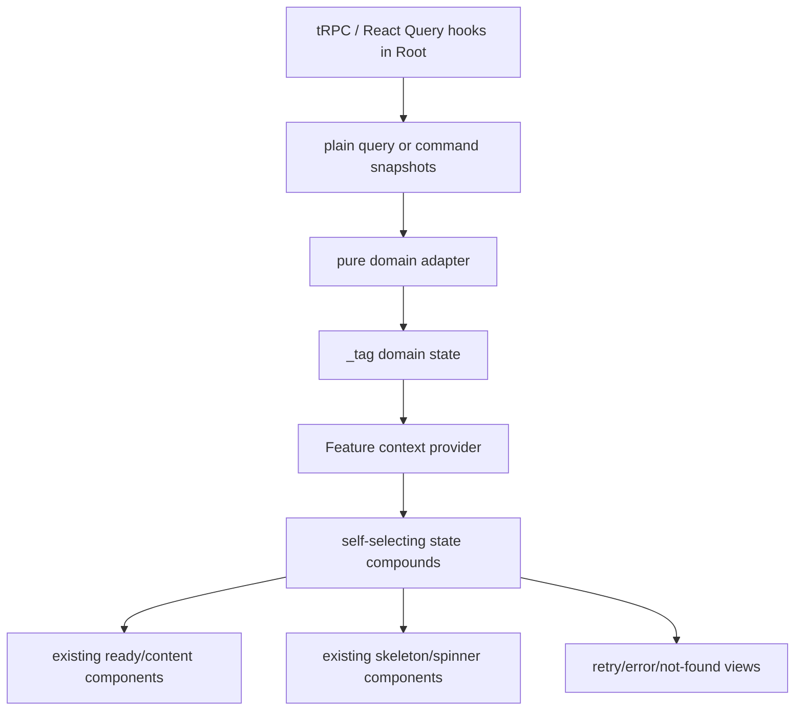
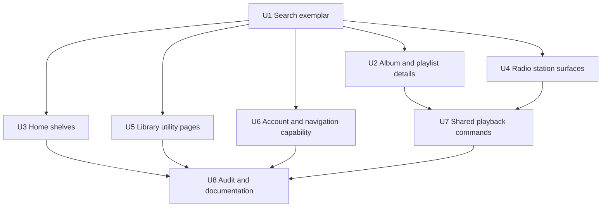
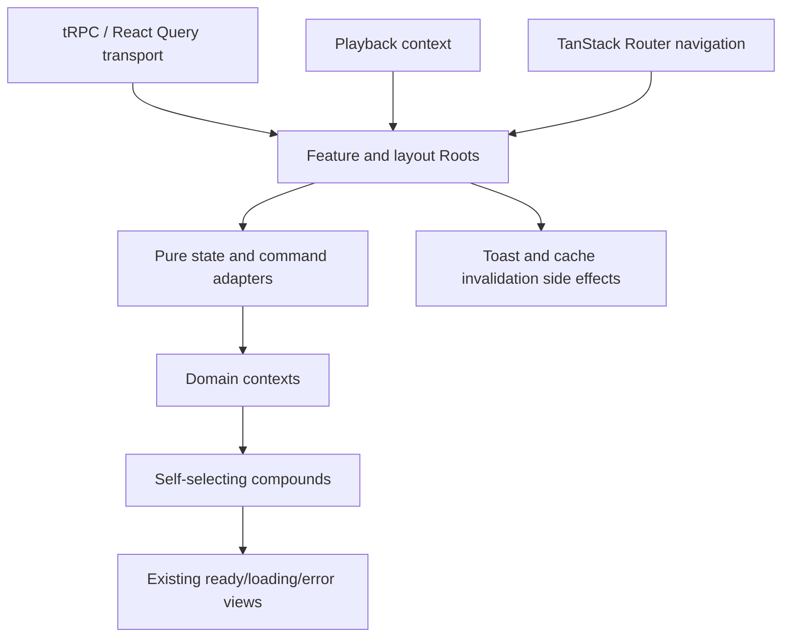

# refactor: Replace raw React query branching with state boundaries

## Summary

Refactor Pyxis web UI surfaces so tRPC/React Query state is converted at Root seams into domain `_tag` state ADTs, then rendered through self-selecting state compounds. The migration is full-scale across the identified feature pages and shared layout consumers, staged by surface family so each slice remains reviewable while preserving existing transport and observable behavior.

---

## Problem Frame

Pyxis currently uses React Query/tRPC directly in many page and layout components, with JSX branching on `isLoading`, `isError`, nullable `data`, `error`, and mutation pending fields. That makes each page responsible for infrastructure state interpretation and drifts from the Lattice React pattern: Root owns runtime state, pure adapters produce domain state, and child compounds select their active case.

This refactor is architectural rather than product-facing: users should see the same screens and behavior, while maintainers get repeatable page-state boundaries that make later Effect atom migration mechanical instead of a rewrite.

---

## Requirements

- R1. Replace raw query-state branching in the identified feature pages with Root/provider seams that expose domain ADTs using explicit `_tag` cases.
- R2. Keep existing tRPC/React Query transport behavior, cache invalidation, enabled-query semantics, subscriptions, navigation, playback side effects, and toast outcomes intact.
- R3. Use self-selecting state compounds for loading, error, empty/not-found, ready, and defect-like states instead of presenter-level `switch` statements or boolean prop forests.
- R4. Keep conversion and selection helpers pure and covered by unit tests; selectors should return `Option` from `effect`.
- R5. Preserve project-local conventions: current `@/web/...` alias, Biome tab formatting, one component per file, no barrel exports, and direct imports from component files.
- R6. Stage the full migration so Search establishes the exemplar and subsequent page families follow the same pattern without introducing a generic result-boundary framework prematurely.
- R7. Treat shared layout tRPC consumers as in-scope when they own query or mutation state that affects rendered navigation, playback actions, or command availability.

---

## Scope Boundaries

- Do not replace tRPC/React Query with Effect atoms in this pass; atoms remain the destination posture for future seams.
- Do not change API contracts, server routers, database schema, or source-manager behavior.
- Do not redesign the UI, rewrite routing, change aliases, or migrate formatter policy.
- Do not fold every page into one shared async-boundary abstraction; keep state models domain-specific unless repeated implementation proves a small shared helper is necessary.
- Do not fix unrelated product behavior discovered during the refactor unless preserving current behavior requires a local correction.

### Deferred to Follow-Up Work

- Effect atom/layer migration for these surfaces: separate follow-up once state boundaries are stable.
- Optional Storybook/page-harness coverage: future UI harness work; this repository currently has no Storybook setup.
- Broader audit of sandbox-only surfaces such as `src/web/features/sandbox/queue-coverflow/QueueCoverflowPage.tsx`: follow-up unless the sandbox is promoted to product UI.

---

## Context & Research

### Relevant Code and Patterns

- `src/web/features/search/search-page.tsx` already has an embryonic `SearchState`, but uses `type` cases, a local `switch`, and direct query/mutation state inside the page.
- `src/web/features/home/home-page.tsx` branches per shelf on query loading fields and passes `isLoading` into `PlaylistShelf`, making shelf state a prop-level boolean contract.
- `src/web/features/album-detail/library-album-detail-root.tsx` and `src/web/features/album-detail/source-album-detail-root.tsx` already act like Roots, but still branch directly on query loading/error/not-found states.
- `src/web/features/stations/stations-page.tsx`, `src/web/features/station-detail/station-detail-page.tsx`, `src/web/features/bookmarks/bookmarks-page.tsx`, `src/web/features/genres/genres-page.tsx`, `src/web/features/history/history-page.tsx`, `src/web/features/settings/settings-page.tsx`, and `src/web/features/playlist-detail/playlist-detail-page.tsx` contain page-level raw query branching.
- `src/web/shared/layout/sidebar.tsx` and `src/web/shared/layout/mobile-nav.tsx` duplicate auth-status query interpretation for Pandora-gated nav visibility.
- `src/web/shared/layout/now-playing-bar.tsx` and `src/web/shared/layout/command-palette.tsx` keep mutation state and tRPC command wiring inside layout components.
- Existing provider examples to follow for guarded hooks: `src/web/shared/playback/playback-context.tsx` and `src/web/shared/theme/theme-context.tsx`.
- Existing tests are colocated and run with Bun, e.g. `src/web/shared/lib/now-playing-utils.test.ts`; web feature state tests should follow `*.test.ts` / `*.test.tsx` colocation.

### Institutional Learnings

- `docs/solutions/feature-patterns/2026-04-15-shared-primitives-react-audit.md` says simple leaf primitives can remain simple, but behavior-bearing widgets should decompose when state and modes grow. It also previously accepted sidebar/mobile nav local branching for compound-component purposes; this plan revisits them only because the current scope is raw query-state boundaries.

### External References

- External research was not used. The target pattern is defined by the provided Lattice React guidance and current repository conventions are sufficient to plan the migration.

---

## Key Technical Decisions

- Domain-specific state boundaries per feature family: preserves meaningful UI language and avoids a shallow generic result-boundary framework.
- Search first, then fan out: Search has the clearest existing state shape and should become the exemplar before applying the pattern to more complex pages.
- Root remains the transport seam: existing pages/roots may still call tRPC, but only the Root/adapters interpret raw query or mutation primitives; compounds consume domain state/actions from context.
- Plain query snapshots in pure adapters: conversion helpers should accept minimal data/status/error snapshots rather than React Query objects so tests stay pure and independent of hook runtime.
- Mutations become command state only where UI consumes them: pending/failure outcomes used for disabled controls or visible feedback should be modeled as command ADTs; fire-and-toast commands without rendered pending state can stay encapsulated at the Root seam.
- Shared layout gets shared-layout seams, not feature imports: navigation and command layout code should not import product feature modules just to access state.
- Preserve current loading semantics: dependent queries such as Search album state resolution and Settings Pandora-only queries must keep their `enabled` behavior and avoid showing errors for intentionally disabled data.
- Feature-family Roots over one app-wide query facade: page families have different empty/error/not-found semantics, so the plan keeps boundaries close to domain surfaces while still making later shared helpers possible after repetition is proven.
- Characterize before broad motion: each family should lock adapter behavior in tests before JSX is moved, because most risk is accidental state-regression rather than new product behavior.

---

## Alternative Approaches Considered

- Search-only exemplar: rejected because the user clarified this is a full-scale refactor, not a one-off demonstration.
- App-wide generic async boundary: rejected for now because Pyxis surfaces have different ready/empty/not-found/command semantics; a generic framework would either leak booleans back into children or become shallow indirection.
- Immediate Effect atom migration: deferred because the current problem is raw UI branching; stabilizing Root/domain-state seams first makes a later atom migration mechanical.
- Leave shared layout out of scope: rejected because shared layout components still own transport state that affects navigation visibility and command availability.

---

## Open Questions

### Resolved During Planning

- Is this a Search-only exemplar or a full migration? Resolved by user correction: this is a full-scale refactor, with Search only as the first staged slice.
- Should Effect atoms be introduced now? Resolved from handoff and Lattice posture: no, keep transport stable and make future atom migration mechanical.
- Should sidebar/mobile nav remain exempt because an earlier audit accepted them? Resolved: they are in scope for raw query-state cleanup, while the earlier audit remains valid for compound-component concerns.

### Deferred to Implementation

- Exact names and granularity of individual state-specific compounds: decide while editing each feature so names match existing domain language and avoid unnecessary files.
- Whether tiny pages share small helper types: defer until duplication appears across at least two implemented units; do not pre-build a framework.
- Final defect classification for React Query error shapes: implementers should preserve known error UI first and introduce `Defect` only for unexpected adapter inputs.

---

## High-Level Technical Design

> *This illustrates the intended approach and is directional guidance for review, not implementation specification. The implementing agent should treat it as context, not code to reproduce.*

Each migrated surface should follow the same boundary shape, with domain-specific names:

The dependency structure is intentionally staged rather than all-at-once:

---

## Phased Delivery

### Phase 1 — Exemplar and high-risk detail flows

- U1 establishes the state-boundary pattern in Search.
- U2 applies it to detail pages where loading/not-found/auto-play interactions carry the most regression risk.

### Phase 2 — Page-family migration

- U3, U4, U5, and U6 migrate the remaining feature page families while preserving each family’s current data and command behavior.

### Phase 3 — Shared layout and audit closure

- U7 removes layout-owned transport state for playback/command surfaces.
- U8 audits remaining raw query branching, documents accepted exceptions, and captures the final pattern.

---

## Implementation Units

### U1. Search state boundary exemplar

**Goal:** Convert Search into the reference implementation for the migration: a Search Root/context, `_tag` state ADT, pure adapter/selectors, and self-selecting state compounds.

**Requirements:** R1, R2, R3, R4, R5, R6

**Dependencies:** None

**Files:**
- Create: `src/web/features/search/SearchStateRoot.tsx`
- Create: `src/web/features/search/SearchState.context.tsx`
- Create: `src/web/features/search/SearchState.context.test.ts`
- Create: `src/web/features/search/components/SearchIdle.tsx`
- Create: `src/web/features/search/components/SearchLoading.tsx`
- Create: `src/web/features/search/components/SearchEmpty.tsx`
- Create: `src/web/features/search/components/SearchLoadError.tsx`
- Create: `src/web/features/search/components/SearchDefect.tsx`
- Create: `src/web/features/search/components/SearchReady.tsx`
- Modify: `src/web/features/search/search-page.tsx`
- Modify: `src/web/features/search/components/SearchResultsEmpty.tsx` if it is reused or renamed into the state compound
- Test: `src/web/features/search/SearchState.context.test.ts`

**Approach:**
- Move Search query interpretation out of `search-page.tsx` into a Root/context seam while preserving the existing query, library-state resolution, mutations, playback, and toast behavior.
- Replace the local `type`-based `SearchState` with `_tag` cases for idle, loading, empty, ready, load error, and defect-like unexpected states.
- Keep album state enrichment in the Search adapter or Root seam so ready compounds receive already-enriched `SearchAlbum` records.
- Replace the `SearchContent` presenter `switch` with state-specific compounds that read from `useSearchState()` or a selected case helper and return `null` when inactive.

**Execution note:** Implement the pure adapter and selector tests first so the exemplar pattern is locked before moving JSX.

**Patterns to follow:**
- Guarded context hook shape in `src/web/shared/playback/playback-context.tsx`.
- Existing Search domain types in `src/web/features/search/types.ts`.
- Existing Search presentational components under `src/web/features/search/components/`.

**Test scenarios:**
- Happy path: query below the minimum length with no data converts to `Idle`, and `select("Idle")` returns `Option.some` only for that case.
- Happy path: a loading unified query with an eligible query converts to `Loading`.
- Happy path: unified results with tracks, albums, Pandora artists, or genres convert to `Ready` with the original result groups preserved.
- Happy path: resolved library album states enrich matching Search albums before the Ready view sees them.
- Edge case: unified results with all result groups empty convert to `Empty`.
- Edge case: a disabled library-state query with no source ids does not block Ready results.
- Error path: a failed unified search converts to `LoadError` with a retry-capable state instead of falling through to Idle or Empty.
- Error path: unexpected adapter inputs convert to `Defect` or an explicitly documented fallback state.

**Verification:**
- `search-page.tsx` no longer branches on `unifiedQuery.isLoading`, `unifiedQuery.data`, or `libraryStatesQuery.data` in JSX.
- Search compounds render only through the provider and selectors.
- Search behavior remains unchanged for idle, loading, empty, result, save-album, play-album, create-station, and create-radio flows.

---

### U2. Album and playlist detail state roots

**Goal:** Move detail-page loading, error, not-found, ready, and command-pending interpretation behind domain state roots for album and playlist details.

**Requirements:** R1, R2, R3, R4, R5

**Dependencies:** U1

**Files:**
- Create: `src/web/features/album-detail/AlbumDetailStateRoot.tsx`
- Create: `src/web/features/album-detail/AlbumDetailState.context.tsx`
- Create: `src/web/features/album-detail/AlbumDetailState.context.test.ts`
- Create: `src/web/features/album-detail/components/AlbumDetailLoading.tsx`
- Create: `src/web/features/album-detail/components/AlbumDetailLoadError.tsx`
- Create: `src/web/features/album-detail/components/AlbumDetailNotFound.tsx`
- Create: `src/web/features/album-detail/components/AlbumDetailReady.tsx`
- Create: `src/web/features/playlist-detail/PlaylistDetailStateRoot.tsx`
- Create: `src/web/features/playlist-detail/PlaylistDetailState.context.tsx`
- Create: `src/web/features/playlist-detail/PlaylistDetailState.context.test.ts`
- Create: `src/web/features/playlist-detail/components/PlaylistDetailLoading.tsx`
- Create: `src/web/features/playlist-detail/components/PlaylistDetailNotFound.tsx`
- Create: `src/web/features/playlist-detail/components/PlaylistDetailReady.tsx`
- Modify: `src/web/features/album-detail/library-album-detail-root.tsx`
- Modify: `src/web/features/album-detail/source-album-detail-root.tsx`
- Modify: `src/web/features/playlist-detail/playlist-detail-page.tsx`
- Test: `src/web/features/album-detail/AlbumDetailState.context.test.ts`
- Test: `src/web/features/playlist-detail/PlaylistDetailState.context.test.ts`

**Approach:**
- Treat `library-album-detail-root.tsx` and `source-album-detail-root.tsx` as transport Roots that feed a shared Album Detail state context.
- Preserve the distinction between library albums and source albums in the Ready case so placement/editing capabilities remain explicit rather than inferred from nullable props.
- Move `isSavingAlbum` and `isSettingPlacement` into command-state fields consumed by ready compounds instead of boolean prop forests.
- Split `PlaylistDetailPage` into a Root plus state compounds; move the inline `PlaylistDetailSkeleton` out of the page file if it remains a separately imported unit.
- Preserve auto-play guards and playback error clearing at the Root/side-effect seam.

**Patterns to follow:**
- Existing `AlbumDetailContent` and `AlbumDetailSkeleton` as ready/loading views.
- Existing playback queue conversion helpers in `src/web/shared/lib/now-playing-utils.ts`.
- Search state adapter shape from U1.

**Test scenarios:**
- Happy path: library album query plus tracks query success converts to Ready with editable/manageable capabilities.
- Happy path: source album query plus library state query success converts to Ready with source-state placement capabilities.
- Happy path: playlist metadata plus track list success converts to Ready with computed track count and duration inputs available to the ready view.
- Edge case: album success with missing album payload converts to `NotFound` rather than Ready with nullable album.
- Edge case: playlist id absent from playlist list converts to `NotFound` after loading completes.
- Error path: album query failure converts to `LoadError` with retry behavior preserved.
- Error path: tracks query failure is represented explicitly instead of silently passing an empty track list unless current behavior intentionally requires that fallback.
- Integration: auto-play still fires once after ready data exists and does not fire from loading/error/not-found states.

**Verification:**
- Detail page JSX no longer contains top-level `if (query.isLoading)`, `if (query.isError)`, or nullable ready-data branching.
- Existing album save, placement, rename, track rename, playlist play, shuffle, and auto-play behaviors remain observable.

---

### U3. Home shelves and collection overview state

**Goal:** Convert the Home page’s multi-query shelf composition into stateful shelf compounds without loading booleans in shelf props.

**Requirements:** R1, R2, R3, R4, R5

**Dependencies:** U1

**Files:**
- Create: `src/web/features/home/HomeStateRoot.tsx`
- Create: `src/web/features/home/HomeState.context.tsx`
- Create: `src/web/features/home/HomeState.context.test.ts`
- Create: `src/web/features/home/components/HomePlaylistShelfLoading.tsx`
- Create: `src/web/features/home/components/HomePlaylistShelfReady.tsx`
- Create: `src/web/features/home/components/HomeAlbumShelfLoading.tsx`
- Create: `src/web/features/home/components/HomeHotShelfReady.tsx`
- Create: `src/web/features/home/components/HomeDiscoveryShelfReady.tsx`
- Create: `src/web/features/home/components/HomeCollectionShelfReady.tsx`
- Create: `src/web/features/home/components/HomeArchiveShelfReady.tsx`
- Modify: `src/web/features/home/home-page.tsx`
- Modify: `src/web/features/home/playlist-shelf.tsx`
- Modify: `src/web/features/home/album-shelf.tsx` if needed to keep it presentational and source-agnostic
- Test: `src/web/features/home/HomeState.context.test.ts`

**Approach:**
- Model Home as a composition of independent shelf states rather than one monolithic page status; Hot, Discovery, Collection, Archive, and Playlists can load independently as they do today.
- Remove `isLoading` from `PlaylistShelf` and represent playlist loading through a Home-specific loading compound.
- Keep `showArchive` as widget-local UI state owned by the Home Root; preserve the archive query’s enabled-only-when-visible behavior.
- Keep `AlbumShelf` and `PlaylistShelf` as source-agnostic ready views that receive already-normalized data.

**Patterns to follow:**
- Existing shelf components in `src/web/features/home/`.
- Existing collection skeletons in `src/web/shared/ui/collection-grid/CollectionGridSkeleton.tsx`.
- Search state selector pattern from U1.

**Test scenarios:**
- Happy path: playlists success converts to a playlist Ready shelf while album shelves can still be Loading independently.
- Happy path: hot/discovery/collection query successes convert to Ready shelves with normalized `AlbumData` values.
- Edge case: empty shelf data remains a Ready shelf with existing empty messages, not a page-level Empty state.
- Edge case: archive remains Idle or Hidden while `showArchive` is false and becomes Loading/Ready only when enabled.
- Error path: a shelf query failure maps to an explicit shelf load-error state or a documented existing fallback without affecting unrelated shelves.
- Integration: clicking playlist/station shelves still navigates to the same routes with the same search params.

**Verification:**
- Home JSX composes shelf state components rather than inline ternaries over `query.isLoading`.
- Ready shelf components receive normalized data, not raw query objects.

---

### U4. Radio station surfaces

**Goal:** Refactor station list, station detail, and station management dialogs so radio query/mutation state is interpreted at roots and exposed through domain state/action contracts.

**Requirements:** R1, R2, R3, R4, R5, R7

**Dependencies:** U1

**Files:**
- Create: `src/web/features/stations/StationsStateRoot.tsx`
- Create: `src/web/features/stations/StationsState.context.tsx`
- Create: `src/web/features/stations/StationsState.context.test.ts`
- Create: `src/web/features/stations/components/StationsLoading.tsx`
- Create: `src/web/features/stations/components/StationsLoadError.tsx`
- Create: `src/web/features/stations/components/StationsReady.tsx`
- Create: `src/web/features/station-detail/StationDetailStateRoot.tsx`
- Create: `src/web/features/station-detail/StationDetailState.context.tsx`
- Create: `src/web/features/station-detail/StationDetailState.context.test.ts`
- Create: `src/web/features/station-detail/components/StationDetailLoading.tsx`
- Create: `src/web/features/station-detail/components/StationDetailLoadError.tsx`
- Create: `src/web/features/station-detail/components/StationDetailNotFound.tsx`
- Create: `src/web/features/station-detail/components/StationDetailReady.tsx`
- Modify: `src/web/features/stations/stations-page.tsx`
- Modify: `src/web/features/stations/add-seed-dialog.tsx`
- Modify: `src/web/features/stations/quick-mix-dialog.tsx`
- Modify: `src/web/features/stations/rename-station-dialog.tsx`
- Modify: `src/web/features/stations/delete-station-dialog.tsx`
- Modify: `src/web/features/station-detail/station-detail-page.tsx`
- Test: `src/web/features/stations/StationsState.context.test.ts`
- Test: `src/web/features/station-detail/StationDetailState.context.test.ts`

**Approach:**
- Keep station filter/dialog-open state local to the Stations Root while moving list query loading/error/ready interpretation into a state adapter.
- Preserve QuickMix detection, station filtering, and current-station playback highlighting as Ready-state derived data.
- Convert Station Detail loading/error/not-found/ready handling into state compounds; keep queue subscription and radio-track fetch side effects in the Root.
- For dialogs, model mutation pending states as command state where they currently drive disabled buttons or labels.
- Keep add-seed search query state local to the dialog Root and represent searching, empty result, ready result, and add-pending states explicitly.

**Patterns to follow:**
- Existing station list components in `src/web/features/stations/station-list/`.
- Existing station detail presentational components in `src/web/features/station-detail/`.
- Mutation toast/invalidation patterns already in each dialog.

**Test scenarios:**
- Happy path: station list success converts to Ready with QuickMix availability and filtered station data.
- Happy path: station detail success converts to Ready with artist seed, song seed, liked feedback, and disliked feedback groups derived without nullable rendering checks.
- Happy path: add-seed search with matching artist/song data converts to a Ready result state.
- Edge case: station list empty data remains Ready with an empty station collection, preserving current list behavior.
- Edge case: station detail with no seeds and no feedback produces Ready state with empty sections, not NotFound.
- Error path: station list query error converts to LoadError with the existing error message intent.
- Error path: station detail query error converts to LoadError and does not render partial station content.
- Error path: add-seed search failure and add-seed mutation failure are distinguishable from empty results.
- Integration: deleting, renaming, QuickMix updating, seed removal, and station creation still invalidate the same radio queries and close dialogs on success where they do today.

**Verification:**
- Station pages and dialogs no longer render directly from `stationsQuery.isLoading`, `stationQuery.error`, `searchQuery.isFetching`, or mutation `isPending` fields in presentation JSX.
- Radio playback start and auto-play behavior remains unchanged.

---

### U5. Library utility pages

**Goal:** Migrate Bookmarks, Genres, and History from page-level query branching to domain state roots with explicit empty, ready, loading, and error cases.

**Requirements:** R1, R2, R3, R4, R5

**Dependencies:** U1

**Files:**
- Create: `src/web/features/bookmarks/BookmarksStateRoot.tsx`
- Create: `src/web/features/bookmarks/BookmarksState.context.tsx`
- Create: `src/web/features/bookmarks/BookmarksState.context.test.ts`
- Create: `src/web/features/bookmarks/components/BookmarksLoading.tsx`
- Create: `src/web/features/bookmarks/components/BookmarksEmpty.tsx`
- Create: `src/web/features/bookmarks/components/BookmarksReady.tsx`
- Create: `src/web/features/genres/GenresStateRoot.tsx`
- Create: `src/web/features/genres/GenresState.context.tsx`
- Create: `src/web/features/genres/GenresState.context.test.ts`
- Create: `src/web/features/history/HistoryStateRoot.tsx`
- Create: `src/web/features/history/HistoryState.context.tsx`
- Create: `src/web/features/history/HistoryState.context.test.ts`
- Modify: `src/web/features/bookmarks/bookmarks-page.tsx`
- Modify: `src/web/features/genres/genres-page.tsx`
- Modify: `src/web/features/history/history-page.tsx`
- Test: `src/web/features/bookmarks/BookmarksState.context.test.ts`
- Test: `src/web/features/genres/GenresState.context.test.ts`
- Test: `src/web/features/history/HistoryState.context.test.ts`

**Approach:**
- Bookmarks should model separate artist/song groups in Ready state and an explicit Empty state when both groups are empty.
- Genres should keep expansion state in the Root and expose category Ready state; station creation pending state should be represented where it affects controls.
- History should model pagination state with page-level Loading, Ready, EmptyFirstPage, and LoadError cases; relative time formatting remains a pure view concern unless tests show it needs extraction.
- Preserve current create-station, remove-bookmark, and pagination behavior.

**Patterns to follow:**
- Existing button/spinner primitives in `src/web/shared/ui/`.
- Existing page copy and layout in the current page files.
- Search state adapter and Option selectors from U1.

**Test scenarios:**
- Happy path: bookmarks with artists and songs convert to Ready with both groups available.
- Happy path: genres query success converts to Ready with categories and station rows preserved.
- Happy path: history query success converts to Ready with pagination metadata derived from offset and page size.
- Edge case: bookmarks response with no artists and no songs converts to Empty.
- Edge case: history first page with no entries converts to EmptyFirstPage, while later empty pages remain Ready or a documented pagination boundary state.
- Error path: failed bookmarks, genres, and history queries each convert to LoadError rather than silently rendering empty lists.
- Integration: bookmark removal and genre/bookmark station creation still invalidate the same queries and show the same success/error toasts.

**Verification:**
- Utility pages no longer branch on raw query loading/data fields in page JSX.
- Empty states are explicit domain cases rather than incidental `array.length` checks scattered through the page.

---

### U6. Account and navigation capability state

**Goal:** Centralize Pandora-auth capability interpretation for Settings, Sidebar, and MobileNav so auth query state is not interpreted independently in each component.

**Requirements:** R1, R2, R3, R4, R5, R7

**Dependencies:** U1

**Files:**
- Create: `src/web/features/settings/SettingsStateRoot.tsx`
- Create: `src/web/features/settings/SettingsState.context.tsx`
- Create: `src/web/features/settings/SettingsState.context.test.ts`
- Create: `src/web/features/settings/components/SettingsLoading.tsx`
- Create: `src/web/features/settings/components/SettingsNoAccount.tsx`
- Create: `src/web/features/settings/components/SettingsReady.tsx`
- Create: `src/web/shared/layout/navigation/NavigationCapabilityRoot.tsx`
- Create: `src/web/shared/layout/navigation/NavigationCapability.context.tsx`
- Create: `src/web/shared/layout/navigation/NavigationCapability.context.test.ts`
- Modify: `src/web/features/settings/settings-page.tsx`
- Modify: `src/web/shared/layout/sidebar.tsx`
- Modify: `src/web/shared/layout/mobile-nav.tsx`
- Modify: `src/web/shared/lib/nav-items.ts` if the visible-item helper belongs with nav item definitions
- Test: `src/web/features/settings/SettingsState.context.test.ts`
- Test: `src/web/shared/layout/navigation/NavigationCapability.context.test.ts`

**Approach:**
- Settings should model auth status, Pandora account absence, settings/usage loading, partial data availability, and update command state explicitly.
- Navigation should use one capability context for Pandora-gated nav visibility so Sidebar and MobileNav no longer duplicate auth-status query interpretation.
- Keep navigation open/closed state local to MobileNav; that is widget-local UI state, not infrastructure state.
- Preserve settings query `enabled: hasPandora` behavior and `retry: false` settings/usage semantics.

**Patterns to follow:**
- Existing `navItems` structure in `src/web/shared/lib/nav-items.ts`.
- Existing context guard shape from playback/theme providers.
- Earlier shared-primitives audit guidance: do not over-refactor leaf primitives; focus on query capability state only.

**Test scenarios:**
- Happy path: auth status with Pandora available makes Pandora-gated nav items visible to Sidebar and MobileNav.
- Happy path: settings and usage successes convert to Settings Ready with account and usage sections available.
- Edge case: auth status without Pandora converts Settings to NoAccount and disables settings/usage queries.
- Edge case: settings success without usage still renders account settings while usage is absent or explicitly unavailable.
- Error path: auth status failure maps to a navigation capability fallback and a Settings load-error state without exposing raw query errors to children.
- Error path: explicit-filter update failure preserves existing toast error behavior if added during implementation.
- Integration: changing explicit filter still invalidates settings and updates the visible account state after refetch.

**Verification:**
- Sidebar and MobileNav no longer call `trpc.auth.status.useQuery()` directly.
- Settings no longer branches on raw status/settings/usage query fields in page JSX.

---

### U7. Shared playback and command action seams

**Goal:** Move layout-level playback command mutations and subscription-derived state behind layout Roots/action contexts so shared components do not own raw tRPC mutation state.

**Requirements:** R2, R3, R4, R5, R7

**Dependencies:** U2, U4

**Files:**
- Create: `src/web/shared/layout/now-playing-bar/NowPlayingBarRoot.tsx`
- Create: `src/web/shared/layout/now-playing-bar/NowPlayingBar.context.tsx`
- Create: `src/web/shared/layout/now-playing-bar/NowPlayingBar.context.test.ts`
- Create: `src/web/shared/layout/command-palette/CommandPaletteRoot.tsx`
- Create: `src/web/shared/layout/command-palette/CommandPalette.context.tsx`
- Create: `src/web/shared/layout/command-palette/CommandPalette.context.test.ts`
- Modify: `src/web/shared/layout/now-playing-bar.tsx`
- Modify: `src/web/shared/layout/command-palette.tsx`
- Modify: `src/web/shared/layout/now-playing-bar/components/NowPlayingSecondaryActions.tsx` if command availability is currently prop-driven by booleans
- Modify: `src/web/shared/layout/command-palette/components/CommandPaletteCommandListPanel.tsx` if command availability moves into context
- Test: `src/web/shared/layout/now-playing-bar/NowPlayingBar.context.test.ts`
- Test: `src/web/shared/layout/command-palette/CommandPalette.context.test.ts`

**Approach:**
- Keep queue subscription, feedback/sleep/bookmark mutations, and toast wiring in layout Roots.
- Expose command functions and command availability states through layout contexts so child components do not know about tRPC mutation objects.
- Model radio-only commands, current-track-required commands, and pending command states explicitly enough that disabled/hidden UI decisions are domain-level.
- Preserve existing navigation-to-context and action-sheet behavior.

**Patterns to follow:**
- Existing compound file layout under `src/web/shared/layout/now-playing-bar/components/` and `src/web/shared/layout/command-palette/components/`.
- Existing playback context as the global playback source.
- Existing mutation side-effect/toast behavior in current layout files.

**Test scenarios:**
- Happy path: current radio track enables like/dislike/sleep/bookmark command states and executes the same mutation payloads through Root actions.
- Happy path: manual or non-radio context disables radio-only feedback commands without hiding unrelated playback controls.
- Edge case: no current track disables track-specific commands and does not attempt mutations.
- Edge case: queue subscription updates queue context and current index state without resetting local action-sheet state.
- Error path: feedback, sleep, and bookmark mutation failures keep existing toast behavior and do not leave command state permanently pending.
- Integration: command palette actions still close the palette before executing playback/navigation commands.

**Verification:**
- Shared layout child components receive domain command state/actions, not tRPC mutation objects.
- Now Playing and Command Palette observable behavior remains unchanged for playback controls, navigation, and track actions.

---

### U8. Migration audit, documentation, and guardrails

**Goal:** Verify the full migration removed targeted raw query branching, document the pattern for future surfaces, and leave follow-up work visible without expanding this refactor.

**Requirements:** R1, R4, R5, R6, R7

**Dependencies:** U3, U5, U6, U7

**Files:**
- Create: `docs/solutions/feature-patterns/2026-05-24-react-query-state-boundaries.md`
- Modify: `docs/solutions/feature-patterns/2026-04-15-shared-primitives-react-audit.md` if the navigation/layout conclusions need a narrow update after this refactor
- Test: none -- documentation and audit unit; behavioral coverage is owned by U1-U7

**Approach:**
- Run a repository audit for remaining raw query-state branching in product UI surfaces and classify any survivors as accepted exceptions, deferred sandbox work, or missed migration targets.
- Document the final pattern with examples at the decision level: Root owns transport, context exposes domain state/actions, helpers are pure and tested, compounds self-select.
- Keep docs focused on the solved Pyxis pattern rather than restating all Lattice principles.

**Patterns to follow:**
- Existing solution-doc shape in `docs/solutions/feature-patterns/2026-04-15-shared-primitives-react-audit.md`.
- Project logging/test command guidance in `AGENTS.md` and `justfile`.

**Test scenarios:**
- Test expectation: none -- this unit creates documentation and audit classification; code behavior is covered by the feature-bearing units.

**Verification:**
- A targeted grep/audit finds no unclassified raw query-state branching in the in-scope UI paths.
- Documentation explains how to migrate the next page without introducing a generic framework.
- `just typecheck`, `just test`, `just lint`, and `just format` pass or only report pre-existing unrelated issues that are documented for follow-up.

---

## System-Wide Impact

- **Interaction graph:** Query hooks remain in page/layout Roots; contexts feed state compounds; ready views continue to call navigation, playback, and mutation actions through domain-level callbacks.
- **Error propagation:** Query and mutation errors should be converted into `LoadError`, command failure, or existing toast outcomes at the Root seam. Children should not inspect raw error objects except through typed domain cases.
- **State lifecycle risks:** Dependent queries (`enabled` flags), one-shot auto-play refs, queue subscriptions, mutation pending states, and dialog close-on-success behavior must survive the refactor without duplicate effects.
- **Cache and invalidation parity:** Existing invalidations on save-album, set-placement, station create/update/delete, seed mutations, settings updates, and bookmarks must stay at the Root seam and target the same query families.
- **API surface parity:** tRPC router inputs/outputs and route search params are unchanged. The refactor changes UI state boundaries only.
- **Integration coverage:** Unit tests cover pure adapters; manual or higher-level verification must cover auto-play, navigation, queue subscription updates, and mutation invalidation because those span hooks and side effects.
- **Unchanged invariants:** Playback context remains the global playback source; tRPC remains the transport; shared layout remains product-agnostic within `src/web/shared/layout/` and must not import feature-specific state.

---

## Risks & Dependencies

| Risk | Mitigation |
|------|------------|
| Migration becomes a giant unreviewable diff | Stage by U-ID surface families; land Search exemplar first and apply the same pattern incrementally. |
| New contexts become shallow wrappers | Keep adapters responsible for meaningful state conversion, error/empty/not-found distinctions, and command availability rather than just renaming query fields. |
| Behavior changes accidentally during structural refactor | Preserve current transport hooks and side effects; add adapter tests before moving JSX; verify route/playback/mutation flows after each unit. |
| Over-abstraction creates a generic framework too early | Keep state ADTs domain-specific; document repeated patterns only after multiple units validate them. |
| Under-abstraction creates inconsistent state names and selectors | Use U1 as the naming and selector exemplar; document deviations only when a domain state genuinely differs. |
| Shared layout starts depending on product feature modules | Put layout seams under `src/web/shared/layout/` and keep imports flowing from shared layout to shared utilities only. |
| Tests become implementation-coupled | Test pure state conversion and selectors through public helper contracts, not React internals or private component structure. |
| Disabled dependent queries are mistaken for failed loads | Adapter tests must cover disabled/idle dependent-query cases for Search, Settings, Home archive, and radio-track fetching. |

---

## Documentation / Operational Notes

- This is a frontend architecture refactor with no deployment or data migration steps.
- Update solution documentation only after implementation confirms the final shape.
- If visual regressions are suspected, verify the affected screens manually because this repo currently does not expose a Storybook or Playwright visual harness.

---

## Sources & References

- Handoff input: session-provided handoff file
- React guidance: `.pi/git/github.com/simonwjackson/pi-lattice-stack/skills/react/SKILL.md`
- Project guidance: `AGENTS.md`
- Existing audit: `docs/solutions/feature-patterns/2026-04-15-shared-primitives-react-audit.md`
- Search page: `src/web/features/search/search-page.tsx`
- Home page: `src/web/features/home/home-page.tsx`
- Album detail roots: `src/web/features/album-detail/library-album-detail-root.tsx`, `src/web/features/album-detail/source-album-detail-root.tsx`
- Station pages: `src/web/features/stations/stations-page.tsx`, `src/web/features/station-detail/station-detail-page.tsx`
- Utility pages: `src/web/features/bookmarks/bookmarks-page.tsx`, `src/web/features/genres/genres-page.tsx`, `src/web/features/history/history-page.tsx`, `src/web/features/settings/settings-page.tsx`
- Shared layout: `src/web/shared/layout/sidebar.tsx`, `src/web/shared/layout/mobile-nav.tsx`, `src/web/shared/layout/now-playing-bar.tsx`, `src/web/shared/layout/command-palette.tsx`
- Tooling: `package.json`, `tsconfig.web.json`, `biome.json`, `justfile`
