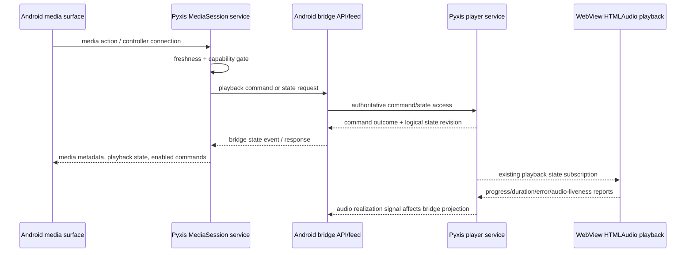

# feat: Add Android MediaSession Bridge

## Summary

Add a service-owned Android media-session bridge beside the existing Sony kiosk WebView, backed by a bounded daemon-facing playback/control surface that native Kotlin can consume without becoming a second player. The implementation keeps Pyxis daemon/WebView playback authoritative while making Bluetooth, hardware/media buttons, lockscreen/notification controls, and screen-off behavior first-class validation targets.

---

## Problem Frame

The Sony kiosk now launches Pyxis as a dedicated WebView shell, but Android still sees it more like a browser than a music app. The next step is to expose truthful native media state and controls without replacing the existing web playback surface or splitting playback truth away from the Pyxis daemon.

---

## Requirements

- R1. Expose Pyxis as an Android media app to OS-level media surfaces. (Origin R1)
- R2. Treat Bluetooth AVRCP, Sony/Android media buttons, and lockscreen/notification controls as required success paths. (Origin R2)
- R3. Publish recognizable current playback metadata to Android when Pyxis has it. (Origin R3)
- R4. Keep Android media surfaces updated across play, pause, resume, stop, error, reconnect, and track changes. (Origin R4)
- R5. Route native Android controls to Pyxis playback commands; do not create independent Android-owned playback truth. (Origin R5)
- R6. Converge stale or conflicting Android/WebView/daemon state toward the authoritative Pyxis state. (Origin R6)
- R7. Degrade or clear media surfaces when Pyxis state is unknown or not controllable. (Origin R7)
- R8. Support play, pause, next, and previous while the Sony screen is off or locked, subject to Pyxis capabilities. (Origin R8)
- R9. Keep the WebView-visible playback state consistent after screen-off native control actions. (Origin R9)
- R10. Add enough diagnostics to distinguish bridge failure, daemon failure, WebView/audio failure, and unsupported Android behavior. (Origin R10)
- R11. Preserve the WebView/Pyxis web app as the primary browse and playback surface. (Origin R11)
- R12. Do not require Android to become a full native playback engine. (Origin R12)
- R13. Validate first on the Sony Walkman NW-A306 before claiming broader Android support. (Origin R13)
- R14. Bridge control/state/log surfaces must require an explicit bridge guardrail for this plan: disabled unless configured, protected by a non-URL bridge token on every bridge endpoint, bounded by schema/rate limits, and diagnosable; CORS alone is not an authorization boundary. (Plan-derived security guardrail)

**Origin actors:** A1 Device listener; A2 Android system media surfaces; A3 Pyxis daemon/web app; A4 Device provisioner/developer

**Origin flows:** F1 Control Pyxis from Android media surfaces; F2 Keep system metadata truthful; F3 Use Pyxis with the Sony screen off; F4 Recover from disagreement or unavailable playback

**Origin acceptance examples:** AE1 Bluetooth pause with screen off; AE2 lockscreen/notification play; AE3 metadata changes on track advance; AE4 stale state clears/degrades; AE5 WebView state matches native actions after wake

---

## Scope Boundaries

- Native Android audio playback engine is out of scope.
- Replacing the Pyxis web player or browse UI is out of scope.
- Offline sync, cached audio playback, and local-library playback are out of scope.
- Kiosk pairing/discovery, heartbeat dashboards, remote restart, and broader control-plane work are out of scope except for diagnostics needed to validate media bridge behavior.
- Generic Android support is deferred until Sony NW-A306 behavior is proven.
- Multi-device playback handoff is deferred beyond keeping the Sony's Android media surfaces truthful.
- Broad playback architecture rewrites are out of scope unless implementation proves a small prerequisite is necessary for the bridge to be truthful.
- Exposing stream URLs, source tokens, credentials, or source-specific auth material through Android media metadata or bridge state is out of scope.

### Deferred to Follow-Up Work

- Capture a `docs/solutions/` learning after the bridge lands: current institutional docs have no Android/kiosk/MediaSession-specific entry.
- Revisit kiosk pairing/control-plane work separately: it remains a stronger next direction, but not part of this media-session bridge plan.
- Consider native playback only if Sony screen-off validation proves WebView audio cannot satisfy the requirements without it; that would require a new brainstorm/plan because it changes product scope.
- Align the existing web/tRPC playback control security model with the bridge token model in a separate security hardening plan if Pyxis moves beyond the current trusted-LAN personal MVP. This plan protects the new bridge endpoints only and documents that existing web playback controls remain reachable under the current LAN posture.

---

## Context & Research

### Relevant Code and Patterns

- `android/app/src/main/kotlin/com/simonwjackson/pyxis/kiosk/MainActivity.kt` owns the current WebView, reachability, reconnect/defect UI, and kiosk policy application. It currently sets `FLAG_KEEP_SCREEN_ON`, which conflicts with real screen-off validation unless adjusted deliberately.
- `android/app/src/main/kotlin/com/simonwjackson/pyxis/kiosk/PyxisShellState.kt`, `ReachabilityClient.kt`, and `NavigationPolicy.kt` demonstrate small Kotlin state/client/policy seams with JVM tests.
- `android/app/src/main/kotlin/com/simonwjackson/pyxis/kiosk/KioskPolicy.kt` currently applies Device Owner, `LOCK_TASK_FEATURE_NONE`, status-bar disabling, and keyguard disabling; those choices are known conflicts for visible lockscreen/notification controls.
- `server/services/player.ts` is the current daemon-side logical playback authority. Its command semantics matter: Android `play` should resume a paused current track rather than accidentally invoking server behavior that restarts or replaces playback.
- `server/routers/player.ts` exposes tRPC state, controls, and `player.onStateChange` subscription used by the web playback layer. Its serialization should not be duplicated independently by the bridge.
- `src/api/contracts/player.ts` defines Effect Schema playback contracts and is the closest existing shared contract source.
- `src/web/shared/playback/use-playback.ts` owns the actual `HTMLAudioElement`, subscribes to server playback state, applies server state locally, and reports audio progress/duration/errors. It has first-SSE/autoplay behavior that must be characterized for native screen-off commands.
- `server/routers/log.ts` and web playback logging provide the existing client-to-server playback diagnostic pattern; native diagnostics should remain distinguishable from web client logs.
- `docs/operations/sony-android-kiosk-validation.md` is the right home for Sony manual validation scenarios.
- `src/api/contracts/import-boundary.test.ts` is an existing guardrail for keeping contract boundaries explicit.

### Institutional Learnings

- `docs/solutions/ui-bugs/pause-resume-restarts-song-playback-20260210.md`: playback refs can go stale if only server pushes update them; native controls must be tested for pause/resume and position drift.
- `docs/solutions/feature-patterns/2026-02-10-listen-log.md`: playback truth and side effects belong at transition points in `server/services/player.ts`, with structured logging for non-critical failures.
- `docs/solutions/correctness/enforce-strict-upgrade-domain-contracts-in-config-and-db-sch.md`: bridge protocols should use strict literal states/actions/capabilities and negative contract tests.
- `docs/solutions/feature-patterns/2026-02-10-album-browsing-without-save.md`: avoid duplicate upstream work; expose one authoritative shape instead of recomputing metadata in Android.

### External References

- AndroidX Media3 `MediaSessionService` and background playback: https://developer.android.com/media/media3/session/background-playback
- AndroidX Media3 playback control model: https://developer.android.com/media/media3/session/control-playback
- Media3 `Player` / `SimpleBasePlayer`: https://developer.android.com/media/media3/session/player
- Android media surfaces and Android 13 media control behavior: https://developer.android.com/media/implement/surfaces/mobile
- Android 14 foreground service type requirements: https://developer.android.com/about/versions/14/changes/fgs-types-required
- Android 12 foreground service start restrictions: https://developer.android.com/about/versions/12/foreground-services
- Notification permission exemptions for media sessions: https://developer.android.com/develop/ui/views/notifications/notification-permission
- Media button routing: https://developer.android.com/media/legacy/media-buttons
- Android audio focus guidance: https://developer.android.com/media/optimize/audio-focus

---

## Key Technical Decisions

- Media3 service-owned bridge: Use AndroidX Media3 session/service concepts as the native Android control surface because this is the current Android media-control path for notification, lockscreen, hardware buttons, and Bluetooth.
- Proxy, not player: The native media layer represents Pyxis state and forwards commands; it does not decode or stream audio independently.
- Shared server projection: The Android bridge must derive from the same `PlayerService` authority and a shared server-side state projection rather than duplicating player serialization logic in parallel with `server/routers/player.ts`.
- Logical state vs audio realization state: `server/services/player.ts` is authoritative for playback intent/logical state, while WebView audio reports are the best signal of audio realization/liveness. Android-visible state should degrade when logical playback is active but audio realization is unconfirmed or failed.
- Bridge-friendly daemon surface: Add a small HTTP/SSE surface for Android state, commands, and native logs instead of teaching Kotlin to speak the current tRPC subscription internals; every bridge endpoint requires the same bridge token guardrail.
- Explicit command outcomes: Bridge commands should distinguish applied, rejected, no-op, unavailable, and stale-state outcomes, and return the resulting authoritative bridge state for Android to publish.
- Monotonic state ordering: Bridge state events should include a monotonic revision or sequence so Android can ignore older delayed events after newer command acknowledgements or snapshots.
- State freshness is explicit: Android media state must distinguish ready/controllable, paused, playing, stopped, unavailable/reconnecting, and defect/degraded cases so controls are not shown as valid when Pyxis truth is stale.
- Handler-level command gating: Advertised MediaSession commands are advisory; native command handlers must still enforce freshness/capability checks before forwarding to Pyxis.
- Android play means Pyxis resume when resumable: Native play/resume controls should not reintroduce the pause/resume restart bug by mapping a paused current track to server behavior that restarts playback.
- Security posture is explicit: The new bridge endpoints require a bridge token even in the trusted-LAN MVP; the existing public LAN web/tRPC playback posture is documented as a separate accepted MVP risk, not solved by this bridge plan.
- Sony validation is required: Unit tests can prove contracts and mapping, but screen-off, Bluetooth, lockscreen/notification, Device Owner, and WebView audio interactions must be proven on the NW-A306.

---

## Open Questions

### Resolved During Planning

- Should Android become a native playback engine? No. The origin document explicitly keeps WebView/Pyxis web playback primary and native playback out of scope.
- Should Kotlin consume existing tRPC directly? No for the first plan. Repo research found the current tRPC/SSE surface is web-oriented; a bridge-friendly daemon surface is lower risk for native code and easier to contract-test.
- Should validation rely on emulator/unit tests only? No. External research and origin requirements make Sony hardware validation mandatory for screen-off, Bluetooth, and lockscreen/media surfaces.
- Should the bridge expose stream URLs to Android? No. Android system media surfaces need display metadata, not playback stream URLs or source credentials.

### Deferred to Implementation

- Exact Media3 version and dependency coordinates: choose the current compatible AndroidX Media3 release during implementation and lock it in Gradle.
- Exact Android service lifecycle behavior under the Sony Device Owner policy: verify on hardware because current kiosk policy may suppress lockscreen/status-bar surfaces.
- Exact state freshness thresholds and retry/backoff values for the native bridge: choose bounded values during implementation and validate against real Wi-Fi/screen-off behavior.
- Exact representation of command capabilities: derive from current Pyxis state and Media3 command support during implementation, with contract tests for invalid or stale cases.
- Exact artwork loading strategy for Android metadata: prefer available artwork URLs first; only add bitmap caching if required for visible Android media surfaces.
- Exact token generation/storage mechanics: use the plan-level bridge-token guardrail, but choose the simplest development-friendly secret source during implementation without placing secrets in URLs or logs.

---

## High-Level Technical Design

> *This illustrates the intended approach and is directional guidance for review, not implementation specification. The implementing agent should treat it as context, not code to reproduce.*

Key shape:
- Android system controls talk to a native service-owned media session.
- The native service talks to a daemon bridge API/feed, not to WebView JavaScript.
- The daemon remains the authority for logical playback state and commands.
- The WebView remains the actual browse/playback surface and continues using existing playback state subscriptions.
- The bridge projection combines logical player state with audio liveness/freshness so Android does not claim audible playback when the WebView audio path has failed or gone stale.
- If the bridge cannot confirm fresh Pyxis state, Android surfaces degrade instead of preserving stale metadata/actions.
- Delayed bridge events are ignored when they are older than the current session state revision.

Initial state/action policy for implementation and tests:

| Bridge state | Metadata posture | Advertised actions | Handler outcome |
|---|---|---|---|
| Playing + audio observed | Show current metadata | Pause, next, previous | Forward supported commands |
| Paused with current track | Show current metadata/progress | Play/resume, next, previous | Play maps to Pyxis resume |
| Stopped with resumable current track | Show metadata only if Pyxis marks it resumable | Play/resume | Resume or no-op per Pyxis outcome |
| Stopped with no track | Clear current metadata | None or disabled play | Unavailable/no-op |
| Reconnecting/stale feed | Retain metadata briefly as stale | Disable or reject transport | Stale-state outcome |
| Audio unknown during screen-off grace | Retain metadata, mark not fully confirmed | Conservative transport only | Forward only freshness-safe commands |
| Audio failed / daemon unavailable / defect | Clear or degrade metadata | No transport controls | Unavailable/defect outcome |

Implementation may tune the exact thresholds during Sony validation, but it must keep the state categories and handler outcomes explicit.

---

## Phased Delivery

### Phase 1 — Minimal native session and feasibility gate
- U2 creates the service-owned MediaSession scaffold with configurable in-memory behavior.
- U6 validates the minimal MediaSession/WebView screen-off premise on the Sony before contract/API/client polish.
- U1 defines the contract/projection needed for bridge state after the proxy-WebView premise survives the feasibility gate.

### Phase 2 — Full media presence and reconciliation
- U8 exposes the bounded daemon bridge surface after the feasibility gate has not invalidated the proxy-WebView premise.
- U3 adds the native client/freshness supervisor against the real bridge surface.
- U4 maps bridge state into Android metadata/actions.
- U5 hardens WebView/audio reconciliation and diagnostics.
- U7 completes Sony validation and operational documentation.

If U6 proves that WebView audio cannot satisfy screen-off requirements, pause and revise the plan before continuing to Phase 2.

---

## Implementation Units

### U1. Bridge contract and shared playback projection

**Goal:** Define the bridge contract and a shared server-side projection of Pyxis playback state so Android and existing web routes do not grow divergent playback semantics.

**Requirements:** R3, R4, R5, R6, R7, R10, R14; F1, F2, F4; AE3, AE4

**Dependencies:** U6

**Files:**
- Create: `src/api/contracts/androidMediaBridge.ts`
- Create: `src/api/contracts/androidMediaBridge.test.ts`
- Create: `server/lib/playerStateView.ts`
- Create: `server/lib/playerStateView.test.ts`
- Create: `server/lib/androidMediaBridgeState.ts`
- Create: `server/lib/androidMediaBridgeState.test.ts`
- Modify: `server/routers/player.ts`
- Modify: `server/services/player.ts`
- Test: `src/api/contracts/import-boundary.test.ts`

**Approach:**
- Extract or introduce one shared server-side playback projection that existing tRPC serialization and the Android bridge can both use.
- Define strict bridge literals for playback status, availability/degraded state, command capabilities, command outcomes, and state freshness.
- Include separate concepts for logical player state, published bridge state, and audio-observed/liveness state where available.
- Include monotonic bridge state revision/sequence and timestamps sufficient for Android to reject stale events.
- Define command outcomes that distinguish applied, rejected, no-op, unavailable, and stale-state responses.
- Ensure bridge display metadata excludes stream URLs, source tokens, credentials, and source-specific auth material.
- Preserve existing web playback behavior while moving shared serialization/projection logic behind a reusable seam.

**Execution note:** Implement contract and projection tests before route/service wiring; this is the cross-runtime agreement.

**Patterns to follow:**
- `src/api/contracts/player.ts` for schema shape and bounded playback values.
- `server/routers/player.ts` for current player-state serialization.
- `server/services/player.ts` for authoritative command/state semantics.
- `src/api/contracts/import-boundary.test.ts` for contract-boundary guardrails.

**Test scenarios:**
- Happy path: playing Pyxis state projects to bridge state with display metadata, progress, capabilities, and state revision.
- Happy path: paused state preserves progress and exposes resume/play capability without resetting playback.
- Happy path: stopped/no-track state exposes no stale track metadata and no invalid transport capabilities.
- Edge case: WebView audio liveness is missing or stale while logical state is playing; projection degrades rather than presenting fully healthy playback.
- Edge case: missing artwork/duration produces safe display metadata without blocking controls.
- Error path: invalid status/action/capability literals and negative progress/duration are rejected by contract tests.
- Error path: bridge contract excludes stream URLs, source tokens, credentials, and source auth material.
- Covers AE3. Track advance updates bridge metadata rather than retaining the previous track.
- Covers AE4. Unavailable or stale Pyxis state produces a degraded/cleared bridge state.

**Verification:**
- There is one server-side projection path for shared playback state semantics.
- Contract tests cover healthy, degraded, stale, and invalid bridge states.
- Existing web playback tRPC behavior remains compatible with the shared projection.

---

### U8. Bridge HTTP/SSE boundary and native log intake

**Goal:** Expose the bridge projection through a bounded Android-facing daemon surface for state snapshots, state events, commands, and native structured logs.

**Requirements:** R3, R4, R5, R6, R7, R10, R14; F1, F2, F4; AE3, AE4

**Dependencies:** U1

**Files:**
- Create: `server/lib/androidMediaBridge.ts`
- Create: `server/lib/androidMediaBridge.test.ts`
- Modify: `server/index.ts`
- Modify: `server/services/player.ts`
- Modify: `src/config.ts`
- Test: `src/config.test.ts`
- Create: `server/lib/androidMediaBridgeLog.ts`

**Approach:**
- Add direct Bun HTTP handling for bridge state snapshot, state-event feed, command intake, and native structured logs.
- Keep the route handlers thin; they should use U1 projection/contract logic rather than recomputing playback state.
- Add minimal configuration for bridge enablement and token sourcing: disabled by default; server token supplied through config/env without checking secrets into source; Android debug token supplied through Gradle/BuildConfig from a local property or environment variable, never in a URL or log.
- Require the non-URL bridge token on snapshot, feed, command, and native-log endpoints so the new surface is not accidentally exposed as an open control API.
- Do not rely on CORS as authorization. Reject browser-like or malformed attempts that lack the bridge token before parsing payloads.
- Bound payload sizes and field lengths, especially for native logs and command sources; reject unknown native-log event names/fields and redact token-, URL-, and credential-shaped values.
- Add rate-limiting/debouncing for command storms from LAN clients, Bluetooth glitches, or rogue controllers.
- Use no-store/no-cache semantics for bridge state/feed responses.
- Emit bridge feed keepalives or current-state refreshes below the native freshness threshold so healthy unchanged playback does not become stale on Android.
- Keep native logs structured and distinguishable from existing web `log.client` messages; never accept or emit bridge secrets, stream URLs, source tokens, or credentials.

**Patterns to follow:**
- `server/lib/health.ts` and `server/lib/health.test.ts` for small direct HTTP handlers.
- `server/routers/log.ts` for playback log destination and structured log style, but prefer a bridge-specific native log intake over forcing Kotlin through tRPC.
- `server/routers/player.ts` subscription behavior for immediate initial state plus subsequent updates.

**Test scenarios:**
- Happy path: authorized bridge state snapshot returns the U1 projection.
- Happy path: authorized bridge event feed emits initial state and subsequent player-state changes.
- Happy path: authorized pause/play/next/previous commands route through `server/services/player.ts` and return the resulting bridge state.
- Error path: missing or invalid bridge token on a bridge command does not change playback state.
- Error path: missing or invalid bridge token on bridge snapshot/feed cannot read or subscribe to bridge state.
- Error path: browser-like cross-origin bridge attempt without the bridge token is rejected before payload parsing.
- Error path: oversized, unknown-field, unsafe-field, or token/URL/source-leaking native log payload is rejected or redacted and does not flood playback logs.
- Error path: command storm is bounded and logged without wedging playback.
- Integration: command outcome includes enough correlation/source information to connect native action logs to server logs.
- Integration: healthy unchanged playback remains fresh because bridge keepalives/current-state events arrive below the stale threshold.
- Integration: Kotlin event parser tolerates heartbeat/comment/empty event frames without corrupting state.

**Verification:**
- Kotlin can consume bridge state/commands/logging without tRPC knowledge and without placing the bridge token in URLs or logs.
- The daemon bridge surface is bounded, diagnosable, and protected by the bridge-token guardrail for every bridge endpoint.
- Existing `/trpc` and `/stream` behavior remains unchanged.

---

### U2. Android media-session service scaffold

**Goal:** Add an Android service-owned media-session surface that Android system controllers can connect to independently of the visible WebView Activity.

**Requirements:** R1, R2, R8, R11, R12, R14; F1, F3; AE1, AE2

**Dependencies:** None; use configurable in-memory playback behavior for service/proxy-player tests until U8 exists.

**Files:**
- Modify: `android/app/build.gradle.kts`
- Modify: `android/app/src/main/AndroidManifest.xml`
- Modify: `android/app/src/main/kotlin/com/simonwjackson/pyxis/kiosk/MainActivity.kt`
- Create: `android/app/src/main/kotlin/com/simonwjackson/pyxis/kiosk/PyxisMediaSessionService.kt`
- Create: `android/app/src/main/kotlin/com/simonwjackson/pyxis/kiosk/PyxisMediaSessionController.kt`
- Create: `android/app/src/main/kotlin/com/simonwjackson/pyxis/kiosk/PyxisMediaSessionState.kt`
- Create: `android/app/src/main/kotlin/com/simonwjackson/pyxis/kiosk/PyxisMediaSessionProjection.kt`
- Create: `android/app/src/main/kotlin/com/simonwjackson/pyxis/kiosk/PyxisProxyPlayer.kt`
- Create: `android/app/src/test/kotlin/com/simonwjackson/pyxis/kiosk/PyxisMediaSessionStateTest.kt`
- Create: `android/app/src/test/kotlin/com/simonwjackson/pyxis/kiosk/PyxisMediaSessionProjectionTest.kt`
- Create: `android/app/src/test/kotlin/com/simonwjackson/pyxis/kiosk/PyxisProxyPlayerTest.kt`

**Approach:**
- Add the AndroidX Media3 dependency and manifest/service declarations needed for a media-playback foreground service on the current SDK targets.
- Include foreground service type and permissions required by the target SDK; account for Android 13/14 media-notification and foreground-service behavior.
- Let the service own the native session lifecycle and expose a session activity that returns users to the kiosk Activity with an immutable, narrow intent.
- Keep `PyxisMediaSessionService` thin: service lifecycle, session ownership, and foreground integration delegate to controller/projection units. Back the session with a non-decoding Media3 proxy player whose timeline/state come only from the bridge projection; do not create an ExoPlayer/audio renderer.
- Define a controller connection policy: allow required Android system/Bluetooth/media infrastructure, log controller identity when available, expose only standard media commands required by the plan, and default unknown local app controllers to metadata-only/no transport commands. Avoid custom commands that could escape kiosk mode or change configuration.
- Start or bind the service from the kiosk Activity once the app has a Pyxis target, without making Activity visibility a requirement for future media-button callbacks.
- Model service/session lifecycle as explicit Kotlin state rather than scattering booleans through the Activity.

**Patterns to follow:**
- `android/app/src/main/kotlin/com/simonwjackson/pyxis/kiosk/KioskPolicy.kt` for isolated policy/lifecycle boundary.
- `android/app/src/main/kotlin/com/simonwjackson/pyxis/kiosk/PyxisShellState.kt` for sealed state modeling.
- Existing Android JVM tests under `android/app/src/test/kotlin/com/simonwjackson/pyxis/kiosk/`.

**Test scenarios:**
- Happy path: service state transitions from uninitialized to active when Pyxis is reachable and the Activity starts the bridge.
- Happy path: session activity resolves back to the kiosk Activity and ignores untrusted extras.
- Happy path: controller/projection/proxy player exposes only required standard media commands for healthy states.
- Error path: service state enters unavailable/defect when required setup fails instead of silently pretending media controls are active.
- Error path: unknown controller identity receives metadata-only/no transport capability by default and cannot trigger custom or non-media behavior.
- Integration: Activity startup path triggers the bridge service without breaking existing reconnect/defect rendering.
- Test expectation: Android OS controller connection itself is validated manually on device in U6/U7; JVM tests cover service state and lifecycle decisions only.

**Verification:**
- Android app builds with the media-session dependency and service declarations.
- Existing kiosk launch/reconnect behavior still works without native media control interaction.
- The media-session service can be observed on device once started.

---

### U3. Native Pyxis playback client and freshness supervisor

**Goal:** Give the Android service a tested Kotlin client for bridge state, bridge commands, live state updates or bounded polling, and stale/unreachable transitions.

**Requirements:** R4, R5, R6, R7, R8, R10, R14; F1, F2, F4; AE1, AE2, AE4

**Dependencies:** U1, U8, U2

**Files:**
- Modify: `android/app/build.gradle.kts`
- Modify: `android/app/src/main/kotlin/com/simonwjackson/pyxis/kiosk/PyxisConfig.kt`
- Create: `android/app/src/main/kotlin/com/simonwjackson/pyxis/kiosk/PyxisPlaybackClient.kt`
- Create: `android/app/src/main/kotlin/com/simonwjackson/pyxis/kiosk/PyxisPlaybackBridgeState.kt`
- Create: `android/app/src/main/kotlin/com/simonwjackson/pyxis/kiosk/PyxisPlaybackCommand.kt`
- Create: `android/app/src/main/kotlin/com/simonwjackson/pyxis/kiosk/PyxisPlaybackFreshness.kt`
- Create: `android/app/src/main/kotlin/com/simonwjackson/pyxis/kiosk/PyxisBridgeJson.kt`
- Create: `android/app/src/test/kotlin/com/simonwjackson/pyxis/kiosk/PyxisPlaybackClientTest.kt`
- Create: `android/app/src/test/kotlin/com/simonwjackson/pyxis/kiosk/PyxisPlaybackBridgeStateTest.kt`
- Create: `android/app/src/test/kotlin/com/simonwjackson/pyxis/kiosk/PyxisPlaybackFreshnessTest.kt`
- Create: `android/app/src/test/kotlin/com/simonwjackson/pyxis/kiosk/PyxisBridgeJsonTest.kt`
- Create: `android/app/src/test/resources/android-media-bridge/playing.json`
- Create: `android/app/src/test/resources/android-media-bridge/degraded.json`

**Approach:**
- Reuse the existing configured Pyxis origin and health-check posture; do not add pairing/discovery in this plan.
- Implement native state retrieval plus one primary update mechanism. Prefer one simple event feed first; add bounded polling only if hardware validation or network behavior proves it necessary. Use the existing `HttpURLConnection` style plus a small line-oriented event parser and platform JSON decoding; add the minimal JVM test dependency needed for JSON parsing tests rather than introducing a broader HTTP stack.
- Route native control actions through the bridge command surface and update Android state only from acknowledged command responses or subsequent authoritative state events.
- Map Android play to Pyxis resume when a current paused track exists; if stopped with no resumable track, return unavailable/degraded rather than accidentally restarting or inventing playback.
- Mark state stale when updates stop arriving within a bounded freshness window; stale state must disable or degrade Android commands.
- Use an injected clock/time source in freshness tests so stale-state tests do not sleep. Start with validation defaults of 5 seconds for command acknowledgement, 15 seconds for bridge-feed silence, and a longer screen-off audio-liveness grace period that U6 calibrates on the Sony.
- Add native diagnostics around action source, request outcome, freshness expiration, and reconnection.

**Execution note:** Add tests for stale-state and command-failure behavior before integrating with the media session; these are the primary split-brain risks.

**Patterns to follow:**
- `android/app/src/main/kotlin/com/simonwjackson/pyxis/kiosk/ReachabilityClient.kt` for small HTTP client seam.
- `android/app/src/test/kotlin/com/simonwjackson/pyxis/kiosk/ReachabilityClientTest.kt` for fake-server/client tests.
- `android/app/src/main/kotlin/com/simonwjackson/pyxis/kiosk/NavigationPolicy.kt` for explicit accept/reject policy testing.

**Test scenarios:**
- Happy path: client reads a playing state with track metadata and maps it to a fresh bridge state.
- Happy path: client sends pause/play/next/previous commands and returns the acknowledged Pyxis state.
- Happy path: Android play on paused current track maps to resume semantics and preserves progress.
- Error path: Android play while stopped with no resumable track returns unavailable/degraded rather than invoking a misleading restart.
- Error path: HTTP failure or malformed response moves the bridge to unavailable/degraded state.
- Error path: missing state updates beyond the freshness window disables command availability.
- Error path: command rejection preserves or refreshes authoritative state rather than applying an Android-only transition.
- Error path: older state revision arriving after a newer acknowledgement is ignored.
- Integration: live update path receives an initial state then a track-change update from a fake server.
- Covers AE4. State loss or daemon unreachable clears/degrades stale media controls.

**Verification:**
- Android service can obtain authoritative Pyxis playback state and command outcomes without WebView JavaScript.
- Stale/unreachable conditions are observable in native state and logs.
- Pause/resume semantics do not reintroduce the restart-from-beginning defect.

---

### U6. Early Sony media-session and kiosk-policy feasibility gate

**Goal:** Validate the existential screen-off and Device Owner policy risks on the Sony before investing in full metadata, artwork, and reconciliation polish.

**Requirements:** R1, R2, R8, R13, R14; F1, F3

**Dependencies:** U2

**Files:**
- Modify: `android/app/src/main/kotlin/com/simonwjackson/pyxis/kiosk/KioskPolicy.kt`
- Modify: `android/app/src/main/kotlin/com/simonwjackson/pyxis/kiosk/MainActivity.kt`
- Modify: `android/app/src/test/kotlin/com/simonwjackson/pyxis/kiosk/KioskPolicyTest.kt`
- Modify: `docs/operations/sony-android-kiosk-validation.md`

**Approach:**
- Review the current kiosk choices that disable status bar/keyguard and keep the screen awake against the new requirements.
- Add a policy matrix covering Bluetooth/media buttons with screen off, notification controls, lockscreen controls, status shade visibility, keyguard enabled/disabled, lock-task features, and escape risk.
- Make the smallest policy/lifecycle adjustments needed to allow media-session behavior without undermining the dedicated-device posture.
- Validate whether a minimal MediaSession/proxy-player scaffold can be observed on the Sony under non-owner and Device Owner postures before building the full server bridge/client stack.
- Validate whether WebView audio continues to behave with the screen off for a short smoke interval, and whether minimal media-button callbacks can be observed, before proceeding to full media-session polish.
- If Device Owner policy prevents visible lockscreen/notification controls, either adjust policy or stop and escalate the mismatch before claiming completion.
- Avoid adding a general settings escape or control-plane UI as part of this unit.

**Patterns to follow:**
- `android/app/src/main/kotlin/com/simonwjackson/pyxis/kiosk/KioskPolicy.kt` result/failure reporting pattern.
- `docs/operations/sony-android-kiosk-provisioning.md` safety-first posture around Device Owner validation.

**Test scenarios:**
- Happy path: policy plan keeps Pyxis as the dedicated app while allowing the selected media-session posture.
- Edge case: non-Device Owner mode still permits media-session smoke testing without kiosk lock-down.
- Error path: policy application failure produces a visible defect or logged failure instead of silently suppressing media controls.
- Integration: package replacement or activity resume does not stop the media-session service while playback should remain controllable.
- Manual scenario: MediaSession is visible through Android diagnostics under the selected policy posture.
- Manual scenario: screen can turn off during existing WebView playback and audio either continues for the short feasibility window or the proxy-WebView premise is marked failed.
- Manual scenario: Bluetooth/hardware media-button callbacks are observable by the MediaSession scaffold, even though end-to-end Pyxis routing is deferred to U7.
- Manual scenario: lockscreen/notification media surfaces are observable under the chosen policy, or the exact Device Owner policy limitation is documented before completion.
- Manual abuse scenario: newly enabled system surfaces do not allow escape through settings, notification shade, recents, home, back, notification taps, or package replacement flows unless explicitly accepted.

**Verification:**
- The plan has an early stop/go signal, before bridge contract/API/client work, for whether proxy-only WebView playback can satisfy screen-off requirements.
- The Sony can remain a dedicated Pyxis device while supporting the minimum MediaSession visibility/callback posture or explicitly surfacing the product mismatch.
- The validation checklist reflects the final policy posture rather than the old “native media polish deferred” assumption.

---

### U4. Media metadata, command capability, and session mapping

**Goal:** Map Pyxis bridge state into Android media metadata, playback state, available actions, and command handling without overstating controllability.

**Requirements:** R1, R2, R3, R4, R5, R6, R7, R14; F1, F2, F4; AE2, AE3, AE4

**Dependencies:** U2, U3, U6, U8

**Files:**
- Modify: `android/app/src/main/kotlin/com/simonwjackson/pyxis/kiosk/PyxisMediaSessionService.kt`
- Modify: `android/app/src/main/kotlin/com/simonwjackson/pyxis/kiosk/PyxisMediaSessionController.kt`
- Modify: `android/app/src/main/kotlin/com/simonwjackson/pyxis/kiosk/PyxisMediaSessionProjection.kt`
- Create: `android/app/src/main/kotlin/com/simonwjackson/pyxis/kiosk/PyxisMediaMetadataMapper.kt`
- Create: `android/app/src/main/kotlin/com/simonwjackson/pyxis/kiosk/PyxisMediaCommandMapper.kt`
- Create: `android/app/src/test/kotlin/com/simonwjackson/pyxis/kiosk/PyxisMediaMetadataMapperTest.kt`
- Create: `android/app/src/test/kotlin/com/simonwjackson/pyxis/kiosk/PyxisMediaCommandMapperTest.kt`
- Create: `android/app/src/test/kotlin/com/simonwjackson/pyxis/kiosk/PyxisMediaSessionControllerTest.kt`

**Approach:**
- Convert fresh Pyxis bridge state into Android-visible metadata with title, artist, album, duration, and artwork when available. Use a canonical state/action matrix for playing, paused, stopped-with-current-track, stopped-without-track, reconnecting, stale, audio-unknown, audio-failed, and defect states.
- Publish only the controls Pyxis can currently honor; stop/unknown/unreachable states must not expose the same command set as a healthy playing state.
- Keep command mapping driven by bridge capabilities so Android does not infer queue/player state independently.
- Enforce freshness/capability checks in command handlers, not only in advertised MediaSession commands.
- Forward Android standard media commands through the native playback client and update session state from confirmed bridge state. For stale/audio-unknown states, retain recognizable metadata when useful but disable or reject controls according to the state/action matrix; clear metadata for unavailable/defect states where retaining it would mislead.
- Keep metadata and command mapping pure/testable so Sony-specific OS behavior is isolated from core correctness.
- Treat artwork as best-effort; reject unsafe artwork schemes and do not block transport controls on artwork failures.
- Ensure metadata and extras contain display information only, not stream URLs, source tokens, bridge credentials, or sensitive diagnostics.

**Patterns to follow:**
- U1 bridge projection and contract types.
- Existing Kotlin pure policy tests for mapper coverage.
- `server/routers/player.ts` serialization logic for current safe client metadata fields.

**Test scenarios:**
- Happy path: playing state with full metadata maps to Android metadata and play/pause/next/previous availability.
- Happy path: paused state maps to resumable media state with correct current item and progress.
- Happy path: Android play/resume handler validates freshness before forwarding to Pyxis.
- Happy path: state/action matrix defines metadata retention, advertised actions, and handler outcomes for each bridge state.
- Edge case: missing artist/album/artwork/duration still produces recognizable safe metadata.
- Edge case: unknown duration maps to Android’s unknown/unset duration concept rather than zero when appropriate.
- Edge case: seconds-to-milliseconds conversion preserves progress/duration meaning.
- Edge case: stopped state has no stale current track metadata unless Pyxis explicitly marks it resumable.
- Error path: unavailable/degraded state disables or clears controls and metadata according to the bridge state.
- Error path: unsafe artwork URL is ignored and logged as non-fatal.
- Error path: metadata/extras never include stream URLs, source tokens, or bridge credentials.
- Integration: a native next/previous action invokes the playback client and republishes the acknowledged state.
- Covers AE3. Track metadata changes replace previous metadata on Android surfaces.
- Covers AE4. Stale or unavailable state does not keep previous metadata as if it were controllable.

**Verification:**
- Android media surfaces receive truthful state derived from Pyxis bridge state, not local-only assumptions.
- Mapper and controller tests cover healthy, degraded, stale, and unsafe metadata states.

---

### U5. WebView/audio reconciliation and bridge diagnostics

**Goal:** Ensure native commands, daemon state, and WebView audio converge, and add diagnostics that make failures traceable across Android, server, and web playback logs.

**Requirements:** R6, R7, R9, R10, R11, R12; F2, F3, F4; AE4, AE5

**Dependencies:** U1, U8, U3, U4

**Files:**
- Modify: `src/web/shared/playback/use-playback.ts`
- Modify: `server/services/player.ts`
- Modify: `server/routers/player.ts`
- Modify: `server/lib/androidMediaBridgeLog.ts`
- Modify: `android/app/src/main/kotlin/com/simonwjackson/pyxis/kiosk/PyxisMediaSessionService.kt`
- Test: `server/services/player.test.ts`
- Test: `server/lib/androidMediaBridge.test.ts`

**Approach:**
- Start with characterization and structured diagnostics; make minimal reconciliation changes only for failures proven by logs or device validation.
- Audit current web playback handling for native-command scenarios: commands now may originate from Android while the WebView is backgrounded or screen-off.
- Pay special attention to first-SSE/autoplay behavior, native play while WebView is backgrounded, WebView reload while server says `playing`, wake into kiosk after native actions, and pause/resume progress preservation.
- Strengthen logging around server command source, WebView audio application, progress reporting, audio errors, native bridge state publication, feed disconnect/reconnect, and audio-liveness staleness. Add or adapt an audio-realization channel so WebView progress/duration/error observations can affect bridge projection instead of relying on inferred player progress alone.
- Preserve the existing WebView as the audio engine, but detect and surface cases where server state says playback should be active while WebView/audio is not confirming progress or duration.
- Avoid broad playback rewrites; only add reconciliation or diagnostics needed to make Android media state truthful.
- If implementation discovers WebView screen-off playback cannot satisfy the requirement, stop and escalate rather than silently drifting into native playback.

**Execution note:** Add characterization coverage around existing player command semantics before changing command/reconciliation behavior.

**Patterns to follow:**
- Existing `src/web/shared/playback/use-playback.ts` log-to-server events around SSE, audio errors, duration, and track end.
- `server/services/player.ts` transition logging and listen-log side-effect handling.
- `docs/solutions/ui-bugs/pause-resume-restarts-song-playback-20260210.md` caution about stale position refs.

**Test scenarios:**
- Happy path: Android-originated pause/play updates server state and WebView playback state converges through the existing subscription path.
- Happy path: Android play/resume while paused preserves progress and does not restart from the beginning.
- Happy path: track advance from native next produces server state, WebView audio update, and bridge metadata update.
- Edge case: initial state after WebView reload reports `playing`; WebView behavior is characterized and either resumes correctly, shows a clear reconciling/degraded state, or logs/degrades truthfully.
- Error path: WebView audio error while Android media session is active leads to a logged degraded state instead of stale playing state.
- Error path: daemon command succeeds but WebView does not confirm progress within expected bounds; diagnostics identify the mismatch.
- Covers AE5. After screen-off native control, the next visible WebView state matches the native action outcome.

**Verification:**
- Playback logs can trace Android action source → daemon command → WebView/audio reaction → MediaSession state update.
- Existing web playback behavior remains intact for normal on-screen controls.
- Diagnostics clearly distinguish logical player state from audio-realization/liveness state.

---

### U7. Sony hardware validation and operational documentation

**Goal:** Prove the bridge on the NW-A306 with real OS media surfaces and update operational docs with observed behavior and recovery/debug evidence.

**Requirements:** R1, R2, R3, R4, R5, R6, R7, R8, R9, R10, R13, R14; F1, F2, F3, F4; AE1, AE2, AE3, AE4, AE5

**Dependencies:** U1, U8, U2, U3, U6, U4, U5

**Files:**
- Modify: `docs/operations/sony-android-kiosk-validation.md`
- Modify: `docs/operations/sony-android-kiosk-provisioning.md` if Device Owner/media-session policy changes affect recovery
- Create: `docs/operations/sony-android-mediasession-validation.md` if the checklist becomes too large for the existing kiosk validation doc
- Modify: `README.md` if developer commands or validation instructions change materially

**Approach:**
- Validate each origin acceptance example on the actual Sony, not only in emulator or unit tests.
- Use Android diagnostic tools and Pyxis playback logs to capture evidence for media-session state, active session, service lifecycle, controller identity, and command flow.
- Cover Bluetooth controls, ADB media key events, any physical/media buttons available on the Sony, notification controls, lockscreen controls when visible, screen-off intervals, Wi-Fi loss, daemon restart, WebView reload, competing audio/audio-focus scenarios, and package replacement/reboot behavior.
- Include abuse cases scoped to the new bridge endpoints and Android media service: missing/invalid bridge-token attempts, browser-origin bridge attempts, unknown Android controllers, notification/lockscreen escape attempts, and command storms. Document that existing web/tRPC LAN playback controls remain part of the current MVP trust boundary unless separately hardened.
- Record accepted limitations separately from completed requirements; do not mark the feature complete if a required control path only works in a narrow foreground case.
- Keep recovery steps independent of Pyxis availability and WebView loading.

**Patterns to follow:**
- `docs/operations/sony-android-kiosk-validation.md` checklist structure.
- Project logging guidance in `AGENTS.md`: debug playback via logs first.

**Test scenarios:**
- Covers AE1. With Pyxis playing and the Sony screen off for the required 15-minute validation window, Bluetooth pause changes Pyxis state and Android state to paused; failure during this window blocks completion unless the origin requirement is formally revised.
- Covers AE2. From lockscreen/notification controls, play/resume reaches Pyxis and updates system media state.
- Covers AE3. Track advance updates title/artist/album/artwork when available on Android surfaces.
- Covers AE4. During daemon unreachable, WebView reload, Wi-Fi loss, or renderer failure, Android media surfaces clear/degrade stale state.
- Covers AE5. After screen-off controls, waking into the kiosk shows WebView playback state consistent with the native action outcome.
- Manual scenario: 5 and 15 minute screen-off runs must keep required controls truthful; degradation during those windows is a failure or documented limitation. A 60 minute run is observational stress evidence unless the product requirement is later raised.
- Observational stress scenario: competing audio app or audio-focus loss does not leave Pyxis media controls lying about playback; findings inform follow-up unless they directly break AE1–AE5.
- Abuse scenario: a client missing the bridge token cannot use the new bridge endpoints to pause/skip/play or subscribe to bridge state.
- Abuse scenario: unknown Android controller app receives metadata-only/no transport capability by default, cannot access custom commands, and cannot escape kiosk.
- Abuse scenario: logs contain correlation fields but no bridge secrets, source tokens, stream URLs, or credentials.

**Verification:**
- Documentation contains pass/fail evidence for every required media-control path.
- Known Sony-specific limitations are explicit and mapped to follow-up work if they prevent broader Android claims.
- The plan’s requirements can be checked without relying on memory from the implementation session.

---

## System-Wide Impact

- **Interaction graph:** Android media surfaces call the MediaSession service; the service calls the daemon bridge surface; the daemon updates `server/services/player.ts`; the WebView receives existing playback updates and controls actual audio.
- **Error propagation:** Android command failures and stale daemon state must degrade Android media surfaces and log structured evidence rather than silently applying local state.
- **State lifecycle risks:** Playback truth spans logical server state, WebView audio realization, native service state, and Android system surfaces; stale progress, background WebView behavior, and out-of-order bridge events are the highest-risk lifecycle issues.
- **API surface parity:** Existing web tRPC playback APIs remain; the new bridge surface must adapt the same authority and shared projection rather than diverging in behavior.
- **Kiosk policy conflicts:** Keyguard disabled may make lockscreen controls unobservable; status bar disabled may hide notification controls; `FLAG_KEEP_SCREEN_ON` may prevent real screen-off validation; lock-task features may constrain media notification affordances.
- **LAN control surface:** The bridge widens the LAN playback-control surface unless it is explicitly guarded; the MVP’s trusted-LAN posture must be deliberate and documented.
- **Integration coverage:** Unit tests cover contracts/mappers/state transitions; Sony manual validation covers Bluetooth, hardware/media buttons, lockscreen/notification, screen-off, Device Owner, and abuse-path interactions.
- **Cross-runtime contract drift:** TypeScript and Kotlin will mirror bridge state manually; golden examples/fixtures or equivalent contract examples should cover healthy and degraded states.
- **Unchanged invariants:** WebView remains the playback engine; `/stream` audio proxy behavior is unchanged; kiosk launch/reconnect remains the baseline Android shell behavior.

---

## Risks & Dependencies

| Risk | Mitigation |
|------|------------|
| WebView audio may not keep playing reliably with the screen off despite a native MediaSession | Validate early on Sony in U6; if WebView cannot satisfy the requirement, stop and re-scope rather than implementing a hidden native player. |
| Current Device Owner policy may hide lockscreen or notification surfaces | Include U6 policy matrix and hardware validation; do not claim lockscreen/notification success unless the final policy allows those surfaces or the requirement is formally revised. |
| Android media controls could create split-brain playback state | Route commands through Pyxis, gate handlers by freshness/capabilities, and update Android state only from bridge acknowledgements/fresh authoritative events. |
| Kotlin bridge could drift from tRPC/web behavior | Add a shared server-side playback projection and cross-runtime bridge examples/tests. |
| MediaSession service lifecycle may be constrained by Android foreground-service restrictions | Follow current Media3/foreground-service guidance and validate service lifecycle with Android diagnostics on the Sony. |
| Metadata/artwork loading may be slow, unsafe, or unavailable | Treat artwork as best-effort, restrict unsafe schemes, and make title/artist/album enough for recognizability. |
| Debugging failures across Android, server, and WebView may be opaque | Add structured logging for each control-path transition and update validation docs to require log evidence. |
| Bridge endpoints expose playback control to the LAN | Require explicit bridge enablement, a non-URL bridge token for every bridge endpoint, server-side command authorization, bounded payloads, and bridge-endpoint abuse tests before hardware validation. |
| Existing web playback routes are already public on the LAN and the bridge token only protects the new bridge surface | Document the current trust boundary; scope unauthorized-client tests to the bridge endpoints; defer whole-system playback authorization to follow-up work. |
| Cleartext HTTP allows LAN observation/tampering | Keep cleartext scoped to the existing Sony MVP; never put the bridge token in URLs, use no-store responses, redact secrets from logs, and document that LAN observers can still see metadata and potentially replay captured traffic until HTTPS/pairing is planned. |
| Exported MediaSession service allows other local apps/controllers to issue commands | Add controller policy, log controller identity, expose only required standard commands, and reject custom/unknown control paths. |
| Native log intake can be abused for spam or sensitive data leakage | Add schema length limits, rate limiting, redaction, and structured event allowlists. |

---

## Documentation / Operational Notes

- Update `docs/operations/sony-android-kiosk-validation.md` so native media controls are no longer listed as deferred polish once implemented.
- Add or extend validation instructions for Bluetooth AVRCP, media buttons, lockscreen/notification, screen-off durations, audio focus, daemon unreachable, WebView reload, Android diagnostics, controller identity, and abuse-path evidence.
- If Device Owner policy must be relaxed for media controls, update `docs/operations/sony-android-kiosk-provisioning.md` with the final policy/recovery posture and escape-path validation.
- Keep any new Android dependency or validation prerequisite visible in `README.md` only if it changes normal developer setup.

---

## Sources & References

- **Origin document:** [docs/brainstorms/android-mediasession-bridge-requirements.md](../brainstorms/android-mediasession-bridge-requirements.md)
- **Ideation origin:** [docs/ideation/2026-05-25-sony-kiosk-next-direction-ideation.md](../ideation/2026-05-25-sony-kiosk-next-direction-ideation.md)
- **Existing kiosk plan:** [docs/plans/2026-05-24-002-feat-sony-android-kiosk-apk-plan.md](2026-05-24-002-feat-sony-android-kiosk-apk-plan.md)
- `android/app/src/main/kotlin/com/simonwjackson/pyxis/kiosk/MainActivity.kt`
- `android/app/src/main/kotlin/com/simonwjackson/pyxis/kiosk/KioskPolicy.kt`
- `server/services/player.ts`
- `server/routers/player.ts`
- `src/api/contracts/player.ts`
- `src/web/shared/playback/use-playback.ts`
- `docs/solutions/ui-bugs/pause-resume-restarts-song-playback-20260210.md`
- `docs/solutions/feature-patterns/2026-02-10-listen-log.md`
- `docs/solutions/correctness/enforce-strict-upgrade-domain-contracts-in-config-and-db-sch.md`
- Android Media3 background playback: https://developer.android.com/media/media3/session/background-playback
- Android Media3 control playback: https://developer.android.com/media/media3/session/control-playback
- Android media surfaces: https://developer.android.com/media/implement/surfaces/mobile
- Android 14 foreground service types: https://developer.android.com/about/versions/14/changes/fgs-types-required
