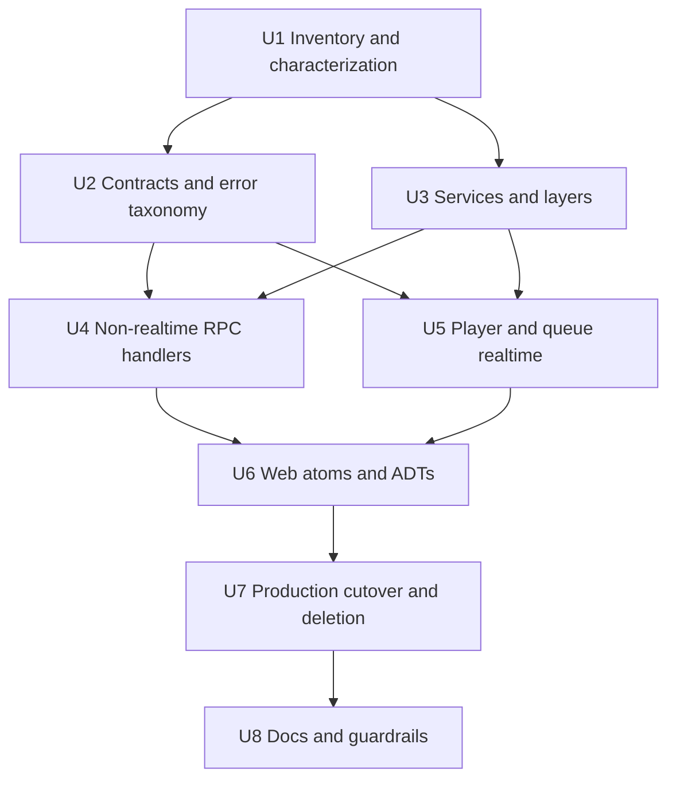

# refactor: Big-bang switchover to Effect runtime

## Summary

Switch Pyxis to the Lattice runtime in one coordinated production cutover: Effect Schema wire contracts, Effect RPC handlers, Effect services/layers, and Effect atom-driven React state replace tRPC, React Query, and Zod API contracts as the live app boundary. The implementation may use branch-internal parity scaffolding while it is being built, but the shipped state has one application RPC runtime, no production `/trpc` transport, and unchanged product behavior.

---

## Problem Frame

Pyxis now uses the Lattice runtime end-to-end: Effect Schema contracts under `src/api/contracts/**`, the authoritative `src/api/rpc.ts` group, `server/rpc/**` handlers/services, and Effect atom-driven React state. The legacy `/trpc` transport, React Query provider, web tRPC client, and server tRPC routers have been removed; stale `/trpc/*` requests fail closed.

The previous active migration plan assumed a production strangler period with `/rpc` and `/trpc` side by side. The user clarified that the desired posture is a big-bang switchover: prepare safely inside the branch, then land a single Effect-first production state rather than a mixed runtime.

---

## Requirements

- R1. Replace the live application API runtime with Effect RPC and Effect Schema contracts for all current tRPC endpoint families.
- R2. Remove tRPC and React Query from production runtime code in the same cutover; no production React Query bridge or long-lived dual `/rpc` + `/trpc` state remains.
- R3. Preserve current Pyxis product behavior across library, source album, search, stations, playlists, auth/settings, bookmarks, genres, history, track, logging, player, queue, and Android media bridge flows.
- R4. Keep `/stream/:compositeTrackId` as plain HTTP byte-range media streaming; RPC may return stream URLs but must not carry audio bytes.
- R5. Use Effect services/layers as the server dependency boundary, with the existing source manager, Pandora session behavior, player singleton, queue singleton, persistence, and listen-log side effects behind explicit service contracts.
- R6. Replace web tRPC/React Query consumers with Effect atom/runtime layer seams and domain ADTs before rendering; no raw runtime result branching in feature JSX.
- R7. Define typed `_tag` public errors and redacted defect handling at the RPC boundary; schema tests must include negative contract cases.
- R8. Provide a cutover readiness gate that proves every current tRPC endpoint, every web consumer, Android bridge state/control behavior, and `/stream` behavior is either migrated, preserved, or intentionally removed.
- R9. Preserve Pyxis' current local single-user trust model: default loopback/same-origin posture, explicit credentialed API CORS, no credentialed wildcard/reflected origins, and no state-changing GET/simple-request RPC commands.

---

## Scope Boundaries

- This is a runtime/API/state switchover, not a product redesign.
- The shipped state should not include a production tRPC fallback, production React Query invalidation bridge, or a mixed transport by feature area.
- Branch-internal compatibility scaffolding is allowed only to characterize and compare behavior before cutover; it must be deleted or converted to permanent Effect tests before merge.
- `/stream/:compositeTrackId`, `/healthz`, static asset serving, Vite dev middleware, and Android media bridge URL contracts remain plain HTTP concerns unless a specific unit says otherwise.
- Provider-internal Zod schemas under `src/sources/**` and non-API config parsing may remain if still needed; this plan removes Zod as the application wire/API contract source, not every incidental Zod import.
- Do not migrate aliases from `@/*` to `@app/*` / `@shared/*`, change Biome indentation policy, or perform broad visual/UI cleanup as part of this cutover.
- Do not introduce a generic result-boundary framework before repeated feature-specific Effect atom/ADT seams prove the shape.

### Deferred to Follow-Up Work

- Full Storybook/fixture preview harness adoption for all Effect atom states.
- Project-wide alias migration to Lattice `@app/*` / `@shared/*` conventions.
- Removing non-API Zod usage in provider-specific parsers and config files, if it remains after the runtime cutover.
- Formatting-only churn or design-token cleanup unrelated to runtime migration.

---

## Context & Research

### Relevant Code and Patterns

- `server/index.ts` owns HTTP routing for `OPTIONS`, `/healthz`, `/stream/*`, `/trpc`, static assets, and Vite fallback. The final cutover must remove `/trpc` without breaking `/stream`, `/healthz`, or dev fallback ordering.
- `server/router.ts`, `server/trpc.ts`, and `server/routers/*.ts` define the current API surface and Pandora protected procedure behavior.
- `src/web/shared/lib/trpc.ts` and `src/web/main.tsx` wire the tRPC React client and `QueryClientProvider` globally.
- Direct `trpc.*` / React Query consumers exist across `src/web/features/**`, `src/web/shared/layout/**`, `src/web/shared/playback/use-playback.ts`, `src/web/shared/keyboard-shortcuts.ts`, and `src/web/shared/track-info-modal/TrackInfoTraits.tsx`.
- `src/api/contracts/**` already contains partial Effect Schema contract modules and boundary tests, but several shapes remain incomplete or too loose for cutover parity.
- `src/db/config.ts` is the strongest local Effect Schema example: literal domains, bounded numbers, exact optional fields, and negative tests.
- `server/services/player.ts`, `server/services/queue.ts`, `server/services/persistence.ts`, and `server/services/autoLogin.ts` are the runtime authority for playback, queue, restore, radio auto-fetch, and listen-log side effects.
- `server/lib/androidMediaBridge*.ts` and `src/api/contracts/androidMediaBridge.ts` are adjacent to playback/queue state and must stay coherent with the same player singleton after the cutover.

### Institutional Learnings

- `docs/solutions/correctness/enforce-strict-upgrade-domain-contracts-in-config-and-db-sch.md`: schema boundaries must encode domain invariants and include negative validation tests, not only happy-path shape checks.
- `docs/solutions/feature-patterns/2026-02-10-album-browsing-without-save.md`: preserve deep source-manager endpoint semantics such as album-with-tracks; do not split expensive upstream workflows into thin calls that duplicate work.
- `docs/solutions/feature-patterns/2026-02-10-listen-log.md`: listen logging is server-side transition behavior owned by player service state changes, not client UI state.
- `docs/solutions/ui-bugs/pause-resume-restarts-song-playback-20260210.md`: playback must account for both server-authoritative state and local `HTMLAudioElement` state; pause/resume can regress if local progress and server pushes drift.
- `docs/solutions/feature-patterns/2026-04-15-shared-primitives-react-audit.md`: avoid broad UI churn; refactor behavior-bearing roots/state seams and leave leaf primitives alone.

### External References

- Effect v4 beta package consolidation and unstable modules: `effect@4.0.0-beta.60` exports RPC, HTTP, Schema, and Reactivity under `effect/unstable/*`.
- Effect RPC concepts: schema-backed RPC groups, typed errors, streaming RPCs, protocol layers, and in-memory RPC tests.
- Effect service/layer target: `Context.Service<Self, Shape>()("ID")`, `Layer.effect(...)` for live wiring, `Layer.succeed(...)` or configurable in-memory layers for tests/harnesses.
- Effect atom React target: layer atoms and `Atom.runtime((get) => get(layerAtom))` as the production/test/harness seam.
- HTTP byte-range semantics remain outside RPC: `Range`, `Accept-Ranges`, `Content-Range`, `206`, and `416` are browser/media-player contracts.

---

## Key Technical Decisions

| Decision | Rationale |
|---|---|
| Big-bang at the production boundary, branch-internal parallel change only | The user explicitly rejected a production strangler. Branch-local old/new parity can reduce risk, but mixed runtime scaffolding must not ship. |
| Effect v4 beta installed source is the import/API authority | Official examples still show older package names. Pyxis already pins `effect`, `@effect/atom-react`, and `@effect/platform-bun` to the same beta version, so implementation should verify against installed `.d.ts` and avoid adding stale packages. |
| Contract inventory before handler replacement | Big-bang cutover has no production fallback. Every current tRPC procedure needs an explicit migrated, preserved, or removed status before `/trpc` is deleted. |
| Complete server service/layer seams before frontend atom cutover | Effect atoms and RPC handlers need stable service contracts; shallow one-to-one router ports would preserve legacy coupling and make tests weaker. |
| Preserve singleton state owners for player, queue, Android bridge, and stream-adjacent behavior | Replacing transport must not fork playback or queue state. The Effect layer wraps existing authority first; state-store redesign is out of scope. |
| Snapshot-first realtime streams | Player and queue streams should emit current state on subscribe/reconnect, then live snapshots. No historical replay buffer is introduced. |
| `/stream` stays plain HTTP | Media byte ranges, prefetch, abort propagation, and transcoding are browser/proxy concerns, not RPC envelope concerns. |
| React Query invalidation is replaced by typed Effect atom refresh tags, not a shipped bridge | Current cache invalidations must be preserved, but the production app should not carry React Query just to refresh old consumers. Mutations publish domain-scoped refresh tags consumed by query atoms; tests cover the same fan-out currently expressed through `trpc.useUtils()` invalidations. |
| Permanent verification survives router deletion | Live old/new parity can run while old routers still exist, but permanent tests must be contract, handler, fixture, and service tests that remain after `server/routers/**` is deleted. |
| Startup readiness is an explicit state, not an incidental race | Current boot and auto-login behavior may be non-blocking. The Effect service layer must either preserve and characterize that behavior or expose a deliberate restoring/unavailable state so first web and Android clients do not observe accidental emptiness. |
| Stale clients fail closed | Removed `/trpc/*` paths, rejected origins, stale playback reports, and invalid stream IDs should produce explicit safe failures or typed no-op outcomes rather than falling through to static content or mutating state. |
| `/stream` gets its own security contract | Even though audio bytes stay outside RPC, stream IDs, `next=` hints, CORS, and error bodies are still public HTTP surfaces. Stream responses should use the app-origin policy unless an explicit compatibility reason keeps wildcard media CORS, and all stream error bodies must be redacted with raw causes logged server-side only. |

---

## Open Questions

### Resolved During Planning

- Should this be a strangler migration or a big-bang cutover? Resolved by user correction: big-bang switchover at the production boundary.
- Should `/stream/:compositeTrackId` move into RPC? Resolved from existing stream behavior and HTTP range semantics: no.
- Should production code keep a React Query/tRPC compatibility bridge? Resolved by big-bang posture: no; any bridge is branch-internal scaffolding only.
- Should Android media bridge be treated as out-of-scope because it is not tRPC? Resolved from flow analysis: no; it shares player/queue authority and is a cutover blocker for coherence.

### Deferred to Implementation

- Exact Effect v4 beta RPC/HTTP/Atom import names and helper APIs: verify against installed package definitions during implementation because the modules are unstable.
- Exact endpoint tag grouping: preserve domain names and current semantics, but adjust group boundaries if installed RPC ergonomics require a more coherent group layout.
- Final classification for legacy no-op/clamp behavior vs schema validation errors: preserve current behavior where user-visible, but reject malformed/non-finite inputs at the schema boundary.
- Final permanent parity fixture format: choose the smallest maintainable form once live old/new parity tests have captured current behavior.

---

## Output Structure

Expected new and reshaped structure, subject to adjustment during implementation:

```text
src/api/
  contracts/
    common.ts
    auth.ts
    library.ts
    album.ts
    artist.ts
    search.ts
    radio.ts
    playlist.ts
    player.ts
    queue.ts
    listenLog.ts
    log.ts
    track.ts
    *.test.ts
  rpc.ts
server/rpc/
  context.ts
  errors.ts
  sourceErrorMap.ts
  handler.ts
  middleware.ts
  contractFixtures.test-support.ts
  cutoverInventory.test.ts
  services/
    authSession.ts
    library.ts
    player.ts
    queue.ts
    sourceCatalog.ts
  handlers/
    auth.ts
    library.ts
    album.ts
    artist.ts
    search.ts
    radio.ts
    playlist.ts
    player.ts
    queue.ts
    listenLog.ts
    log.ts
    track.ts
src/web/shared/effect/
  layerAtom.ts
  runtime.ts
src/web/shared/api/
  rpcClient.ts
src/web/features/**/
  *State.ts
  *State.test.ts
```

---

## High-Level Technical Design

> *This illustrates the intended approach and is directional guidance for review, not implementation specification. The implementing agent should treat it as context, not code to reproduce.*

```mermaid
flowchart TB
  Browser[React UI] --> Atoms[Effect atoms and domain ADTs]
  Atoms --> RpcClient[Effect RPC client layer]
  RpcClient --> RpcEndpoint[/rpc application API]
  RpcEndpoint --> RpcHandlers[Effect RPC handlers]
  RpcHandlers --> Layers[Effect services and layers]
  Layers --> Domain[Existing domain services]
  Domain --> DB[ProseQL and persistence]
  Domain --> Sources[Source manager and providers]
  Domain --> PlayerQueue[Player and queue singletons]
  Android[Android media bridge HTTP/SSE] --> PlayerQueue
  Browser --> Stream[/stream plain HTTP media]
  Stream --> Sources
```

The cutover shape is:

1. Inventory and characterize the current runtime while old tRPC code still exists.
2. Complete Effect Schema/RPC contracts and server service layers.
3. Implement all server handlers and permanent tests against Effect services.
4. Replace frontend runtime state with Effect atoms and domain ADTs.
5. Flip HTTP routing/provider wiring and delete tRPC/React Query production code before merge.

No step above implies a long-lived production dual transport. Branch-internal comparisons are test scaffolding, not shipped architecture.

---

## Cutover Readiness Gate

The branch is not ready to merge until all of these are true:

- Every current file in `server/routers/*.ts`, including `server/routers/artist.ts`, has a mapped Effect RPC handler or an explicit removal decision in the cutover inventory.
- `server/index.ts` routes `/rpc` intentionally and no longer mounts `/trpc` as a live application API.
- Stale `/trpc/*` requests fail with an explicit removed API response rather than falling through to static/Vite fallback.
- Runtime code has no imports from `@trpc/*`, `@tanstack/react-query`, or `src/web/shared/lib/trpc.ts`.
- Runtime code has no `QueryClientProvider`, `createTRPCReact`, or feature-level `trpc.*` hooks.
- API wire contracts use Effect Schema, not Zod. Any remaining `zod` imports are documented non-API/provider/config usage.
- `/stream/:compositeTrackId` HTTP range, abort, prefetch, CORS, redacted error, and format behaviors pass focused tests.
- Default bind/trust posture is verified: loopback by default, and any non-loopback mode is explicit and documented as unsafe without additional auth.
- Player and queue streaming tests prove snapshot-first state, cleanup, reconnect, and stale report protection.
- Android media bridge tests prove state/events/commands still operate on the same player/queue state as web RPC and reject missing/invalid bridge tokens without mutating player state.
- Server startup, auto-login, and restored playback state have characterized first-client behavior after restart.
- Browser bundle/runtime checks prove no production dual-client scaffolding or branch-only parity helper is imported by web code.
- A kiosk/WebView smoke check or documented equivalent proves the Android WebView can use the final Effect RPC/stream transport.
- `just typecheck`, `just test-unit`, `just lint`, and `just build` pass.

---

## Implementation Units



### U1. Inventory current runtime contracts and characterize behavior

**Goal:** Build the cutover map and behavior safety net while the old tRPC/React Query implementation still exists.

**Requirements:** R1, R3, R8

**Dependencies:** None

**Files:**
- Create: `server/rpc/cutoverInventory.test.ts`
- Create: `server/rpc/parity.test-support.ts`
- Create: `src/api/contracts/parity.test-support.ts`
- Create: `src/web/shared/api/cutoverInventory.test.ts`
- Modify: `src/api/contracts/import-boundary.test.ts`
- Modify: `server/services/player.test.ts`
- Modify: `server/services/queue.test.ts`
- Modify: `server/services/stream.test.ts`
- Test: `server/rpc/cutoverInventory.test.ts`
- Test: `src/web/shared/api/cutoverInventory.test.ts`
- Test: `server/services/player.test.ts`
- Test: `server/services/queue.test.ts`
- Test: `server/services/stream.test.ts`

**Approach:**
- Enumerate every current tRPC procedure from `server/routers/*.ts`, including input shape, success shape, error behavior, consumer surfaces, cache/invalidation behavior, and whether it is read, command, or stream.
- Enumerate every web runtime consumer of `src/web/shared/lib/trpc.ts`, React Query provider state, manual `/trpc` URLs, and `trpc.useUtils()` invalidation so frontend removal is tracked with the same rigor as server endpoint removal.
- Add cutover inventory tests that fail when a router/procedure or web runtime consumer exists without a mapped Effect RPC/atom replacement or explicit removal note.
- Add branch-internal parity helpers that canonicalize old tRPC outputs and future Effect outputs without making the helper part of the public API surface.
- Characterize fragile behavior before replacement: player/queue state transitions, stream byte-range behavior, and server-side listen-log side effects.
- Keep this unit free of production runtime changes; it exists to make the big-bang safe.

**Execution note:** Characterization-first. Do not delete or replace old routers until inventory and fragile-flow tests exist.

**Patterns to follow:**
- `server/services/libraryAlbums.test.ts` for real service tests with controlled data.
- `server/services/player.test.ts` and `server/services/queue.test.ts` for singleton behavior coverage.
- `server/services/stream.test.ts` for HTTP stream invariants.

**Test scenarios:**
- Happy path: inventory includes every file in `server/routers/*.ts` and every exported procedure in the root router.
- Happy path: canonical parity helper normalizes current library, search, playback, and queue payloads without dropping product fields.
- Edge case: a newly added tRPC procedure without an Effect mapping fails the inventory test.
- Edge case: a newly added `trpc.*` hook, manual `/trpc` URL, or React Query provider/import fails the web consumer inventory test.
- Edge case: current stream open-ended range, bounded range, full GET, prefetch, and mp3-format behavior are characterized.
- Error path: current player/queue invalid command behavior, playback local-error behavior, and stream invalid-range behavior are captured before replacement.
- Integration: listen-log side effects remain server-owned when player transitions through a track boundary.

**Verification:**
- The implementation team can see the full endpoint/consumer blast radius before modifying runtime wiring.
- Fragile playback, queue, stream, and listen-log behaviors are protected by tests that will survive the cutover.

---

### U2. Complete Effect Schema contracts, RPC groups, and public error taxonomy

**Goal:** Make `src/api/contracts/**` the authoritative wire contract for every application API endpoint before handlers and clients are swapped.

**Requirements:** R1, R4, R7, R8, R9

**Dependencies:** U1

**Files:**
- Modify: `src/api/contracts/common.ts`
- Modify: `src/api/contracts/auth.ts`
- Modify: `src/api/contracts/library.ts`
- Create: `src/api/contracts/album.ts`
- Create: `src/api/contracts/artist.ts`
- Modify: `src/api/contracts/search.ts`
- Modify: `src/api/contracts/radio.ts`
- Modify: `src/api/contracts/playlist.ts`
- Modify: `src/api/contracts/player.ts`
- Modify: `src/api/contracts/queue.ts`
- Modify: `src/api/contracts/listenLog.ts`
- Modify: `src/api/contracts/log.ts`
- Modify: `src/api/contracts/track.ts`
- Create: `src/api/rpc.ts`
- Test: `src/api/contracts/common.test.ts`
- Test: `src/api/contracts/auth.test.ts`
- Test: `src/api/contracts/library.test.ts`
- Test: `src/api/contracts/album.test.ts`
- Test: `src/api/contracts/artist.test.ts`
- Test: `src/api/contracts/search.test.ts`
- Test: `src/api/contracts/radio.test.ts`
- Test: `src/api/contracts/playlist.test.ts`
- Test: `src/api/contracts/player.test.ts`
- Test: `src/api/contracts/queue.test.ts`
- Test: `src/api/contracts/listenLog.test.ts`
- Test: `src/api/contracts/log.test.ts`
- Test: `src/api/contracts/track.test.ts`
- Test: `src/api/contracts/import-boundary.test.ts`

**Approach:**
- Fill the partial contract modules until they cover all current router families: auth, library, album, artist, search, radio, playlist, track, player, queue, listen log, and client log.
- Define RPC tags using `entity.concept.action` naming while preserving current endpoint semantics such as source album-with-tracks and stream URL generation.
- Define public error unions with `_tag` discriminants for validation, unauthorized/no credentials, auth refresh failure, not found, source unavailable, persistence failure, provider failure, stale command/report, and defects.
- Add bounded schemas for composite IDs, source IDs, stream URLs, volume/progress/duration, pagination, placement/status literals, command identity fields, and bounded client log payloads.
- Preserve current `null` vs absent optional wire semantics where UI behavior depends on them.
- Keep contracts browser-safe: no imports from `server/**`, provider internals, filesystem/env modules, or DB-side-effect modules.

**Execution note:** Write negative contract tests alongside each schema family before handler implementation depends on the contract.

**Patterns to follow:**
- `src/db/config.ts` for Effect Schema literal domains, bounded numerics, exact optional fields, and filters.
- Existing `src/api/contracts/*.test.ts` for contract test location.
- `docs/solutions/correctness/enforce-strict-upgrade-domain-contracts-in-config-and-db-sch.md` for negative validation posture.

**Test scenarios:**
- Happy path: current representative responses for library albums, source album-with-tracks, artist get/search, search results, station detail, playlist detail, player state, queue state, and listen-log entries round-trip through schemas.
- Edge case: optional fields that are absent remain absent, while current nullable fields remain `null` where consumers expect `null`.
- Edge case: source-backed album and unified search contracts preserve source IDs, capabilities, and library-state indicators.
- Error path: invalid placement, malformed composite ID, unknown source prefix, non-finite progress/duration, out-of-range volume, negative pagination, oversized strings, and malformed stream URLs fail decoding.
- Error path: provider errors and defects encode to allow-listed public fields only; raw causes, stack traces, filesystem paths, provider URLs, and secret-shaped values are not serialized.
- Integration: import-boundary test fails if contract modules import server-only or side-effecting modules.

**Verification:**
- `src/api/rpc.ts` exposes a complete RPC group for the cutover.
- Contract tests prove both positive round trips and negative boundary failures for each endpoint family.

---

### U3. Wrap domain authority in Effect services and live layers

**Goal:** Introduce Effect services/layers that wrap existing domain behavior without forking state or changing product semantics.

**Requirements:** R3, R5, R7, R9

**Dependencies:** U1, U2

**Files:**
- Create: `server/rpc/context.ts`
- Create: `server/rpc/errors.ts`
- Create: `server/rpc/sourceErrorMap.ts`
- Create: `server/rpc/middleware.ts`
- Create: `server/rpc/services/authSession.ts`
- Create: `server/rpc/services/library.ts`
- Create: `server/rpc/services/sourceCatalog.ts`
- Create: `server/rpc/services/player.ts`
- Create: `server/rpc/services/queue.ts`
- Modify: `server/services/credentials.ts`
- Modify: `server/services/sourceManager.ts`
- Modify: `server/services/player.ts`
- Modify: `server/services/queue.ts`
- Modify: `server/services/autoLogin.ts`
- Test: `server/rpc/services/library.test.ts`
- Test: `server/rpc/services/authSession.test.ts`
- Test: `server/rpc/services/player.test.ts`
- Test: `server/rpc/services/queue.test.ts`

**Approach:**
- Declare service contracts with Effect `Context.Service` classes and live layers that wrap current services rather than replacing their internals.
- Keep the existing player and queue singleton authority in production. The Effect service layer delegates to it so web RPC and Android bridge state cannot fork.
- Centralize Pandora credentials/session/source-manager refresh behavior in one Effect service used by RPC handlers, server auto-fetch flows, and any restored playback path that needs provider access after startup.
- Preserve refresh-on-known-auth-error semantics: require credentials, coalesce concurrent refresh attempts, rate-cap repeated failures, retry once at request/connect boundaries, and return typed public errors.
- Decide and document service readiness during server boot: either preserve the current non-blocking restore semantics with explicit characterization, or expose a restoring/unavailable state through the service layer and matching UI/Android projections.
- Map provider/source/persistence failures through one error seam. Unknown defects are logged with structured context and redacted from public payloads.
- Provide configurable in-memory/test layers with behavior/config inputs rather than mock-prefixed doubles.

**Execution note:** Characterize existing service behavior before moving any handler logic whose behavior is not already covered.

**Patterns to follow:**
- `server/services/libraryAlbums.ts` for dependency-passing and transaction behavior.
- `server/services/sourceManager.ts` for source aggregation and Pandora manager lifecycle.
- `server/trpc.ts` for current Pandora protected-procedure semantics.
- `src/logger.ts` for structured logging.

**Test scenarios:**
- Happy path: library service lists, gets, saves, places, and updates albums using the same ordering and placement semantics as current services.
- Happy path: auth/session service returns usable Pandora-backed source manager state when credentials exist.
- Happy path: player and queue services expose current state from the existing singleton, not a second in-memory copy.
- Edge case: server restore/auto-login flows and RPC services observe the same player/queue state after startup.
- Edge case: first web and Android clients after restart see the characterized startup state rather than an accidental empty state caused by async restore timing.
- Error path: missing credentials, refresh failure, provider unavailable, persistence failure, and unknown defects map to typed errors or redacted defects as appropriate.
- Integration: Android media bridge state helpers and Effect player service observe the same player state after a command.

**Verification:**
- RPC handlers can be written against service contracts without importing old tRPC context.
- No production Effect layer creates an independent player or queue state store.

---

### U4. Implement complete Effect RPC handlers for non-realtime endpoint families

**Goal:** Replace all non-streaming tRPC procedure behavior with Effect RPC handlers over the new service layer.

**Requirements:** R1, R3, R5, R7, R8, R9

**Dependencies:** U2, U3

**Files:**
- Create: `server/rpc/handler.ts`
- Create: `server/rpc/handlers/auth.ts`
- Create: `server/rpc/handlers/library.ts`
- Create: `server/rpc/handlers/album.ts`
- Create: `server/rpc/handlers/artist.ts`
- Create: `server/rpc/handlers/search.ts`
- Create: `server/rpc/handlers/radio.ts`
- Create: `server/rpc/handlers/playlist.ts`
- Create: `server/rpc/handlers/track.ts`
- Create: `server/rpc/handlers/listenLog.ts`
- Create: `server/rpc/handlers/log.ts`
- Test: `server/rpc/handler.test.ts`
- Test: `server/rpc/handlers/auth.test.ts`
- Test: `server/rpc/handlers/library.test.ts`
- Test: `server/rpc/handlers/album.test.ts`
- Test: `server/rpc/handlers/artist.test.ts`
- Test: `server/rpc/handlers/search.test.ts`
- Test: `server/rpc/handlers/radio.test.ts`
- Test: `server/rpc/handlers/playlist.test.ts`
- Test: `server/rpc/handlers/track.test.ts`
- Test: `server/rpc/handlers/listenLog.test.ts`
- Test: `server/rpc/handlers/log.test.ts`

**Approach:**
- Implement handlers for every current non-realtime router family: auth, library, album, artist, search, radio, playlist, track, listen log, and client log.
- Preserve deep endpoint semantics and source-manager workflows, especially source album-with-tracks, unified search, playlist track retrieval, stream URL generation, and station/radio creation.
- Keep all state-changing RPCs on preflighted transports and validate payloads before reaching services.
- Bound and sanitize client log payloads; logging must be fire-and-forget, rate-limited, and never echoed to clients.
- Use branch-internal parity tests against old router behavior while old code exists, then keep permanent Effect handler/service tests with canonical fixtures after router deletion.

**Execution note:** Add parity or characterization coverage before replacing each endpoint family. Convert branch-only parity into permanent handler/contract tests before deleting old routers.

**Patterns to follow:**
- Current endpoint semantics in `server/routers/auth.ts`, `server/routers/library.ts`, `server/routers/album.ts`, `server/routers/artist.ts`, `server/routers/search.ts`, `server/routers/radio.ts`, `server/routers/playlist.ts`, `server/routers/track.ts`, `server/routers/listenLog.ts`, and `server/routers/log.ts`.
- `docs/solutions/feature-patterns/2026-02-10-album-browsing-without-save.md` for preserving album-with-tracks behavior.

**Test scenarios:**
- Happy path: each current read endpoint returns equivalent canonical data through Effect handlers for seeded sources and database state.
- Happy path: library save/place/remove/update commands update all affected domain records and return the same user-visible outcomes as current routers.
- Happy path: Pandora-backed station/bookmark/settings flows work with a valid session and preserve current response shapes.
- Edge case: empty library, empty search results, no Pandora credentials, missing album, missing playlist, missing station, and no listen-log entries map to current ready/empty/not-found semantics.
- Error path: malformed payloads fail with typed validation errors before service calls.
- Error path: provider failures, auth refresh failures, persistence failures, and client-log bursts map to safe typed errors or dropped logs without raw internals.
- Integration: non-realtime handlers can run in memory through the Effect RPC test protocol without Bun HTTP.

**Verification:**
- Every non-realtime procedure from the U1 inventory has a complete Effect handler and permanent test coverage.
- No handler imports `server/trpc.ts` or tRPC router context.

---

### U5. Migrate player and queue realtime contracts and lifecycle behavior

**Goal:** Replace tRPC subscriptions and manual `/trpc/player.onStateChange` SSE behavior with Effect RPC streaming/Effect services while preserving playback, queue, Android bridge, and `/stream` interactions.

**Requirements:** R1, R3, R4, R5, R7, R8

**Dependencies:** U2, U3

**Files:**
- Create: `server/rpc/handlers/player.ts`
- Create: `server/rpc/handlers/queue.ts`
- Modify: `server/services/player.ts`
- Modify: `server/services/queue.ts`
- Modify: `server/services/persistence.ts`
- Modify: `server/lib/androidMediaBridge.ts`
- Modify: `server/lib/androidMediaBridgeState.ts`
- Modify: `server/lib/playerStateView.ts`
- Modify: `server/lib/ids.ts`
- Test: `server/rpc/handlers/player.test.ts`
- Test: `server/rpc/handlers/queue.test.ts`
- Test: `server/services/player.test.ts`
- Test: `server/services/queue.test.ts`
- Test: `server/lib/androidMediaBridge.test.ts`
- Test: `server/lib/androidMediaBridgeState.test.ts`
- Test: `server/lib/playerStateView.test.ts`
- Test: `server/lib/ids.test.ts`

**Approach:**
- Define snapshot-first stream behavior for player and queue: current state on subscribe/reconnect, then live snapshots, no historical replay.
- Preserve or explicitly replace heartbeat/reconnect behavior that current playback code relies on.
- Specify stream cancellation and listener cleanup as part of the handler contract so aborted browser streams do not leak listeners, fibers, or queue/player subscriptions.
- Add command/report identity where needed so retries, double-clicks, and stale tabs cannot mutate the wrong current track.
- Reject malformed/non-finite progress, duration, seek, and volume inputs at the schema boundary while preserving current clamp/no-op behavior where it is user-visible and safe.
- Keep listen-log writes server-side at transition points and non-blocking with structured failure logging.
- Verify Android media bridge commands, state, events, and logs still use the same player and queue state after the RPC layer is introduced.
- Keep stream URL generation and `next=` prefetch semantics outside RPC; RPC only provides URLs and metadata.
- Treat the web playback stream consumer as a wholesale replacement of the current raw EventSource block, not a small delta. Capture current connection, heartbeat, reconnect, and first-sync semantics before replacing them.

**Execution note:** Characterization-first. This unit must prove the previous pause/resume restart regression class cannot return.

**Patterns to follow:**
- `src/web/shared/playback/use-playback.ts` for current audio lifecycle expectations.
- `server/routers/player.ts` and `server/routers/queue.ts` for current serialized state shapes.
- `docs/solutions/ui-bugs/pause-resume-restarts-song-playback-20260210.md` for local/server playback drift risk.
- `docs/solutions/feature-patterns/2026-02-10-listen-log.md` for listen-log ownership.

**Test scenarios:**
- Happy path: player stream emits current stopped/paused/playing state immediately, then emits state snapshots for play, pause, resume, seek, skip, previous, stop, jump, progress, duration, and track-ended commands.
- Happy path: queue stream emits current queue immediately and updates after add, remove, clear, jump, shuffle, and radio auto-fetch changes.
- Happy path: Android media bridge command/state/event tests observe the same player state as Effect RPC handlers.
- Happy path: persisted player and queue snapshots written before the cutover restore into equivalent state through the new service layer.
- Edge case: reconnect emits one current snapshot, does not replay history, and does not duplicate listeners or fibers.
- Edge case: aborting or unsubscribing from a player/queue stream removes listeners and stops related fibers without requiring process restart.
- Edge case: duplicate events, heartbeat events, and same-track stream URL updates do not reload audio or reset progress unexpectedly.
- Edge case: stale `appliesToTrackId` progress/duration/ended reports are no-op typed outcomes and do not emit subscriber updates.
- Error path: media load/play errors surface as playback error state and keep diagnostic logging bounded.
- Error path: invalid queue indices, malformed IDs, and non-finite playback values fail safely according to the schema/legacy behavior decision.
- Error path: missing or invalid Android bridge tokens on state, events, commands, and logs endpoints are rejected and do not mutate player or queue state.
- Integration: `/stream` range requests and prefetch hints still work with player RPC state because audio bytes remain outside RPC.

**Verification:**
- There is a complete Effect RPC replacement for `player.onStateChange` and `queue.onChange` before web code is cut over.
- Player/queue singleton state remains coherent across web RPC, Android bridge, persistence restore, listen log, and stream URL generation.

---

### U6. Replace web tRPC/React Query consumers with Effect atoms and domain ADTs

**Goal:** Convert the React app to Effect atom/runtime state seams and remove raw tRPC/React Query state from feature and shared layout components.

**Requirements:** R2, R3, R6, R8

**Dependencies:** U4, U5

**Files:**
- Create: `src/web/shared/effect/layerAtom.ts`
- Create: `src/web/shared/effect/runtime.ts`
- Create: `src/web/shared/api/rpcClient.ts`
- Modify: `src/web/main.tsx`
- Modify: `src/web/features/home/home-page.tsx`
- Modify: `src/web/features/search/search-page.tsx`
- Modify: `src/web/features/album-detail/library-album-detail-root.tsx`
- Modify: `src/web/features/album-detail/source-album-detail-root.tsx`
- Modify: `src/web/features/stations/stations-page.tsx`
- Modify: `src/web/features/station-detail/station-detail-page.tsx`
- Modify: `src/web/features/bookmarks/bookmarks-page.tsx`
- Modify: `src/web/features/genres/genres-page.tsx`
- Modify: `src/web/features/history/history-page.tsx`
- Modify: `src/web/features/settings/settings-page.tsx`
- Modify: `src/web/features/playlist-detail/playlist-detail-page.tsx`
- Modify: `src/web/features/stations/add-seed-dialog.tsx`
- Modify: `src/web/features/stations/delete-station-dialog.tsx`
- Modify: `src/web/features/stations/quick-mix-dialog.tsx`
- Modify: `src/web/features/stations/rename-station-dialog.tsx`
- Modify: `src/web/features/sandbox/queue-coverflow/QueueCoverflowPage.tsx`
- Modify: `src/web/routes/+sandbox.queue.tsx`
- Modify: `src/web/shared/layout/sidebar.tsx`
- Modify: `src/web/shared/layout/mobile-nav.tsx`
- Modify: `src/web/shared/layout/now-playing-bar.tsx`
- Modify: `src/web/shared/layout/command-palette.tsx`
- Modify: `src/web/shared/keyboard-shortcuts.ts`
- Modify: `src/web/shared/playback/use-playback.ts`
- Modify: `src/web/shared/track-info-modal/TrackInfoTraits.tsx`
- Test: `src/web/features/search/SearchState.test.ts`
- Test: `src/web/features/album-detail/AlbumDetailState.test.ts`
- Test: `src/web/features/home/HomeState.test.ts`
- Test: `src/web/features/stations/StationsState.test.ts`
- Test: `src/web/features/station-detail/StationDetailState.test.ts`
- Test: `src/web/features/bookmarks/BookmarksState.test.ts`
- Test: `src/web/features/genres/GenresState.test.ts`
- Test: `src/web/features/history/HistoryState.test.ts`
- Test: `src/web/features/settings/SettingsState.test.ts`
- Test: `src/web/features/playlist-detail/PlaylistDetailState.test.ts`
- Test: `src/web/features/sandbox/queue-coverflow/QueueCoverflowState.test.ts`
- Test: `src/web/shared/layout/NowPlayingBarState.test.ts`
- Test: `src/web/shared/layout/CommandPaletteState.test.ts`
- Test: `src/web/shared/playback/PlaybackState.test.ts`
- Test: `src/web/shared/playback/use-playback.test.tsx`

**Approach:**
- Replace `trpc.Provider` and `QueryClientProvider` with the Effect atom registry/runtime provider shape supported by the installed packages.
- Provide an RPC client layer as the browser transport seam. Feature atoms use the layer; components do not construct clients or import transport modules directly.
- Convert RPC/atom `AsyncResult` and command exits into feature-specific domain ADTs before rendering: `Loading`, `Ready`, `Empty`, `NotFound`, `LoadError`, `Defect`, `Submitting`, `Succeeded`, `Failed`, and domain-specific command outcomes where useful.
- Preserve current invalidation/refresh behavior with typed domain refresh tags: each mutation publishes the same fan-out currently represented by React Query invalidation keys, and query atoms declare which tags cause them to refetch/recompute.
- Decide the React test harness at this seam. Prefer pure ADT/atom state tests where possible; if browser APIs or hook rendering are needed for playback, add a DOM-capable test harness explicitly rather than relying on an implicit `*.test.tsx` environment.
- Keep presentational leaf primitives stable; refactor behavior-bearing roots and shared layout consumers only where they own runtime state.
- Replace playback and queue subscriptions in `use-playback.ts` and layout consumers with the Effect stream/atom seam from U5, preserving local audio ownership and first-sync autoplay behavior.

**Execution note:** For each feature family, implement pure state conversion tests before moving JSX away from raw query/mutation state.

**Patterns to follow:**
- Lattice React functional state pattern: Root owns runtime state, provider exposes domain ADT/actions, self-selecting compounds render active cases.
- Existing context guard shapes in `src/web/shared/playback/playback-context.tsx` and `src/web/shared/theme/theme-context.tsx`.
- `docs/plans/2026-05-24-003-refactor-react-query-state-boundaries-plan.md` for feature-surface inventory and ADT state expectations, adjusted to Effect atoms instead of React Query.

**Test scenarios:**
- Happy path: home, search, album detail, station, station detail, settings, history, bookmarks, genres, playlist, now-playing, and command palette ready states render from Effect atom data with current product behavior.
- Happy path: save album, placement changes, station mutations, settings updates, feedback/bookmark/sleep, queue commands, and playback controls refresh all affected surfaces without React Query.
- Edge case: empty library/shelf/search/history/bookmark/station states map to explicit ADT cases rather than nullable ready payloads.
- Edge case: disabled dependent queries from current React Query code become explicit idle/unavailable states, not accidental errors.
- Edge case: the reachable sandbox queue route is migrated to Effect data, converted to a fixture-only harness, or intentionally removed before `src/web/shared/lib/trpc.ts` is deleted.
- Error path: typed RPC errors map to `LoadError` or command `Failed`; defects map to `Defect` without raw transport internals in JSX.
- Error path: playback local media errors and RPC stream errors do not crash the app root and preserve diagnostic logging.
- Integration: after this unit, a runtime grep finds no feature/layout imports of `src/web/shared/lib/trpc.ts`, no `trpc.*` hooks, and no React Query provider use.

**Verification:**
- UI state is domain ADTs at Root seams, not raw RPC/atom runtime structures in presentation JSX.
- Current user-visible behavior is preserved while the transport/provider runtime is Effect-first.

---

### U7. Flip production HTTP routing and delete legacy runtime code

**Goal:** Make Effect RPC the only production application API runtime and remove tRPC/React Query from runtime dependencies and code.

**Requirements:** R1, R2, R4, R8, R9

**Dependencies:** U6

**Files:**
- Modify: `server/index.ts`
- Modify: `src/config.ts`
- Delete: `src/web/shared/lib/trpc.ts`
- Delete: `server/trpc.ts`
- Delete: `server/router.ts`
- Delete: `server/routers/auth.ts`
- Delete: `server/routers/library.ts`
- Delete: `server/routers/album.ts`
- Delete: `server/routers/artist.ts`
- Delete: `server/routers/search.ts`
- Delete: `server/routers/radio.ts`
- Delete: `server/routers/playlist.ts`
- Delete: `server/routers/track.ts`
- Delete: `server/routers/player.ts`
- Delete: `server/routers/queue.ts`
- Delete: `server/routers/listenLog.ts`
- Delete: `server/routers/log.ts`
- Modify: `package.json`
- Modify: `bun.lock`
- Modify: `bun.nix`
- Modify: `nix/modules/*.nix`
- Delete: `server/rpc/parity.test-support.ts` if not converted to permanent contract fixture support
- Delete: `src/api/contracts/parity.test-support.ts` if not converted to permanent contract fixture support
- Test: `server/rpc/handler.test.ts`
- Test: `server/services/stream.test.ts`
- Test: `server/lib/health.test.ts`

**Approach:**
- Mount the final Effect RPC route in `server/index.ts` with explicit CORS/preflight behavior and route ordering that leaves `/healthz`, `/stream`, Android bridge routes, static assets, and Vite fallback correct.
- Add an explicit response for stale `/trpc/*` API requests so they do not silently fall through to the SPA/static handler; the response should be safe for stale clients and not expose internal migration details.
- Ensure mutating RPC transports require non-simple credentialed requests from the allowed app origin; do not allow reflected origins, wildcard credentials, or state-changing GET behavior.
- Delete the old tRPC routers, tRPC setup, and web tRPC client after U6 proves all consumers have moved.
- Convert branch-internal parity helpers into permanent fixture/contract support or delete them in this unit; no final output should contain test helpers that depend on removed routers.
- Remove `@trpc/client`, `@trpc/react-query`, `@trpc/server`, and `@tanstack/react-query` from runtime dependencies when no runtime imports remain.
- Remove Zod from API contract dependencies only where it is no longer used for API contracts; retain it only if non-API provider/config parsing still requires it and document that residual usage.
- Verify or set the default server bind address to loopback. Any non-loopback/trusted-LAN mode must be explicit and documented as unsafe without separate authentication.
- Regenerate `bun.nix` after lockfile changes and verify the Nix package still builds.

**Execution note:** Run static removal checks before deleting old tests or helper files. If a `trpc` import remains outside test-only parity scaffolding, do not proceed.

**Patterns to follow:**
- Existing `server/index.ts` route-ordering and streaming lifecycle comments.
- Existing Nix/Bun dependency flow documented by `just nix-lock`.

**Test scenarios:**
- Happy path: Effect RPC requests route correctly through Bun and return schema-encoded responses.
- Happy path: `/stream` full GET, range GET, invalid range, prefetch, mp3-format behavior, app-origin CORS policy, redacted error bodies, and abort cleanup remain unchanged or intentionally tightened after route rewiring.
- Happy path: `/healthz`, Android bridge routes, static assets, and Vite dev fallback still resolve as intended.
- Edge case: stale `/trpc/*` request receives an explicit removed API response and does not render the web app.
- Error path: cross-origin mutating RPC attempts from a disallowed origin fail at preflight, while allowed same-origin credentialed requests succeed.
- Error path: simple-request attempts to perform state-changing actions are rejected before service execution.
- Error path: non-loopback binding without an explicit trusted-LAN opt-in is refused or warned according to the chosen config behavior.
- Integration: static grep/typecheck confirms no runtime `@trpc/*`, React Query, `src/web/shared/lib/trpc.ts`, `QueryClientProvider`, or feature-level `trpc.*` usage remains.
- Integration: final package and Nix build checks pass after dependency removal.

**Verification:**
- Production app has one application RPC runtime: Effect RPC.
- Legacy runtime packages are removed or documented as non-runtime/non-API residuals.

---

### U8. Update durable docs and add post-cutover guardrails

**Goal:** Align project documentation, operations notes, and future-agent guidance with the new Effect-first architecture.

**Requirements:** R1, R2, R4, R5, R6, R8

**Dependencies:** U7

**Files:**
- Modify: `ARCHITECTURE.md`
- Modify: `README.md`
- Modify: `AGENTS.md`
- Modify: `justfile`
- Create: `docs/solutions/feature-patterns/2026-05-25-effect-runtime-big-bang-cutover.md`
- Modify: `docs/plans/2026-05-24-001-refactor-effect-rpc-migration-plan.md`
- Modify: `docs/plans/2026-05-24-003-refactor-react-query-state-boundaries-plan.md`
- Test: none -- documentation and guardrail unit; behavioral coverage is owned by U1-U7.

**Approach:**
- Update architecture docs from tRPC/React Query to Effect RPC, Effect Schema, Effect services/layers, and atom-driven web state.
- Mark the superseded strangler migration plan as superseded by this big-bang plan so future agents do not follow stale `/rpc` + `/trpc` coexistence guidance.
- Mark the React Query state-boundary plan as superseded, absorbed, or blocked by this plan because U6 replaces React Query directly with Effect atoms rather than first refactoring React Query state boundaries.
- Fix stale command references discovered during research only where they block accurate operation of the new runtime; move unrelated Procfile, workflow, or release cleanup to follow-up unless it is required for the new runtime to build.
- Capture the final cutover pattern as a solution doc: branch-internal parity allowed, production dual runtime rejected, stream endpoint preserved, and player/queue/Android coherence required.
- Add lightweight guardrails where practical so future API additions use Effect Schema/RPC rather than recreating tRPC/Zod API routes.

**Patterns to follow:**
- Existing architecture overview structure in `ARCHITECTURE.md`.
- Existing solution-doc shape under `docs/solutions/feature-patterns/`.
- Project command guidance in `AGENTS.md` and `justfile`.

**Test scenarios:**
- Test expectation: none -- this unit updates docs and guardrails after behavior-bearing units have their own tests.

**Verification:**
- Durable docs no longer describe tRPC/React Query as the active architecture after the cutover.
- The old strangler plan is visibly superseded, not left as a competing active plan.
- Future agents can identify the correct runtime boundary and verification gate without reading this chat.

---

## System-Wide Impact

```mermaid
flowchart TB
  HTTP[server/index.ts routing] --> RPC[Effect RPC]
  HTTP --> Stream[/stream HTTP media]
  HTTP --> Android[Android media bridge]
  RPC --> Services[Effect service layers]
  Services --> SourceManager[Source manager and Pandora session]
  Services --> Persistence[ProseQL and persistence]
  Services --> PlayerQueue[Player and queue singletons]
  PlayerQueue --> Android
  PlayerQueue --> StreamURLs[Stream URL generation]
  Web[React app root] --> AtomRuntime[Effect atom runtime]
  AtomRuntime --> RPC
  AtomRuntime --> Playback[HTMLAudioElement owner]
  Playback --> Stream
```

- **Interaction graph:** `server/index.ts`, Effect RPC handlers, service layers, source manager, ProseQL persistence, player/queue singletons, Android media bridge, React app root, Effect atoms, playback context, and `/stream` all participate in the cutover.
- **Error propagation:** Expected failures become typed `_tag` public errors. Unexpected defects are logged with structured context and surfaced to UI as redacted defect states.
- **State lifecycle risks:** Big-bang removes React Query caches and tRPC subscriptions at once, so Effect atom refresh semantics, stream cleanup, reconnect behavior, and command idempotency must be proven before merge.
- **API surface parity:** Every current tRPC endpoint family needs an Effect RPC equivalent or explicit removal decision in the cutover inventory.
- **Integration coverage:** Contract tests, service tests, handler tests, stream HTTP tests, player/queue realtime tests, Android bridge tests, and static removal checks are all required because unit tests alone cannot prove the runtime boundary.
- **Unchanged invariants:** `/stream` remains plain HTTP; source manager remains the provider aggregation seam; listen-log side effects remain server-owned; Android bridge commands operate on the same player state as web; UI product flows remain unchanged.

---

## Dependencies / Prerequisites

- Effect packages should stay exact-version aligned across `effect`, `@effect/atom-react`, and `@effect/platform-bun`; avoid mid-cutover beta upgrades unless a separate dependency-update checkpoint is planned and verified.
- Implementation must verify unstable Effect v4 RPC/HTTP/Atom APIs against installed package definitions before committing to exact helper names.
- Existing untracked plan/progress files should not be overwritten accidentally.
- React `.tsx` work must follow the repository's React skill guidance before editing components.

---

## Risk Analysis & Mitigation

| Risk | Likelihood | Impact | Mitigation |
|---|---:|---:|---|
| Big-bang misses an endpoint or consumer | Medium | High | U1 inventory plus static removal gates; no `/trpc` deletion until every endpoint and consumer is mapped. |
| Branch-internal compatibility accidentally ships | Medium | High | Make bridge/dual runtime explicitly test-only; U7 deletion and package-removal gates block merge. |
| Effect v4 beta API churn slows implementation | Medium | Medium | Pin exact versions, use installed `.d.ts`/source as authority, avoid adding stale `@effect/rpc` packages, and avoid mid-cutover beta upgrades without a separate checkpoint. |
| Wire contract drift breaks UI behavior | Medium | High | Endpoint-by-endpoint schemas, parity helpers, canonical fixtures, and negative contract tests. |
| Playback regressions return | High | High | Characterization-first playback/queue tests, snapshot-first streams, stale report guards, and `/stream` invariants. |
| Player/queue state forks between web and Android | Medium | High | Wrap existing singleton authority first; add Android bridge coherence tests as a cutover gate. |
| React Query invalidation semantics are lost | Medium | High | Replace with typed Effect atom refresh tags and feature-specific fan-out tests before provider removal. |
| Public errors leak provider/internal details | Medium | High | Typed error taxonomy, allow-listed public fields, redacted defect tests, structured internal logs. |
| RPC cutover weakens local-app CSRF/origin posture | Medium | High | Preserve explicit same-origin credentialed CORS, require preflighted mutating requests, reject state-changing GET/simple requests, and test disallowed origins. |
| `/stream` route behavior or security changes during server rewiring | Medium | High | Keep `/stream` before RPC/static fallback, decide stream CORS intentionally, redact stream error bodies, and retain HTTP-level stream tests. |
| Rollback expectations are unclear for a big-bang runtime change | Medium | Medium | Treat rollback as reverting to the previous released build/data-compatible code path; do not rely on production dual-runtime fallback. Document go/no-go and smoke checks before release. |
| Docs lead future agents back to stale strangler plan | Medium | Medium | U8 marks the old plan superseded and updates architecture docs. |

---

## Alternative Approaches Considered

- **Production strangler with `/rpc` and `/trpc` side by side:** rejected by user expectation. Useful only as branch-internal parallel-change scaffolding, not shipped architecture.
- **Small read-only pilot first:** rejected after user correction. The implementation may still order work internally, but the plan target is full cutover.
- **Adapter preserving `trpc.*.useQuery()` call sites over Effect transport:** rejected because it would keep the leaky React Query/tRPC component architecture and fight the Lattice target.
- **Move audio bytes into RPC:** rejected because browser/media byte-range behavior is a plain HTTP contract.
- **Two sequential shippable PRs with a temporary RPC-to-React-Query adapter:** rejected for this plan because the user asked for a big-bang switchover to the Lattice runtime, not a transitional production state where server transport has changed but the web runtime still ships React Query/tRPC-shaped seams. The implementation may still use branch-internal adapters for characterization, but they do not define a release state.
- **Rewrite domain services while migrating transport:** rejected as unnecessary blast radius. The first Effect service layer wraps existing domain authority and preserves behavior.

---

## Phased Delivery

### Phase 1 — Safety net and contract authority

- U1 inventories and characterizes current behavior.
- U2 completes the Effect Schema/RPC contract surface.

### Phase 2 — Server runtime replacement

- U3 wraps domain authority in Effect services/layers.
- U4 implements non-realtime handlers.
- U5 implements player/queue realtime and bridge coherence.

### Phase 3 — Web runtime replacement and production cutover

- U6 replaces React Query/tRPC consumers with Effect atoms and domain ADTs.
- U7 flips production routing and deletes legacy runtime code.
- U8 updates durable docs and guardrails.

---

## Documentation / Operational Notes

- This plan supersedes `docs/plans/2026-05-24-001-refactor-effect-rpc-migration-plan.md`; the older plan's research remains useful, but its production strangler posture is stale.
- If implementation spans multiple commits, intermediate commits may not represent a shippable production state. The merge gate is the U7 cutover readiness gate, not partial branch progress.
- Because the shipped state is big-bang, rollback is the prior released build, not a hidden production dual-runtime fallback. U5 must prove persisted player/queue state remains backward-compatible or add a separate rollback plan before any persistence-shape change ships.
- Release notes should call out that `/trpc` is removed and `/rpc` is the application API, while `/stream` remains the audio media endpoint.
- Before merge/release, run a smoke pass covering desktop web load, Sony Android WebView load if available, playback start/pause/resume/skip, station playback, queue updates, `/stream` range playback, Android media controls, and stale `/trpc` failure behavior.
- Runtime logs should continue through `src/logger.ts`; client playback diagnostics need the bounded Effect RPC logging handler before old `log.client` disappears.

---

## Sources & References

- Handoff input: `/tmp/handoff-zFosX6.md`
- Superseded plan: `docs/plans/2026-05-24-001-refactor-effect-rpc-migration-plan.md`
- Related state-boundary plan: `docs/plans/2026-05-24-003-refactor-react-query-state-boundaries-plan.md`
- Current architecture guidance: `AGENTS.md`
- Current HTTP routing: `server/index.ts`
- Current tRPC setup: `server/trpc.ts`, `server/router.ts`, `server/routers/*.ts`
- Current web client setup: `src/web/shared/lib/trpc.ts`, `src/web/main.tsx`
- Current API contracts: `src/api/contracts/**`
- Current playback seam: `src/web/shared/playback/use-playback.ts`
- Current player/queue services: `server/services/player.ts`, `server/services/queue.ts`
- Current stream service: `server/services/stream.ts`
- Android media bridge: `server/lib/androidMediaBridge.ts`, `server/lib/androidMediaBridgeState.ts`, `src/api/contracts/androidMediaBridge.ts`
- Institutional learning: `docs/solutions/correctness/enforce-strict-upgrade-domain-contracts-in-config-and-db-sch.md`
- Institutional learning: `docs/solutions/feature-patterns/2026-02-10-album-browsing-without-save.md`
- Institutional learning: `docs/solutions/feature-patterns/2026-02-10-listen-log.md`
- Institutional learning: `docs/solutions/ui-bugs/pause-resume-restarts-song-playback-20260210.md`
- Institutional learning: `docs/solutions/feature-patterns/2026-04-15-shared-primitives-react-audit.md`
- Flow analysis artifact: `progress/flow-analysis-big-bang-effect.md`
- Effect v4 beta release notes: https://effect.website/blog/releases/effect/40-beta/
- Effect Schema docs: https://effect.website/docs/schema/introduction/
- Effect RPC conceptual docs: https://effect-ts.github.io/effect/docs/rpc
