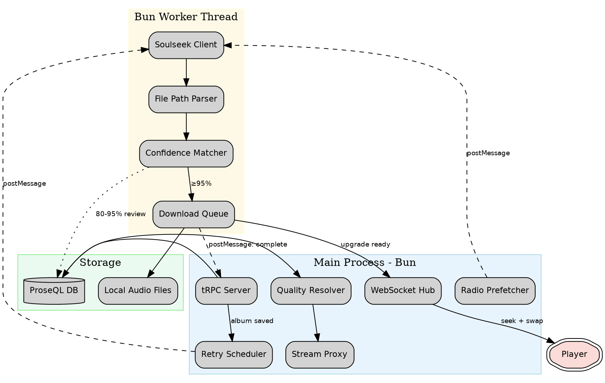

# soulseek-transparent-quality-upgrade

## Proposal

## Why

Pyxis streams music from YouTube, Pandora, and other sources at whatever quality they provide — often lossy 128-192kbps. Users who care about audio quality have no way to get higher-bitrate versions. The system should silently and progressively upgrade tracks to the best available quality without any user interaction.

## What Changes

### 1. Soulseek Client (new: `src/sources/soulseek/`)
Pull the Raziel Soulseek P2P client (~1600 LOC across 15 files in `@lull/raziel`) into `src/sources/soulseek/`. This is a full Soulseek protocol implementation: server connection, peer management, search, file transfer with progress, firewall pierce. Runs in a **Bun worker thread** to crash-isolate P2P networking from the main server.

### 2. Track Sources DB Model (new: `trackSources` collection)
New ProseQL collection tracking per-source quality for every track. Each row represents one source variant: `{trackId, source, sourceTrackId, bitrate (nullable), format, localPath, confidence, reviewStatus}`. Bitrate is only stored when actually known from file metadata — never guessed.

### 3. Quality Resolver (new: stream proxy enhancement)
The existing stream proxy (`server/services/stream.ts`) gains a "quality resolver" step. Before serving a track, it checks `trackSources` for the highest-bitrate local copy. If one exists, serve it. Otherwise fall back to the original streaming source. This is invisible to the rest of the system.

### 4. Upgrade Worker (new: `server/services/upgradeWorker.ts`)
Orchestrates the upgrade pipeline:
- Receives upgrade requests via `postMessage` from main thread
- Searches Soulseek via the client
- Parses file paths for metadata heuristics
- Runs confidence matcher (existing Jaro-Winkler + duration + album + path signals)
- ≥95% → auto-download & swap, 80-95% → download & hold for review, <80% → skip
- Downloads to local cache, extracts bitrate from file metadata
- Updates DB, notifies main thread via `postMessage`

### 5. Upgrade Scheduler (new: `server/services/upgradeScheduler.ts`)
Manages when upgrades are triggered:
- **On album save**: Hooks into `library.saveAlbum` — after saving, enqueues all tracks for upgrade search
- **Retry with backoff**: Tracks below FLAC get retried on exponential schedule (1d → 3d → 1w → 1m)
- **Radio prefetch**: When radio returns upcoming tracks, checks local cache first, then fires speculative Soulseek search for configurable N tracks ahead. No retries for radio.

### 6. Mid-Stream Swap (WebSocket notification)
When an upgrade completes for a currently-playing track, the server sends a WebSocket event. The client seeks to the current playback position in the new, higher-quality source immediately.

### 7. Config Extension
New `sources.soulseek` config section: `{username, password, enabled, maxConcurrentDownloads}`. New `upgrade` config section: `{enabled, radioLookahead, retrySchedule, storage: {maxCapacityMB, ttlDays}}`.



## Impact

- **User experience**: Music quality improves transparently over time. Radio becomes a passive library builder.
- **Storage**: Local files accumulate. Configurable TTL and capacity limits prevent unbounded growth.
- **Network**: Soulseek P2P adds background network usage. Concurrency-limited to prevent saturation.
- **Stability**: Worker thread isolation means Soulseek crashes don't take down the server.
- **Existing code**: Stream proxy gets a new resolver step. `library.saveAlbum` gets a post-save hook. New DB collection. New config section. No breaking changes to existing APIs.

## Design

## Context

Pyxis currently streams from YouTube/Pandora/Bandcamp/SoundCloud at whatever quality those platforms provide. The Raziel project (`/home/simonwjackson/code/raziel/packages/raziel/`) contains a working Soulseek P2P client (~1600 LOC) that handles login, search, peer connections, firewall piercing, and binary file transfer. The Raziel daemon package has a download queue implementation. Both will be pulled into Pyxis.

The existing matcher (`src/sources/matcher.ts`) already implements Jaro-Winkler fuzzy matching with fingerprinting. It operates on `NormalizedRelease` (album-level). For track-level Soulseek matching, we need to extend it to work on individual tracks with additional signals: duration tolerance and file path heuristics.

## Decisions

### D1: Worker Thread Architecture
**Choice**: Bun worker thread via `new Worker()`
**Alternatives considered**:
- Embedded in main process: Simpler but P2P socket management and file I/O could block the event loop
- Separate process with IPC (like Raziel's daemon): More isolation but adds deployment complexity
**Rationale**: Worker threads share memory for efficient `postMessage`, crash-isolated, single deployment unit. Bun's `Worker` supports TypeScript directly.

### D2: Track Matching (not Album Matching)
The existing matcher works at album level. Soulseek returns individual files. We need a **track-level matcher** that scores:
- Title similarity (Jaro-Winkler, weight 0.35)
- Artist similarity (Jaro-Winkler, weight 0.25)
- Duration match (within ±5s = bonus, weight 0.20)
- Album name similarity (Jaro-Winkler, weight 0.10)
- File path heuristics (parsed artist/album/track from path, weight 0.10)

This is a new function `computeTrackConfidence()` in a new `src/sources/soulseek/matcher.ts`, reusing the existing Jaro-Winkler primitives from `src/sources/matcher.ts` (which we'll export).

### D3: File Path Parser
Soulseek paths follow common patterns:
- `Music/FLAC/Artist/Album/01 - Title.flac`
- `Artist - Album (Year)/01. Title.flac`
- `Lossless/Artist/Year - Album/Track.flac`

We'll implement `parseSlskPath(filepath: string)` returning `{artist?, album?, title?, trackNumber?, format?, year?}`. Regex-based with fallback chains.

### D4: Quality Detection from Files
After download, we extract actual bitrate using `ffprobe` (already available since ffmpeg is a dependency). Store in DB as integer kbps. For FLAC, store the actual bitrate (typically ~800-1400kbps) and the format field as `'flac'`. The format field is the real quality indicator; bitrate is supplementary.

### D5: Progressive Quality Ladder
Quality ordering: `format` first, then `bitrate`:
1. FLAC/ALAC/WAV (lossless) — stop searching
2. MP3/AAC/OGG ≥320kbps — keep searching for lossless
3. MP3/AAC/OGG ≥256kbps — upgrade
4. MP3/AAC/OGG ≥192kbps — upgrade
5. Original streaming source — upgrade

An upgrade only happens if the new source is strictly better. The `isUpgrade(current, candidate)` function compares format tier first, then bitrate within the same tier.

### D6: DB Model — `trackSources` Collection
New ProseQL collection alongside existing ones:
```
trackSources:
  id: string (nanoid)
  trackId: string (FK to albumTracks.id OR ephemeral radio track hash)
  source: string (e.g. 'soulseek', 'ytmusic', 'pandora')
  sourceTrackId: string
  bitrate: number | undefined (actual kbps from ffprobe, null if unknown)
  format: string | undefined (e.g. 'flac', 'mp3', 'opus')
  lossless: boolean (derived flag for easy querying)
  localPath: string | undefined (absolute path to local file)
  confidence: number | undefined (0-1 match confidence)
  reviewStatus: string | undefined ('auto_approved' | 'pending_review' | 'rejected')
  slskUsername: string | undefined (Soulseek peer who provided the file)
  slskFilename: string | undefined (original Soulseek file path)
  createdAt: number (unix ms)
```

### D7: Upgrade Retry State — `upgradeQueue` Collection
Tracks the retry schedule per track:
```
upgradeQueue:
  id: string
  trackId: string
  targetFormat: string ('flac')
  currentBestFormat: string | undefined
  currentBestBitrate: number | undefined
  retryCount: number
  nextRetryAt: number (unix ms)
  status: string ('pending' | 'searching' | 'satisfied' | 'max_retries')
  createdAt: number
```

### D8: Stream Proxy Quality Resolution
Modify `handleStreamRequest()` in `server/services/stream.ts`:
1. Before resolving the upstream URL, query `trackSources` for the requesting track
2. If a local file exists with higher quality than the original source, serve it directly (reusing existing `serveCachedFile()`)
3. If no upgrade exists, fall through to existing logic

The resolution uses the track's `albumTracks.id` to look up `trackSources`. For radio/ephemeral tracks, we compute a content hash from `artist::title::duration` to check for serendipitous cache hits.

### D9: Mid-Stream Swap Protocol
When the upgrade worker finishes downloading and the main thread updates the DB:
1. Check if the upgraded track is currently playing (compare against `playerState` + `queueState`)
2. If yes, emit a WebSocket event: `{ type: 'track-upgraded', trackId, newStreamUrl, format, bitrate }`
3. Client receives event, calls `audio.currentTime` to get position, switches `src` to new URL with `?t=<position>` hint, resumes playback

The stream proxy handles the `?t=` parameter by seeking within the local file.

### D10: Radio Prefetch Integration
Hook into the existing radio track fetching (`server/routers/radio.ts`). When `radio.getTracks` returns new tracks:
1. Check `trackSources` for each track (content hash lookup)
2. For cache hits: the quality resolver handles it automatically
3. For cache misses: send upgrade search request to worker for the next N tracks (configurable `radioLookahead`, default 3)
4. No retry scheduling for radio tracks — one-shot best-effort

## Risks / Trade-offs

| Risk | Mitigation |
|------|------------|
| Soulseek searches are slow (10-30s) | Worker thread doesn't block main. Searches are fire-and-forget for radio. |
| Wrong track matched and auto-swapped | Conservative 95% threshold for auto-swap. Duration must match within ±5s. Review queue for gray zone. |
| Disk usage grows unbounded | Configurable `maxCapacityMB` and `ttlDays`. LRU eviction when capacity hit. |
| Soulseek account banned for leeching | Future: implement upload sharing. For now, set shared folders to a reasonable minimum. |
| Worker thread crashes | Main thread monitors worker, restarts on crash. Upgrade queue persisted to DB, resumes on restart. |
| ffprobe not available | Already a dependency (ffmpeg). Graceful fallback: store null bitrate, still serve the file. |

## Specs

### soulseek-client

## ADDED Requirements

### Requirement: Soulseek Client Library
Import Raziel's Soulseek P2P client into `src/sources/soulseek/client/` with the following modules: server connection, peer management, message parsing/building, file transfer, download state machine.

#### Scenario: Successful Login
- **WHEN** valid Soulseek credentials are provided
- **THEN** client connects to `server.slsknet.org:2242`, completes login handshake, and emits a `loggedIn` status

#### Scenario: Search Returns Results
- **WHEN** a search query is submitted
- **THEN** results accumulate from responding peers over 10-30 seconds
- **THEN** each result includes: username, filename (full path), size, bitrate, file extension

#### Scenario: File Download
- **WHEN** a download is requested for a specific user + filename
- **THEN** the client connects to the peer, transfers bytes with progress events
- **THEN** on completion, emits a `complete` event with total bytes received

#### Scenario: Worker Thread Isolation
- **WHEN** the Soulseek client crashes (connection reset, parse error, etc.)
- **THEN** the main Pyxis server process is unaffected
- **THEN** the worker is automatically restarted and re-logged in

### track-matcher

## ADDED Requirements

### Requirement: Track-Level Confidence Matcher
New matcher in `src/sources/soulseek/matcher.ts` that scores individual Soulseek file results against a target track.

#### Scenario: High Confidence Match (≥95%)
- **WHEN** a Soulseek result has matching title, artist, duration (±5s), album, and file path metadata
- **THEN** confidence score is ≥0.95
- **THEN** the track is auto-approved for download

#### Scenario: Medium Confidence Match (80-95%)
- **WHEN** title and artist match well but duration differs by 6-15s or album name is different/missing
- **THEN** confidence score is between 0.80 and 0.95
- **THEN** the track is downloaded but flagged as `pending_review`

#### Scenario: Low Confidence Match (<80%)
- **WHEN** title or artist match poorly
- **THEN** confidence score is below 0.80
- **THEN** the result is skipped entirely

### Requirement: File Path Parser
Extracts metadata from Soulseek file paths.

#### Scenario: Standard Path Format
- **WHEN** path is `Music/FLAC/Radiohead/OK Computer/03 - Subterranean Homesick Alien.flac`
- **THEN** parser extracts: artist=Radiohead, album=OK Computer, trackNumber=3, title=Subterranean Homesick Alien, format=flac

#### Scenario: Flat Path Format
- **WHEN** path is `Radiohead - OK Computer (1997)/03. Subterranean Homesick Alien.flac`
- **THEN** parser extracts: artist=Radiohead, album=OK Computer, year=1997, trackNumber=3, title=Subterranean Homesick Alien, format=flac

### quality-tracking

## ADDED Requirements

### Requirement: Track Sources Database Collection
New `trackSources` ProseQL collection storing per-source quality metadata for every track.

#### Scenario: Store Known Bitrate
- **WHEN** a local file is downloaded and ffprobe reports bitrate=944kbps, format=flac
- **THEN** `trackSources` row is created with `bitrate: 944`, `format: 'flac'`, `lossless: true`

#### Scenario: Unknown Bitrate
- **WHEN** a streaming source (YouTube, Pandora) has no verifiable bitrate
- **THEN** `trackSources` row is created with `bitrate: undefined`, `format: undefined`
- **THEN** the row is never populated with a guess

### Requirement: Quality Resolver in Stream Proxy
The stream proxy selects the best available source when serving a track.

#### Scenario: Local Upgrade Available
- **WHEN** a track is requested for streaming
- **AND** a local FLAC copy exists in `trackSources` with `reviewStatus: 'auto_approved'`
- **THEN** the stream proxy serves the local file directly with range request support
- **THEN** the original streaming source is not contacted

#### Scenario: No Upgrade Available
- **WHEN** a track is requested for streaming
- **AND** no local upgraded copy exists (or only `pending_review` copies)
- **THEN** the stream proxy falls through to existing behavior (upstream fetch + cache)

#### Scenario: Pending Review Not Served
- **WHEN** a local copy exists with `reviewStatus: 'pending_review'`
- **THEN** it is NOT served automatically
- **THEN** the original source is used until the user approves the match

### upgrade-pipeline

## ADDED Requirements

### Requirement: Album Save Triggers Upgrade Search

#### Scenario: New Album Saved
- **WHEN** a user saves an album via `library.saveAlbum`
- **THEN** all tracks in the album are enqueued for Soulseek upgrade search
- **THEN** searches begin immediately in the worker thread

### Requirement: Progressive Quality Ladder

#### Scenario: Intermediate Upgrade Applied
- **WHEN** a track's current best source is YouTube at unknown bitrate
- **AND** a Soulseek search finds a 320kbps MP3 at ≥95% confidence
- **THEN** the MP3 is downloaded and becomes the new stream source
- **THEN** the track remains in the upgrade queue targeting FLAC

#### Scenario: Target Reached
- **WHEN** a track's current best source is already FLAC (lossless)
- **THEN** the track is removed from the upgrade queue with status `satisfied`
- **THEN** no further searches are performed

### Requirement: Exponential Backoff Retry

#### Scenario: No Results Found
- **WHEN** a Soulseek search returns no matches above 80% confidence
- **THEN** the track stays in the upgrade queue
- **THEN** next retry is scheduled at: attempt 1→1 day, 2→3 days, 3→1 week, 4→1 month

#### Scenario: Max Retries Exceeded
- **WHEN** a track has been retried 4+ times with no upgrade
- **THEN** status is set to `max_retries`
- **THEN** no further automatic retries (user can manually re-trigger)

### Requirement: Mid-Stream Swap

#### Scenario: Upgrade During Playback
- **WHEN** an upgrade download completes for the currently-playing track
- **THEN** a WebSocket event `track-upgraded` is emitted with new stream URL and metadata
- **THEN** the client immediately seeks to the current playback position in the new source
- **THEN** playback continues without pause from the higher-quality source

#### Scenario: Upgrade for Non-Playing Track
- **WHEN** an upgrade completes for a track not currently playing
- **THEN** DB is updated silently
- **THEN** next time the track is played, the quality resolver serves the upgraded version

### radio-prefetch

## ADDED Requirements

### Requirement: Radio Track Cache Check

#### Scenario: Cache Hit on Radio Track
- **WHEN** radio returns upcoming tracks
- **AND** a local upgraded copy exists for a track (matched by content hash: artist+title+duration)
- **THEN** the quality resolver automatically serves the local copy
- **THEN** no Soulseek search is triggered

### Requirement: Radio Speculative Prefetch

#### Scenario: Prefetch Search
- **WHEN** radio returns upcoming tracks
- **AND** no local copy exists
- **THEN** a Soulseek search is fired for the next N tracks (configurable `radioLookahead`, default 3)
- **THEN** if a high-confidence match downloads before the track plays, it is used
- **THEN** if not, the original stream source is used

#### Scenario: No Retry for Radio
- **WHEN** a radio prefetch search finds no matches
- **THEN** no retry is scheduled
- **THEN** the track plays from its original source

### Requirement: Radio File Retention

#### Scenario: Files Kept by Default
- **WHEN** a radio track is downloaded from Soulseek
- **THEN** the file is kept forever by default (passive library building)

#### Scenario: Capacity Eviction
- **WHEN** total local file storage exceeds configured `maxCapacityMB`
- **THEN** oldest files (by `createdAt`) are evicted first
- **THEN** eviction only removes files not associated with library albums

#### Scenario: TTL Eviction
- **WHEN** a file's age exceeds configured `ttlDays`
- **AND** the file is not associated with a library album
- **THEN** the file is evicted

### configuration

## ADDED Requirements

### Requirement: Soulseek Configuration

#### Scenario: Config File
- **WHEN** `config.yaml` contains `sources.soulseek.username` and password is in `PYXIS_SOULSEEK_PASSWORD` env var
- **THEN** the Soulseek client logs in on server startup

#### Scenario: Disabled
- **WHEN** `sources.soulseek.enabled` is `false` (default)
- **THEN** no Soulseek client is initialized
- **THEN** no worker thread is spawned
- **THEN** upgrade features are completely inactive

### Requirement: Upgrade Configuration

#### Scenario: Storage Limits
- **WHEN** `upgrade.storage.maxCapacityMB` is set
- **THEN** total local file storage is capped at that value
- **WHEN** `upgrade.storage.ttlDays` is set
- **THEN** non-library files older than TTL are evicted

#### Scenario: Radio Lookahead
- **WHEN** `upgrade.radioLookahead` is set to 5
- **THEN** radio prefetch searches for 5 tracks ahead instead of default 3

## Tasks

## 1. Import Soulseek Client Library
- [ ] 1.1 Copy Raziel's `packages/raziel/src/` into `src/sources/soulseek/client/` (client.ts, server.ts, peer.ts, listen.ts, downloads.ts, common.ts, messages/*, utils/*)
- [ ] 1.2 Adapt imports from `net`/`stream`/`crypto` to work in Bun worker context
- [ ] 1.3 Remove `typed-emitter` dependency — replace with native TypeScript typed EventEmitter pattern
- [ ] 1.4 Add `'soulseek'` to `SourceType` union in `src/sources/types.ts`
- [ ] 1.5 Write integration test: login to Soulseek test server, perform search, verify results structure

## 2. Worker Thread Setup
- [ ] 2.1 Create `src/sources/soulseek/worker.ts` — Bun Worker entry point that instantiates SlskClient and handles postMessage protocol
- [ ] 2.2 Define message types: `{type: 'login', credentials}`, `{type: 'search', query, trackMeta}`, `{type: 'download', username, filename, outputPath}`, `{type: 'status'}` and response types
- [ ] 2.3 Create `server/services/upgradeWorker.ts` — main-thread wrapper that spawns/monitors/restarts the worker, exposes async API (`search()`, `download()`, `getStatus()`)
- [ ] 2.4 Implement worker crash detection and auto-restart with re-login
- [ ] 2.5 Write test: worker crash recovery — kill worker, verify restart and re-login

## 3. Track-Level Matcher
- [ ] 3.1 Export `jaroWinkler`, `normalize`, `normalizeArtist` from `src/sources/matcher.ts` (currently module-private)
- [ ] 3.2 Create `src/sources/soulseek/pathParser.ts` — `parseSlskPath(filepath)` returning `{artist?, album?, title?, trackNumber?, format?, year?}`
- [ ] 3.3 Write path parser tests: standard format, flat format, deeply nested, edge cases (no separators, unicode)
- [ ] 3.4 Create `src/sources/soulseek/matcher.ts` — `computeTrackConfidence(target, candidate)` using title (0.35), artist (0.25), duration (0.20), album (0.10), path (0.10)
- [ ] 3.5 Write matcher tests: high confidence, medium confidence, low confidence, duration tolerance edge cases

## 4. Database Schema Extension
- [ ] 4.1 Add `TrackSourceSchema` to `src/db/config.ts` — fields: id, trackId, source, sourceTrackId, bitrate?, format?, lossless, localPath?, confidence?, reviewStatus?, slskUsername?, slskFilename?, createdAt
- [ ] 4.2 Add `UpgradeQueueSchema` to `src/db/config.ts` — fields: id, trackId, targetFormat, currentBestFormat?, currentBestBitrate?, retryCount, nextRetryAt, status, createdAt
- [ ] 4.3 Register both collections in `dbConfig` with appropriate indexes (trackId, source, status, nextRetryAt)
- [ ] 4.4 Write DB tests: CRUD operations for trackSources and upgradeQueue

## 5. Quality Detection
- [ ] 5.1 Create `src/sources/soulseek/ffprobe.ts` — `probeAudioFile(path)` returning `{bitrate: number, format: string, lossless: boolean, duration: number}` using ffprobe JSON output
- [ ] 5.2 Write tests with sample audio files (or mock ffprobe output)

## 6. Quality Resolver in Stream Proxy
- [ ] 6.1 Create `server/services/qualityResolver.ts` — `resolvebestSource(trackId)` queries `trackSources`, returns highest-quality local path or null
- [ ] 6.2 Add content-hash lookup for ephemeral tracks: `computeContentHash(artist, title, duration)` for radio track matching
- [ ] 6.3 Integrate into `handleStreamRequest()` in `server/services/stream.ts` — check quality resolver before upstream fetch
- [ ] 6.4 Write tests: local file preferred, pending_review skipped, fallback to upstream

## 7. Upgrade Scheduler
- [ ] 7.1 Create `server/services/upgradeScheduler.ts` — manages upgrade queue processing, retry scheduling, timer management
- [ ] 7.2 Hook into `library.saveAlbum` in `server/routers/library.ts` — after successful save, enqueue all tracks for upgrade
- [ ] 7.3 Implement exponential backoff logic: retry intervals 1d→3d→1w→1m, max 4 retries
- [ ] 7.4 Implement upgrade pipeline: search → match → download → probe → store → notify
- [ ] 7.5 Write tests: album save triggers enqueue, retry scheduling, max retries reached

## 8. Mid-Stream Swap
- [ ] 8.1 Add `track-upgraded` WebSocket event type to the existing player subscription system
- [ ] 8.2 On upgrade completion, check current player/queue state — if upgraded track is playing, emit event
- [ ] 8.3 Client-side: listen for `track-upgraded` event, capture current `audio.currentTime`, switch `src` to new stream URL at same position
- [ ] 8.4 Write test: upgrade during playback triggers WebSocket event with correct metadata

## 9. Radio Prefetch Integration
- [ ] 9.1 Hook into radio track fetching in `server/routers/radio.ts` — after `getTracks`, trigger prefetch pipeline
- [ ] 9.2 Implement cache check via content hash lookup in `trackSources`
- [ ] 9.3 For cache misses, send one-shot search requests to upgrade worker (no retry)
- [ ] 9.4 Write tests: cache hit skips search, cache miss triggers search, no retry on failure

## 10. Configuration
- [ ] 10.1 Add `SoulseekSourceSchema` to `src/config.ts`: `{enabled, username, maxConcurrentDownloads}`
- [ ] 10.2 Add `UpgradeSchema` to `src/config.ts`: `{enabled, radioLookahead, retrySchedule, storage: {maxCapacityMB, ttlDays}}`
- [ ] 10.3 Add `PYXIS_SOULSEEK_PASSWORD` env var support (like Pandora password pattern)
- [ ] 10.4 Wire config into upgrade scheduler and worker initialization

## 11. Storage Eviction
- [ ] 11.1 Create `server/services/storageEviction.ts` — periodic job checking total size and file ages
- [ ] 11.2 Implement LRU eviction: evict oldest non-library files when capacity exceeded
- [ ] 11.3 Implement TTL eviction: evict non-library files older than configured TTL
- [ ] 11.4 Write tests: capacity eviction, TTL eviction, library files protected

## 12. Logging
- [ ] 12.1 Add `upgrade` logger: `createLogger('upgrade')` → `~/.local/state/pyxis/upgrade.log`
- [ ] 12.2 Log all upgrade pipeline events: search started, results found, confidence scores, download progress, swap events
- [ ] 12.3 Log worker lifecycle: spawn, crash, restart, login status
